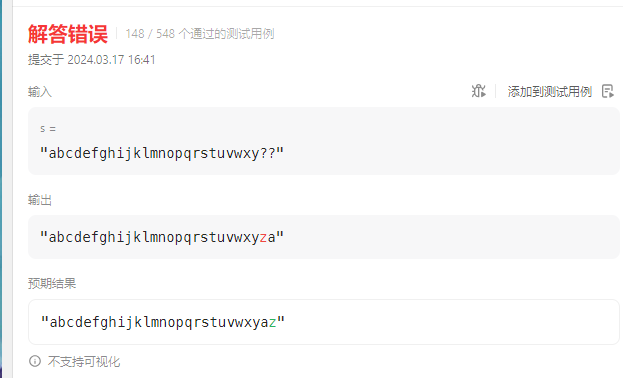
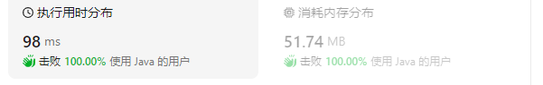
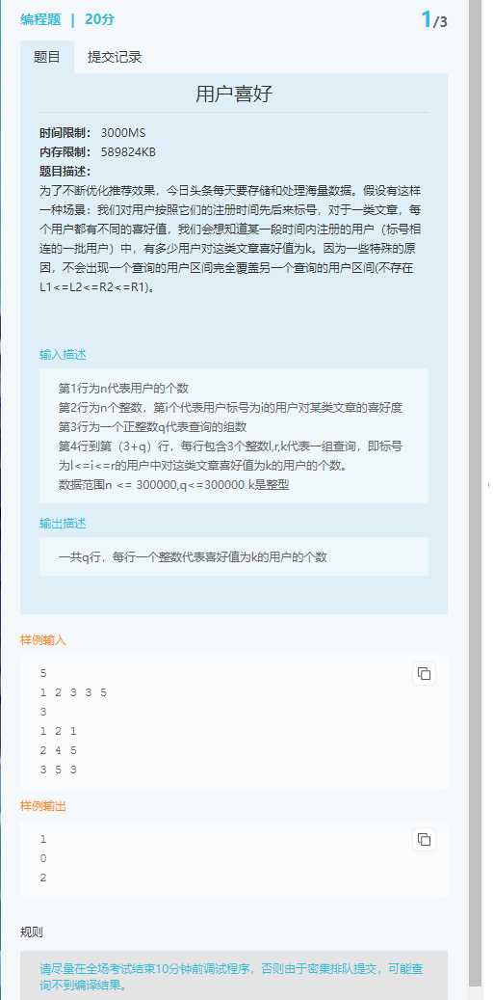
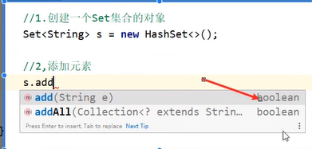

# note

## 1 1011. 在 D 天内送达包裹的能力

### 思路

根据天数对货物均匀切片，求船的最大上界

要在 D 天内运完所有包裹，那么每天至少的承载量为 sum / D
但是，因为一次至少运 1 个包裹，而这个包裹的重量可大可小，那么可能 weights[i] > sum / D
假设包裹最大的重量为 maxWeight
因此，最低承载量应该为 capacity = max(sum / D, maxWeight);

最直接的方法，就是直接从 capacity 开始，每次 capacity++ 进行尝试，但这样效率很低
因此我们可以使用二分查找， left = capacity， right = sum，即最低承载量为 capacity,最高的承载量为 包裹总量
我们判断承载量 mid 是否能在 D 天内装完（无需刚好 D 天，只需要 [1, D] 即可），如果不能，表示承载量太小，则 left = mid + 1，否则 right = mid
因为必定存在一个答案，因此当退出循环， left = right 时，就是答案

### 解答

~~~
#include<iostream>
#include<vector>
#include<stdio.h>
#include<cmath>
using namespace std;
class Solution {
public:
    int shipWithinDays(vector<int>& weights, int days) {
        int w_sum = 0;
        int w_max = 0;
        for (int i = 0; i < weights.size(); i++)
        {
            if (w_max < weights[i])w_max = weights[i];//更新重量
            w_sum += weights[i];//累加
        }
        int w_mean = w_sum / weights.size();//平均重量  
        int capacity = max(w_mean, w_max);//起始重量
        int l = capacity, r = w_sum;//lr边界
        while (l < r)
        {
            int mid = (l + r) / 2;
            int index = 0;//索引
            for (int i=0;i<days;i++)//遍历每一天
            {   
                int w_temp = 0;
                for (;;)
                {
                    if (index < weights.size() && w_temp + weights[index] <= mid)
                    {
                        w_temp += weights[index];
                        index++;
                    }
                    else break;
                }
            }
            if (index == weights.size())//capacity太小
                r = mid;
            else
                l = mid + 1;
        }
        return l;
    }
};
int main()
{   
    vector<int> w;
    int num = 5;
    int days = 4;
    int a[20] = { 1,2,3,1,1 };//1, 2, 3, 4, 5, 6, 7, 8, 9, 10 ;
    for (int i = 0; i < num; i++)
    {
        w.push_back(a[i]);
    }
    Solution s;
    printf("%d",s.shipWithinDays(w, days));
}
~~~

## 2 1013. 将数组分成和相等的三个部分

### 思路

预处理sum是否为3的倍数，不是直接FALSE

用i、j在两端分别向中间累加（i<j)，当两端均为sum的1/3==且i<=j==时，返回TRUE

### 解答

~~~
#include<bits/stdc++.h>
using namespace std;
class Solution {
public:
    bool canThreePartsEqualSum(vector<int>& arr) {
        int sum = 0;
        for(int i = 0;i<arr.size();i++){
            sum += arr[i];
        }
        if(sum%3)return false;
//        printf("%d\n",sum/3);
        int i = 1, j = arr.size()-2;
        int sum_i = arr[0], sum_j = arr[arr.size()-1];//先放入首位确保非空
        while(i<j){
            if(sum_i!=sum/3){//不等于sum/3就加上下一个来调整大小
                sum_i += arr[i++];
            }
            if(sum_j!=sum/3){
                sum_j += arr[j--];
            }
//            printf("%d %d\n",i,j);
            if(sum_i==sum/3&&sum_j==sum/3&&i<=j)return true;//要判i<=j，因为i,j对应值两者都取不到

        }


        return false;
    }
};

int main()
{
    vector<int>arr;
    int n = 10;
    int a[100] = {3,3,6,5,-2,2,5,1,-9,4};//6,1,1,13,-1,0,-10,20
    for(int i=0;i<n;i++){
        arr.push_back(a[i]);
    }
    Solution s;
    cout<<s.canThreePartsEqualSum(arr)<<endl;
    return 0;
}
~~~

## 3 矩形区域不超过 K 的最大数值和


~~~
#include<bits/stdc++.h>
using namespace std;
class Solution {
public:
    int maxSumSubmatrix(vector<vector<int>>& matrix, int k) {
//        for(int i=0;i<matrix.size();i++){
//            for(int j=0;j<matrix[i].size();j++){
//                printf("%d ",matrix[i][j]);
//            }
//            printf("\n");
//        }
        int ans = INT_MIN;//最小INT
        int n = matrix.size(),m = matrix[0].size();
        for(int i=0;i<n;i++){   //下界
            vector<int> sum(m); //一维列数组
            for(int j=i;j<n;j++){   //上界
                for(int k=0;k<m;k++)    //逐列，列上累加
                    sum[k] += matrix[j][k];//加上一列越界？更新列上元素和
                set<int> lr{0};//初值为0
                int s = 0;
                for(int i:sum){//行上累加
                    s += i;
                    set<int>::iterator lb = lr.lower_bound(s-k);//存在大于等于s-k的lb
                    if(lb!=lr.end()){
                        ans = max(ans, s- *lb);
                    }
                    lr.insert(s);
                }
            }
        }
        return ans;
    }

};
int main(){
    int n = 2, m = 3;
    int k = 2;
    int a[2][3] = {1,0,1,0,-2,3};//
    vector<vector<int>> v;
    for(int i=0;i<n;i++){
        vector<int> tempv;
        for(int j=0;j<m;j++){
            tempv.push_back(a[i][j]);
        }
        v.push_back(tempv);
    }
    printf("%d",Solution().maxSumSubmatrix(v,k));

}
~~~

## 4 用最少数量的箭引爆气球

代码思路简单，但很吃优化。

自己想的if逻辑复杂点问题不大，但不优化成按地址传参跑不过。cmp改用lambda函数取代调用其他函数也能提速。

启示：多和官方代码对比，看看哪里调整一下能给代码提速。

~~~c++
#include<bits/stdc++.h>
using namespace std;
class Solution {//tle?
public:
//    static bool cmp(const vector<int>& a, const vector<int>& b){//1、cmp 用const地址传参（有效提速！）
//        return a[1]<b[1];//升序
//    }
    int findMinArrowShots(vector<vector<int>>& points) {
		if (points.empty())return 0;
		int n = points.size();
		sort(points.begin(), points.end(), [](const vector<int> &a, const vector<int> &b) {
			return a[1] < b[1];
		});//同样的算法，我写的tle，它最优？
		int sum = 1;//箭数，至少要一箭
		int l = points[0][0], r = points[0][1];//左右边界，初始化为第一根箭
		for (const vector<int> &p:points) {//遍历points求箭数
			if (p[0] <= r) {//有交集
				if (p[1] < r) {//箭尾比右边界短，更新右边界
					r = p[1];
				}
				continue;
			}
			r = p[1];//没有交集，更新右边界
			sum += 1;
		}
		return sum;
	}
};
int main(){
    int n;
    cin>>n;
    vector<vector<int>> points;
    for(int i=0;i<n;i++){
        vector<int> v(2);
        cin>>v[0]>>v[1];
        points.push_back(v);
    }
    printf("%d\n",Solution().findMinArrowShots(points));

}
/*
4
10 16
2 8
1 6
7 12
*/
~~~

## 5 下一个排列

字典序算法用来解决这样一个问题：给定其中一种排列，求基于字典序的下一种排列。

~~~
#include<bits/stdc++.h>
using namespace std;
class Solution {//原地算法、数组的字典序
public:
	void nextPermutation(vector<int>& nums) {//数组长度小于100，值小于100
		int flag = 0;//0表示没有找到a
		for(int i=nums.size()-1;i>0;i--){//从后向前遍历，找到第一个大于右邻的左邻，标记左邻位置a
			if(nums[i-1]<nums[i]){
				int a = i-1;
				flag = 1;
				for(int i=nums.size()-1;i>a;i--){//再从后向前遍历，找到第一个大于nums[a]的数，和nums[a]交换。
					if(nums[a]<nums[i]){
						int temp = nums[a];
						nums[a] = nums[i];
						nums[i] = temp;
						sort(nums.begin()+a+1, nums.end());//对a后数字升序
						break;
					}
				}
				break;
			}
		}
		if(!flag){//对于降序数组特殊处理
			sort(nums.begin(),nums.end());
		}
	}
};
int main(){
	int arr[] = {3,2,1};//3,5,8,7,6,4//3,6,4,5,7,8//3,2,1
	int n = sizeof(arr)/sizeof(arr[0]);//求数组长度
	vector<int>v;
	for(int i=0;i<n;i++){
		v.push_back(arr[i]);
	}
	Solution().nextPermutation(v);
}

~~~


## 代码优化

### 1 用传地址拷贝形参比直接形参更快

```
//遍历二维vector: points
for(vector<int> p:points){//遍历points求箭数
	if(p[0]>r){
		r = p[1];//没有交集，更新右边界
		sum+=1;
	}
}

//优化：用传地址拷贝形参，并用const固定
for(const vector<int> &p:points){//遍历points求箭数 2、p用const地址传参（能提速，降内存）
    if(p[0]>r){
        r = p[1];//没有交集，更新右边界
        sum+=1;
    }
}
```

结果：时间：从440ms降到416ms；内存：从99MB降到87MB。

~~~
//类似的，也可用用在排序时频繁调用的cmp函数中
 static bool cmp(vector<int> a, vector<int> b){
	return a[1]<b[1];//升序
}

//优化后
 static bool cmp(const vector<int>& a, const vector<int>& b){//1、cmp 用const地址传参（有效提速！）
	return a[1]<b[1];//升序
}
~~~

结果：时间：从524ms降到440ms，内存不变（可能是因为函数小，退栈快）

### 2 使用Lambda 语法比调用别的函数快

~~~
//典型的在sort函数中用cmp
bool cmp(const vector<int>& a, const vector<int>& b){//1、cmp 用const地址传参（有效提速！）
    return a[1]<b[1];//升序
}
sort(points.begin(), points.end(),cmp);

//优化成lambda写法
sort(points.begin(), points.end(),[](const vector<int>& a, const vector<int>& b){
	return a[1]<b[1];
});
~~~

结果：时间：从416ms优化到360ms，内存从87.7MB降到87.5MB（降得不多）


## 共享力扣

~~~
我尊贵的客人，这是您的订单： https://ffmmg4a1xn.feishu.cn/docx/OemkdL3j3o9mNJxMuhpc2nHpnRs 访问蜜: 2ngwk888 有问题联系售后客服 ngwk888 时间不足30天?(到期续费或换号，保证您使用30天) 亲，不要主动退出登录，若要登自己的号麻烦换浏览器或开一个无痕，此号请不要退出。 --------------------- 确认收货后好pin，找客服领取面试资料及刷题宝典礼包一份！ ===2
~~~


力扣会员可以模拟面试


20题


5 最长回文子串

dp题，难受

暴力te

~~~
#include<bits/stdc++.h>
using namespace std;
class Solution {
public:
	bool f(string s){
		int i=0,j=s.size()-1;
		while(i<j){
			if(s[i]!=s[j]){
				return false;
			}
			i++;
			j--;
		}
		return true;
	}
    string longestPalindrome(string s) {
    	if(s.size()==0)return "";
		int len;
		string tmp="";
		for(len=s.size();;len--){
			for(int i=0;i<=s.size()-len;i++){
//				cout<<tmp<<endl;
				tmp=s.substr(i, len);//起点，字符数 
				if(f(tmp))return tmp;//ctrl c种子循环 
			}
		}
		return tmp;
    }
};
int main(){
	string s;
	getline(cin,s);
	Solution solution;
	cout<<"ans:"<<solution.longestPalindrome(s)<<endl;
	return 0;
	
}
/*
babad


*/ 
~~~


翻转字符串里的单词 II

解：题目要求原地操作，以下是非原地版本

~~~
class Solution {
public:
    void reverseWords(vector<char>& s) {
		stack<string>q;
		int j=0;
		string tmp="";//char+string?
		while(j<=s.size()){
			if(j==s.size()||s[j]==' '){
				q.push(tmp);
				tmp="";
			}
			else{
				tmp+=s[j];//j有效 
			}
			j++;
		}
		s.clear();
		while(!q.empty()){
			tmp=q.top();
			q.pop();
			for(auto p:tmp){
				s.push_back(p);
			}
			if(!q.empty()){
				s.push_back(' ');
			}
		}
//		for(auto p:s){
//			cout<<p;
//		}cout<<endl;
    }
};
~~~

优化：原地操作：其实只要先全部翻转，再对单个单词内部翻转

~~~
class Solution {
public:
	void f(vector<char> &s, int i, int j){
		while(i<j){
			char tmp = s[i];
			s[i] = s[j];
			s[j] = tmp;
			i++;
			j--;
		}
	}
    void reverseWords(vector<char>& s) {
//		int i=0, j=s.size()-1;
		f(s,0,s.size()-1);
		int i=0, j=0;
		while(j<=s.size()){
			if(j==s.size()||s[j]==' '){
				f(s, i, j-1);
				i=j+1;//更新i 
			}
			j++;
		}
//		for(auto p:s){
//			cout<<p;
//		}cout<<endl;
    }
};
~~~

[328. 奇偶链表](https://leetcode.cn/problems/odd-even-linked-list/)

解：用cnt有点擦边

~~~
class Solution {
public:
    ListNode* oddEvenList(ListNode* head) {
		if(head==NULL||head->next==NULL)return head;//特判长度为01
		ListNode *tail=head, *pre=head;
		int cnt=0, len = 1;
		while(tail->next){
			tail = tail->next;
			len++;//5
		}
//		len = len%2==0?len/2:len/2;
//		cout<<len<<endl;
		while(pre->next->next&&cnt<len/2){
			tail->next = pre->next;
			pre->next = pre->next->next;
			tail->next->next = NULL;
//			cout<<"pre:"<<pre->val<<" tail:"<<tail->val<<endl;
			pre = pre->next;//挪步
			tail = tail->next;
			cnt++;
//			cout<<"pre:"<<pre->val<<" tail:"<<tail->val<<endl;
		}
		
		return head;
    }
};
~~~

[15. 三数之和](https://leetcode.cn/problems/3sum/)

错解：逆向双指针加二分。实际会漏接，因为端点的不成立没有连续性（即端点收缩后，会一会儿成立一会不成立）

~~~

class Solution {
private:
	vector<vector<int>>ans;
public:
	class cmp{
		public: bool operator()(int a, int b){
					return a<=b;
		}
	};
	void f(vector<int>&v, int i, int j){//找中间值 
		int tar = 0 - v[i]-v[j], l = i+1, r=j-1;
		vector<int> tmp;
		bool flag = false;
		while(l<=r){
			int mid = l+(r-l)/2;
			if(v[mid]==tar){
				flag = true;
				break;
			}
			else if(v[mid]<tar){
				l = mid+1;
			}
			else{
				r = mid-1;
			}
		}
		if(flag){
			tmp.push_back(v[i]);
			tmp.push_back(tar);
			tmp.push_back(v[j]);
			ans.push_back(tmp);
		}
		return;
	}
    vector<vector<int>> threeSum(vector<int>& v) {
        sort(v.begin(), v.end(), cmp());//为真不操作
        for(auto p:v){
        	cout<<p<<' ';
		}cout<<endl;
//Q特判值全一样 
		int i=0,j = v.size()-1;//(假设值不全一样 
		while(i<j){
			f(v,i,j);//算一下当前 
			if(v[i]+v[j]<0){
				int i1 = i+1;
				while(v[i1]==v[i]){
					i1++;
					if(i1>=v.size())return ans;//不存在符合的i 
				}
				i = i1;//向右 
			}
			else if(v[i]+v[j]>0){
				int j1=j-1;
				while(v[j1]==v[j]){//j1不越界 
					j1--;
					if(j1<0)return ans;
				}
				j=j1;
			}
			else{
				int i1 = i+1;
				while(v[i1]==v[i]){
					i1++;
					if(i1>=v.size())return ans;//不存在符合的i 
				}
				int j1=j-1;
				while(v[j1]==v[j]){//j1不越界 
					j1--;
					if(j1<0)return ans;
				}
				f(v,i,j1);
				f(v,i1, j);//各算一下 
				i = i1;
				j = j1;//两头更新 
			}
		}
		return ans;
		
    }
};

/*
-1 0 1 2 -1 -4
0 0 0 0 0 0
-2 -2 -2 0 0 0 2 2 2
-1 0 1 2 -1 -4 -2 -3 3 0 4
-4 -2 -2 -2 0 1 2 2 2 3 3 4 4 6 6
*/
~~~

错解：越界报错，写的有点啰嗦，没检查出来

~~~
class Solution {
private:
	vector<vector<int>>ans;
public:
	class cmp{
		public: bool operator()(int a, int b){
			return a<=b;
		}
	};
	bool f(int num, int size){
		return num<size&&num>=0;
	}
    vector<vector<int>> threeSum(vector<int>& v) {
        sort(v.begin(), v.end(), cmp());//为真不操作
        for(auto p:v){
        	cout<<p<<' ';
		}cout<<endl;
//Q特判值全一样 
		for(int i=0;i<v.size()-2;){//遍历每个位置i,流出最后两个位置 
			int j = i+1, k=v.size()-1; 
			cout<<"i:"<<i<<endl;
			if(v[i]>0||v[k]<0)break;//最小大于0且最大小于0 

			while(j<k&&f(j,v.size())&&f(k, v.size())){
				cout<<"j:"<<j<<" k:"<<k<<endl;
				int sum = v[i]+v[k]+v[j];
				if(sum==0){//找到解
					vector<int>tmp;
					tmp.push_back(v[i]);
					tmp.push_back(v[j]);
					tmp.push_back(v[k]);
					ans.push_back(tmp);
					int j1 = j+1;
					while(v[j1]==v[j]){
						j1++;
						if(j1>=v.size())break;
						cout<<"j1:"<<j1<<endl;
					}
					j = j1;
					int k1 = k-1;
					while(v[k1]==v[k]){
						k1--;
						if(k1<0)break;//找到边界，无解 
						cout<<"k1:"<<k1<<endl;
					}
					k = k1;//更新2个位置 
				}
				else if (sum>0){//r端太大 
					int k1 = k-1;
					while(v[k1]==v[k]){
						k1--;
						if(k1<0)break;//找到边界，无解 
						cout<<"k1:"<<k1<<endl;
					}
					k = k1;//更新2个位置 
				}
				else{//l端太小 
					int j1 = j+1;
					while(v[j1]==v[j]){
						j1++;
						if(j1>=v.size())break;
						cout<<"j1:"<<j1<<endl;
					}
					j = j1;
				} 
 
			}
			int i1=i+1;
			while(v[i1]==v[i]){
				i1++;
				if(i1>=v.size()-2)break;//i1越界 
			}
			i = i1;//i也不重复
		}
		return ans;
    }
};
~~~


[39. 组合总和](https://leetcode.cn/problems/combination-sum/)


~~~
给你一个 无重复元素 的整数数组 candidates 和一个目标整数 target ，找出 candidates 中可以使数字和为目标数 target 的 所有 不同组合 ，并以列表形式返回。你可以按 任意顺序 返回这些组合。

candidates 中的 同一个 数字可以 无限制重复被选取 。如果至少一个数字的被选数量不同，则两种组合是不同的。 

对于给定的输入，保证和为 target 的不同组合数少于 150 个。
~~~

#### [71. 简化路径](https://leetcode.cn/problems/simplify-path/)

解：模拟栈


~~~
class Solution {
    public String simplifyPath(String path) {
        //1 初始化
        String [] strList = path.split("/");
        Deque<String> st = new LinkedList<>();
        for(String str:strList){
            if(str.equals("")||str.equals(".")){
                continue;//路径不变
            }
            else if(str.equals("..")){
                if(!st.isEmpty()){
                    st.removeLast();
                }
            }
            else{
                st.addLast(str);
            }
        }
        StringBuilder builder = new StringBuilder();
        while(!st.isEmpty()){
            builder.append("/").append(st.getFirst());//不要原地建String
            st.removeFirst();
        }
        if(builder.length()==0){
            builder.append("/");//特判为空
        }
        return builder.toString();
    }
}
~~~

#### [LCR 090. 打家劫舍 II](https://leetcode.cn/problems/PzWKhm/)

解：没想法，猜是dp；看标签确实是dp，没想到转移公式；

抄题解后没有处理好头尾；


本质还是确定维数，讨论边界条件以及dp[i]和dp[i-1]的关系（相邻几项


~~~
class Solution {
    public int rob(int[] v) {
        if(v.length==1)return v[0];//特判长度为1
        int [] dp = new int [v.length];//i表示当前房子下标
        dp[0] = v[0];
        dp[1] = max(v[0], v[1]);
        if(v.length==2)return dp[1];
        for(int i=2;i<dp.length-1;i++){
            dp[i] = max(dp[i-1], dp[i-2]+v[i]);//bug1:把尾巴和开头都算进去了：需要在掐头和去尾两个区间上都算一下。
        }
        int ans = dp[dp.length-2];
        dp[1] = v[1];
        dp[2] = max(v[1], v[2]);
        for(int i=3;i<dp.length;i++){
            dp[i] = max(dp[i-1], dp[i-2]+v[i]);//
        }

        return max(ans, dp[dp.length-1]);
    }
}

~~~


华为春招


### 240110 记录某厂编程笔试失败

原因：第二道模拟题，要用堆排序，且要访问mp内的值（应该不是pq），卡在对堆排序函数的不熟悉上（花了一个小时）。第三题是个图论，感觉是染色问题，求最大面积，但好像建图的时候开不下1e4*1e4的图，然后本地过了，样例能过，但求值全错，一分没有。这种建大图的写法最近确实没接触（好像几年前搞洛谷的时候写过，但现在基本没印象了）。

简而言之：教训如下：

- 按模块刷题有道理，但还是刷少了。很多类型没有接触。（按类型深刷）
- 模拟题的本质还是模块。
- 平时做题和面试做题的感觉还是有很大区别。（还是要多模拟面试，限时做题；做题时尽量先自己实现，混分也是能力的一部分；一些基础语句要熟练（比如重写map的排序））
- 不应该跳过相对低分的题去骗高分（低分题写复杂点还能混，高分没想通的话解都是错的，复杂度低也混不到


hr您好，我机试只有100分，没过线（150分），但系统显示机试已完成，请问我应该是被刷掉了吗？


第二题

~~~
#include<iostream>
#include<algorithm>
#include<vector>
#include<queue>
#include<cmath>
#include<string>
#include<unordered_set>
#include<set>
#include<unordered_map>
using namespace std;

class Node{
    public:
        int id;
        int opTime;
        int num;
        int val;
        Node(int x,int y, int z, int a):id(x), opTime(y), num(z), val(a){}
};

class Room{
    private:
        vector<Node>nodes;
        int max_size;//上限
    public:
        Room(int x):max_size(x){}
        bool operator()(Node a, Node b){
            if(a.opTime == b.opTime){
                return a.val>b.val;//前面的偏大，要操作
            }
            return a.opTime>b.opTime;//前面的偏大
        }
        void list(){
            for(auto p:nodes){
                cout<<"id:"<<p.id<<" opTime:"<<p.opTime<<" num:"<<p.num<<" val:"<<p.val<<endl;
            }
        }
        void check(Node a){
            //1 查询a
            for(int i=0;i<nodes.size();i++){
                if(nodes[i].id==a.id){
                    nodes[i].opTime = a.opTime;
                    make_heap(nodes.begin(), nodes.end(), Room(0));//重新建堆
                    break;
                }
            }
        }
        void save(Node a){//O(n)
            //1 查询a
            bool flag = false;
            int i;
            for(i=0;i<nodes.size();i++){
                if(nodes[i].id==a.id){
                    flag = true;
                    break;
                }
            }
            if(flag){//在容器内，改属性
                nodes[i].opTime = a.opTime;
                nodes[i].num++;
                make_heap(nodes.begin(), nodes.end(), Room(0));//重新建堆
            }
            else{//不在容器
                if(nodes.size()==max_size){//库曼，删点
                    pop_heap(nodes.begin(), nodes.end(), Room(0));
                    nodes.pop_back();
                }
                nodes.push_back(a);//插入
                push_heap(nodes.begin(), nodes.end(), Room(0));
            }
        }
};
int main(){
    int n,m;
    cin>>n>>m;
    Room room = Room(m);
    for(int cur = 0;cur<n;cur++){
        string s;
        cin>>s;
        if(s=="s"){
            int id, val;
            cin>>id>>val;
            room.save(Node(id, cur, 1, val));
        }
        else if(s=="c"){
            int id;
            cin>>id;
            room.check(Node(id, cur, 0, 0));
        }
        else{//l
            room.list();
        }
    }
    
}
/*
12 2
s 1 20
s 2 15
c 1
l
s 3 10
l
c 1
l
s 4 1
l
s 1 20
l
*/
~~~


### 换用vscode

setting

~~~
{
    "git.path": "D:/Git/Git/bin/git.exe",
    "editor.linkedEditing": true,
    "files.autoSave": "afterDelay",
    "editor.fontSize": 16,
    "cSpell.languageSettings": [


    ],
    "C_Cpp.errorSquiggles": "enabled",
    "C_Cpp.default.intelliSenseMode": "windows-gcc-x86",
    // "C_Cpp.errorSquiggles": "enabled"

}
~~~

貌似搞好了自动检错

修正input

https://blog.csdn.net/nruuu/article/details/124802824


1 选择要编译的文件夹；2 用release方式；3 编译文件；4 运行可执行文件，鼠标右键来粘入输入。

修改代码后，要重新执行步骤3，再步骤4.

Q**vscode貌似只能一个文件夹运行一个cpp**：影响还没那么大

### 力扣周赛时间


#### 难度分布


## 模块刷题

### 1 双指针

#### [344. 反转字符串](https://leetcode.cn/problems/reverse-string/)

解

~~~
class Solution {
public:
    void reverseString(vector<char>& s) {
		int i=0,j=s.size()-1;
		while(i<j){
			char tmp = s[i];
			s[i] = s[j];
			s[j] = tmp;
			i++;
			j--;
        }
    }
};
~~~

#### [26. 删除有序数组中的重复项](https://leetcode.cn/problems/remove-duplicates-from-sorted-array/)

解

~~~~
class Solution {
public:
    int removeDuplicates(vector<int>& nums) {
		int i=0,j=0;
		while(j<nums.size()){
			if(i==0){
				i++;
			}
			else if(nums[j]!=nums[i-1]){
				nums[i]=nums[j];
				i++;				
			}
			j++;
		}
		return i;
    }
};
~~~~

#### [11. 盛最多水的容器](https://leetcode.cn/problems/container-with-most-water/)

解：方向相反的双指针

~~~
class Solution {
public:
    int maxArea(vector<int>& height) {
		int ans = 0, i=0, j=height.size()-1;
		while(i<j){
			int tmp = min(height[i], height[j])*(j-i);
			ans = ans<tmp ? tmp : ans;
			if(height[i]<=height[j])
				i++;
			else
				j--;
		}
		return ans;
    }
};
~~~

二刷：卡了一下

#### [42. 接雨水](https://leetcode.cn/problems/trapping-rain-water/)

困难

解：知道是双指针，想成同向的，实际上状态不仅和左边有关，也和右边没有处理的数据有关。

看题解确实是双指针，但是是反向指针。维护左右的最值（不是dp，不用额外数组）


~~~
class Solution {
public:
    int trap(vector<int>& v) {
        //1 收尾交替遍历
        int n = v.size(), l=0, r=n-1, l_max = v[l], r_max = v[r], sum=0;
        while(l<=r){
            //1 先动l，l指向的位置没算过
            while(l_max<=r_max&&l<=r){
                if(l_max>v[l]){
                    sum+=l_max-v[l];
                }
                else{
                    l_max = v[l];
                }
                // cout<<"l:"<<l<<" sum:"<<sum<<" l_max:"<<l_max<<endl;
                l++;
            }
            //2 l过大了，动r
            while(r_max<=l_max&&l<=r){
                if(r_max>v[r]){
                    sum+=r_max-v[r];
                }
                else{
                    r_max = v[r];
                }
                // cout<<"r:"<<r<<" sum:"<<sum<<" r_max:"<<r_max<<endl;
                r--;
            }
        }
        return sum;
    }
};
~~~

二刷：看了思路没写出来；看了代码还卡了个等号。。

#### [283. 移动零](https://leetcode.cn/problems/move-zeroes/)

解：双指针

~~~
class Solution {
public:
    void moveZeroes(vector<int>& nums) {
		int i=0, j;
		while(i<nums.size()&&nums[i]!=0)
			i++;
		j=i+1;
		cout<<"i:"<<i<<" j:"<<j<<endl;
		while(j<nums.size()){
			if(nums[j]!=0){
				int temp = nums[j];
				nums[j] = nums[i];
				nums[i] = temp;
				i++;//i 始终指向0 
			}
			j++; 
		}
    }
};
~~~

#### [80. 删除有序数组中的重复项 II](https://leetcode.cn/problems/remove-duplicates-from-sorted-array-ii/)

解：同向双指针；注：小心j取到尾巴时，仍要处理是否有重复数

~~~
class Solution {
public:
    int removeDuplicates(vector<int>& nums) {
        int i=0, j=0;
		while(j<nums.size()){
			if(nums[j]!=nums[i]){
				int cnt = j-i-2;
				if(cnt>0){//长度超过2 
					int k = cnt;
					while(k--){
						nums.erase(nums.begin()+i);//i指向待处理值		
					}
					j -= cnt;//校正j位置 
					i=j;
				}
				else{
					i=j;
				}
			}
			j++;
		}
		int cnt = j-i-2;//对最后一组再判一次 
		if(cnt>0){//长度超过2 
			int k = cnt;
			while(k--){
				nums.erase(nums.begin()+i);//i指向待处理值		
			}
			j-= cnt;
		}
		return j;
    }
};
~~~

#### [1047. 删除字符串中的所有相邻重复项](https://leetcode.cn/problems/remove-all-adjacent-duplicates-in-string/)

解：看起题意，是相邻相同直接删，而不是删除多个连续相同。同向双指针

~~~
class Solution {
public:
    string removeDuplicates(string s) {
        int i=0,j=1;
		while(j<s.size()){
			if(s[i]!=s[j]){
				i=j;
			}//ij一定相邻 
			else{
				s.erase(i,2);
				if(i>0)
					i--;
				j=i;
			} 
			j++;
		}
		return s;
    }
};
~~~


#### [189. 轮转数组](https://leetcode.cn/problems/rotate-array/)


解：

考原地操作，复杂的话，空间为O（n），

~~~
class Solution {
    public void rotate(int[] a, int k) {
        k = k%a.length;
        int []b = new int [a.length];
        for(int i=0;i<a.length;i++){
            b[i] = a[((i+a.length)-k)%a.length];
        }
        for(int i=0;i<a.length;i++){
            a[i]=b[i];
        }
    }
}
~~~

但可以把空间优化为常量，即


~~~
class Solution {
    public void reverse(int []a, int l, int r){
        while(l<r){
            int tmp = a[l];
            a[l] = a[r];
            a[r] = tmp;
            l++;r--;
        }
    }
    public void rotate(int[] a, int k) {
        k = k%a.length;
        //1 整体翻转
        reverse(a, 0, a.length-1);
        reverse(a, 0, k-1);
        reverse(a, k, a.length-1);
    }
}
~~~


#### [165. 比较版本号（待完善）](https://leetcode.cn/problems/compare-version-numbers/)


解：

常规split要O（n）的额外空间

~~~
class Solution {
    public int compareVersion(String a, String b) {

        String[] aList = a.split("\\.");
        String[] bList = b.split("\\.");
//        int n = Math.max(aList.length,bList.length);
        int i=0;
        while(i<aList.length&&i< bList.length){
            if(Integer.parseInt(aList[i])<Integer.parseInt(bList[i]))return -1;
            if(Integer.parseInt(aList[i])>Integer.parseInt(bList[i]))return 1;
            i++;
        }
        while(i<aList.length){//b用完
            if(Integer.parseInt(aList[i])>0)return 1;
            i++;
        }
        while(i<bList.length){
            if(Integer.parseInt(bList[i])>0)return -1;
            i++;
        }
        return 0;
    }
}
~~~

可以用双指针优化成常数空间（原地操作）（暂不写）

### 2 二分查找

[1062. 最长重复子串](https://leetcode.cn/problems/longest-repeating-substring/)

解：对长度二分查找，用f函数判断每个长度是否合法；用set有点慢（查找要O(n)，用unordered_set更快

~~~
class Solution {
public: 
bool f(string s, int len){
	unordered_set<string> str_set;//构造set 
	for(int i=0;i+len<=s.size();i++){//长度不越界 
		string sub_s = s.substr(i, len);
		if(str_set.find(sub_s)!=str_set.end()) {
			return true;
		}
		str_set.insert(sub_s);
	}
	return false;
}
int longestRepeatingSubstring(string s) {
		int l=0, r=s.size()-1;
		while(l<r){
			int mid = l+(r-l+1)/2;
			if(f(s, mid)){
				l=mid;
			}
			else{
				r = mid-1;
			}
		}
		return l;
    }

};
~~~


#### [410. 分割数组的最大值](https://leetcode.cn/problems/split-array-largest-sum/)

困难题，放一放

解：看了看，感觉k=2时有思路，但k变大就没想好怎么用二分。

题解：

**「使……最大值尽可能小」是二分搜索题目常见的问法。**

线性验证：每组的最大和（范围？

假设sum不超过int，得优化上下限（上界为数组所有元素和，下界为数组最大值）

~~~
class Solution {
public:
    int splitArray(vector<int>& v, int k) {
        int max_v = 0;
        for(auto p:v){
            max_v = max_v<p?p: max_v;
        }
        while(true){
            // cout<<"max_v:"<<max_v<<endl;
            int cnt = 0, sum = 0;
            bool f = true;
            for(int i=0;i<v.size();i++){
                if(sum+v[i]>max_v){//过大
                    // cout<<"sum:"<<sum<<" vi:"<<v[i]<<endl;
                    cnt++;
                    sum=v[i];
                }
                else{
                    sum+=v[i];
                }
                if(cnt>k){
                    f=false;
                    break;
                }
            }
            if(sum!=0)cnt++;//修尾巴
            if(f==true&&cnt<=k){
                return max_v;
            }
            max_v++;
        }
        return -1;
    }
};
~~~

然而te了是不是还能优化

得用二分。。


~~~
class Solution {
public:
    int splitArray(vector<int>& v, int k) {
        int max_v = 0, arr_sum = 0;
        for(auto p:v){
            max_v = max_v<p?p: max_v;
            arr_sum+=p;
        }
        int l = max_v, r = arr_sum, mid;
        while(l<r){//忘用2分了
            int mid = l+(r-l)/2;//右边
            // cout<<"max_v:"<<max_v<<endl;
            max_v = mid;
            int cnt = 0, sum = 0;
            bool f = true;
            for(int i=0;i<v.size();i++){
                if(sum+v[i]>max_v){//过大
                    // cout<<"sum:"<<sum<<" vi:"<<v[i]<<endl;
                    cnt++;
                    sum=v[i];
                }
                else{
                    sum+=v[i];
                }
                if(cnt>k){
                    f=false;
                    break;
                }
            }
            if(sum!=0)cnt++;//修尾巴
            if(f==true&&cnt<=k){
                r=mid;
            }
            else{
                l=mid+1;
            }
        }
        return l;
    }
};
~~~

Java版

~~~
class Solution {
    public int splitArray(int[] arr, int k) {
        int max_arr = 0, sum_arr=0;
        for(int p:arr){
            max_arr = Math.max(max_arr, p);
            sum_arr += p;
        }
        int l = max_arr, r = sum_arr, mid;
        while(l<r){
            mid = l+(r-l)/2;
            int cnt=0, sum=0;
            boolean f = true;
            for(int i=0;i<arr.length;i++){
                if(sum+arr[i]>mid){
                    cnt++;
                    sum=arr[i];
                }
                else{
                    sum+=arr[i];
                }
                if(cnt>k){
                    f=false;
                    break;
                }
            }
            if(sum!=0)cnt++;
            if(f==true&&cnt<=k){
                r=mid;
            }
            else{
                l=mid+1;
            }
        }
        return l;
    }
}
~~~


1231(会员题。。)

困难题，放一放

#### [852. 山脉数组的峰顶索引](https://leetcode.cn/problems/peak-index-in-a-mountain-array/)

解：对精确值的二分

~~~
class Solution {
public:
    int peakIndexInMountainArray(vector<int>& arr) {
		int l=1,r=arr.size()-2,mid;
		while(l<=r){
			mid = l+(r-l)/2;
//			cout<<"mid:"<<mid<<endl;
			if(arr[mid]<arr[mid+1]){ //左侧 
				l = mid+1;
			}
			else if(arr[mid]<arr[mid-1]){
				r = mid-1;
			}
			else{
				break;	
			}
			
		}
		return mid;
    }
};
~~~

#### [1292. 元素和小于等于阈值的正方形的最大边长](https://leetcode.cn/problems/maximum-side-length-of-a-square-with-sum-less-than-or-equal-to-threshold/)

解：wa了一半，感觉是求和后超int，但改成ll后又报 AddressSanitizer: heap-buffer-overflow

~~~
typedef long long ll;
class Solution {
public:
	bool check_length(vector<vector<ll>>&mat, int threshold, int len){
		ll sum=0;
		if(len==0)return true;//特判len=0 
		for(int i=0;i<=mat.size()-len;i++){
			for(int j=0;j<=mat.size()-len;j++){
				if(i>0&&j>0){
					sum=mat[i-1][j-1]+mat[i-1+len][j-1+len]-mat[i-1][j-1+len]-mat[i-1+len][j-1];
				}
				else if(i>0){
					sum = mat[i-1+len][j-1+len]-mat[i-1][j-1+len];
				}
				else if(j>0){
					sum = mat[i-1+len][j-1+len]-mat[i-1+len][j-1];
				}
				else{
					sum = mat[i-1+len][j-1+len];
				}
//				cout<<"sum:"<<sum<<endl;
				if(sum<=threshold)
					return true;
			}
		}
		return false;
	}
    int maxSideLength(vector<vector<int>>& mat, int threshold) {
		int l=0, r = min(mat.size(), mat[0].size());
		vector<vector<ll>>sum;
		for(int i=0;i<mat.size();i++){//原地改mat 
			ll rowsum=0;
			vector<ll>v;
			for(int j=0;j<mat[0].size();j++){
				rowsum+= mat[i][j];
				v.push_back(rowsum);
				if(i>0){
					v[j]+= sum[i-1][j];
				}
			}
			sum.push_back(v);
		}
//		for(int i=0;i<mat.size();i++){
//			for(int j=0;j<mat[0].size();j++){
//				cout<<sum[i][j]<<' ';
//			}cout<<endl;
//		}
		while(l<r){
			int mid = l+(r-l+1)/2;
//			cout<<"mid:"<<mid<<endl;
			if(check_length(sum, threshold, mid)){
				l=mid;
			}
			else{
				r = mid-1;
			}

		}
		return l;
    }
};
~~~

其实是数组越界

note：1、存(n+1,m+1)的数组，子矩阵求和时，可以少写越界判断。

~~~
class Solution {//不是int的问题，sum能用int存；用下标为1开始可以省很多if 
public:
	bool check_length(vector<vector<int>>&sum, int threshold, int len){
		int cnt=0;//AddressSanitizer: heap-buffer-overflow on address 好像是数组越界 
		if(len==0)return true;//特判len=0 
		for(int i=1;i<=sum.size()-len;i++){
			for(int j=1;j<=sum[0].size()-len;j++){
				cnt = sum[i-1][j-1]+sum[i-1+len][j-1+len]-sum[i-1][j-1+len]-sum[i-1+len][j-1];
				if(cnt<=threshold){
					return true;
				} 
			}
		}
		return false;
	}
    int maxSideLength(vector<vector<int>>& mat, int threshold) {
		int l=0, r = min(mat.size(), mat[0].size());
		int n = mat.size(), m=mat[0].size();
		vector<vector<int>>sum(n+1, vector<int>(m+1));//tip1:快速填满二维vector:构造（长度，内容(匿名）） 
		for(int i=1;i<=n;i++){//原地改mat 
			int rowsum=0;
			for(int j=1;j<=m;j++){
				rowsum+= mat[i-1][j-1];
				sum[i][j]+=sum[i-1][j]+rowsum;	
			}
		}
//		for(int i=1;i<=n;i++){//原地改mat 
//			for(int j=1;j<=m;j++){
//				cout<<sum[i][j]<<' ';
//			}cout<<endl;
//		}
		while(l<r){
			int mid = l+(r-l+1)/2;
//			cout<<"mid:"<<mid<<endl;
			if(check_length(sum, threshold, mid)){
				l=mid;
			}
			else{
				r = mid-1;
			}
		}
		return l;
    }
};

~~~

二刷：

java；注意用数组+1避免繁琐的越界判断；前缀和优化求和；边长符合二分搜索


~~~
class Solution {
    public int maxSideLength(int[][] v, int thr) {
        //1 转前缀和
        int n = v.length, m = v[0].length;
        int [][]arr = new int [n+1][m+1];
        for(int i=0;i<n;i++){
            int sum = 0;//行和
            for(int j=0;j<m;j++){
                sum+=v[i][j];
                if(i>0){
                    arr[i+1][j+1] = sum+arr[i][j+1];
                }
                else{
                    arr[i+1][j+1] = sum;
                }
            }
        }
//         for(int i=0;i<=n;i++){
//            for(int j=0;j<=m;j++){//不带换行的输出
//                System.out.print(arr[i][j]+" ");
//            }
//            System.out.println();
//        }
        int l=0,r=Math.min(n,m), mid;
        while(l<r){
            mid = l+(r-l+1)/2;//边长
            boolean f = false;
//            System.out.println("mid:"+mid);
            //验证和
            for(int i=0;i<=n-mid;i++){
                for(int j=0;j<=m-mid;j++){
                    int i1 = i+mid, j1 = j+mid;
                    int tmp = arr[i1][j1]+arr[i][j]-arr[i1][j]-arr[i][j1];
//                    System.out.print("i:"+i+" j:"+j+" i1:"+i1+" j1:"+j1+" tmp:"+tmp+'\n');
                    if(tmp<=thr){
                        f=true;
                        break;
                    }
                }
//                System.out.println("*************");
                if(f){break;}
            }
            if(!f){
                r=mid-1;
            }
            else{
                l=mid;
            }
        }
        return l;
    }

}
~~~


### 3 链表

[237. 删除链表中的节点](https://leetcode.cn/problems/delete-node-in-a-linked-list/)

解：删节点

~~~
class Solution {
    public void deleteNode(ListNode node) {
        node.val = node.next.val;
        node.next = node.next.next;
    }
}
~~~

[141. 环形链表](https://leetcode.cn/problems/linked-list-cycle/)

解：快慢指针

~~~
class Solution {
public:
    bool hasCycle(ListNode *head) {//链表找环：快慢指针
        ListNode *p, *q;
        p = head;
        q = head;
        while(q!=NULL&&q->next!=NULL){
            q = q->next->next;
            p = p->next;
            if(q!=NULL&&(q->next==p||q==p)){//这里q要判NULL，不然q=NULL时访问next会报错
                return true;
            }
        }
        return false;
    }
};
~~~


//反转list：头插和递归。。

递归烂掉了

~~~
/**
 * Definition for singly-linked list.
 * struct ListNode {
 *     int val;
 *     ListNode *next;
 *     ListNode() : val(0), next(nullptr) {}
 *     ListNode(int x) : val(x), next(nullptr) {}
 *     ListNode(int x, ListNode *next) : val(x), next(next) {}
 * };
 */
class Solution {
public:
    ListNode* reverseList(ListNode* head) {
        if(head==NULL||head->next==NULL)
            return head;
        ListNode* reverse_head = reverseList(head->next);
        head->next->next = head;
        head->next = NULL;
        return reverse_head;
    }
    ListNode* reverseBetween(ListNode* head, int left, int right) {
        ListNode *p=NULL, *q, *m, *tmp, *t;
        int cnt=1;
        tmp=head;
        while(tmp!=NULL){
            if(cnt==left){
                p = tmp;//p指向left
            }
            else if(cnt==right){
                q = tmp->next;//断开
                tmp->next=NULL;
                break;
            }
            if(p==NULL){
                m=tmp;//m指向上一个p
            }
            tmp=tmp->next;
            cnt++;
        }
        t = reverseList(p);
        if(left>1){
            m->next=t;
        }
        p->next = q;
        return head;
        
    }
};
~~~


解：头插法：一定要画图，而且要多画几个

~~~
class Solution {
public:
    ListNode* reverseBetween(ListNode* head, int left, int right) {
        //空指针 nullptr
        ListNode* dummyhead = new ListNode(-1);//
        dummyhead->next =  head;//使假head的next指向原head
        ListNode* pre = dummyhead;
        for(int i=0;i<left-1;i++){
            pre=pre->next;//让p指向left前一个
        }
        ListNode* cur = pre->next, *next;//指向目标
        for(int i=0;i<right-left;i++){//
            next = cur->next;
            cur->next = next->next;
            next->next = pre->next;
            pre->next = next;
        }
        return dummyhead->next;
    }
};
~~~


#### 25 

困难


解：就是原地逆转链表；在

~~~
class Solution {
public:
    ListNode* reverseKGroup(ListNode* head, int k) {
        ListNode* dummyhead = new ListNode(-1), *pre=dummyhead, *next, *cur, *pre_next;
        dummyhead->next = head;
        while(true){
            //1 判断长度
            int len = k;
            pre_next = pre;
            // cout<<"pre_next:"<<pre_next->val<<' ';
            while( pre_next->next!=nullptr && len>0 ){//卡点：是pre_next->next!=nullptr而不是 pre_next!=nullptr
                // cout<<"len:"<<len<<' ';
                pre_next = pre_next->next;
                // cout<<"pre_next:"<<pre_next->val<<' ';
                len--;
            }

            if(len>0){                //没有减完，最终pre_next指向当前组的尾数
                break;
            }

            // cout<<"pre_next:"<<pre_next->val<<' ';
            //2 翻转
            len = k-1;//长度为k，转k-1次
            cur = pre->next;
            while(len--){
                next = cur->next;
                cur->next = next->next;
                next->next = pre->next;
                pre->next = next;
            }
            //3 next
            pre = cur;
            // cout<<endl;
        }
        return dummyhead->next;
    }
};
~~~


[35. 搜索插入位置](https://leetcode.cn/problems/search-insert-position/)

解：简单二分

~~~
class Solution {
public:
    int searchInsert(vector<int>& v, int tar) {
        int l=0, r=v.size()-1, mid;
        while(l<=r){
            mid = l+(r-l)/2;
            if(v[mid]==tar){
                return mid;
            }
            else if(v[mid]>tar){
                r = mid-1;
            }
            else{
                l=mid+1;
            }
        }
        // cout<<"l:"<<l<<" r:"<<r<<" mid:"<<mid<<endl;
        return min(r, mid)+1;//l一定比目标小1， l==mid
    }
};
~~~


### 4 栈

#### [739. 每日温度](https://leetcode.cn/problems/daily-temperatures/)

解：定义一个严格单增（从栈top向底递增的栈，则栈顶元素为arr[i]右侧最小的较大值）。因为解再右侧找，所以得从右到左。

~~~
class Solution {
public:
    vector<int> dailyTemperatures(vector<int>& t) {
    	vector<int>res(t.size(),0);
		stack<int> st;
    	for(int i=t.size()-1;i>=0;i--){
    		while(!st.empty()&&t[st.top()]<=t[i]){
    			st.pop();//删去小于等于自己的栈内元素(严格旦增 
			}
			if(st.empty()){//栈空 
				res[i]=0;
			}
			else{
				res[i] = st.top()-i;
			}
			st.push(i);
		}
		return res;
    }
};
~~~

二刷：

java，但很慢


~~~
class Solution {
    public int[] dailyTemperatures(int[] v) {
        Stack<Integer> stack = new Stack<>();
        int [] ans = new int [v.length];
        for(int j=v.length-1;j>=0;j--){
            while(!stack.empty()&&v[j]>=v[stack.peek()]){
                stack.pop();
            }
            if(stack.empty()){
                ans[j] = 0;
            }
            else{
                ans[j] = stack.peek()-j;
            }
            stack.add(j);
        }
        return ans;
    }
}
~~~

优化：换个栈的结构体

~~~
Deque<Integer> stack = new LinkedList<>();
~~~


~~~
class Solution {
    public int[] dailyTemperatures(int[] v) {
        Deque<Integer> stack = new LinkedList<>();
        int [] ans = new int [v.length];
        for(int j=v.length-1;j>=0;j--){
            while(!stack.isEmpty()&&v[j]>=v[stack.peek()]){
                stack.pop();
            }
            if(stack.isEmpty()){
                ans[j] = 0;
            }
            else{
                ans[j] = stack.peek()-j;
            }
            stack.push(j);
        }
        return ans;
    }
}
~~~


[735. 小行星碰撞](https://leetcode.cn/problems/asteroid-collision/)

解：从右向左找解，用栈存解；

入栈条件：栈空||同号||入栈石头向右

碰撞条件：入栈（右边）石头向左，栈顶石头向右

讨论碰撞结果。

遍历完后得到解。

~~~
class Solution {
public:
	bool f(int a, int b){//判号 
		return a>0&&b>0||a<0&&b<0;//同号为真 
	} 
    vector<int> asteroidCollision(vector<int>& arr) {
		vector<int>ans;
		stack<int>st;
		for(int i=0;i<arr.size();i++){
			if(st.empty()||f(st.top(), arr[i])||arr[i]>0){//同号或者栈空或栈不空时，栈内向左飞，右边的石头向右飞 
				st.push(arr[i]);
			}
			else{//左边石头向右，右边石头向左
				int pop_num;//质量不为0 
				while(!st.empty()&&st.top()>0){
					if(st.top()+arr[i]<0){//栈内可能仍有解 
						pop_num = st.top();
						st.pop();
					}
					else if(st.top()+arr[i]==0){//抵消，结束操作 
						pop_num = st.top();
						st.pop();
						break;
					}
					else{//撞不过，不退站 
						pop_num = st.top();
						break;
					}
				}
				if(pop_num+arr[i]<0){//只有右边的石头足够大才能入栈 
					st.push(arr[i]);
				}
		}
		while(!st.empty()){
			int top = st.top();
			ans.insert(ans.begin(), top);
			st.pop();
		}
		return ans;
    }
};
~~~


#### [20. 有效的括号](https://leetcode.cn/problems/valid-parentheses/)

简单题，提交四次，注意以下情况

~~~
()()()()
(]
([)]
]
{[]}
{[
~~~


~~~
class Solution {
public:
    bool isValid(string s) {
        stack<char>st;
        for(int i=0;i<s.size();i++){
            char c = s[i];
            if((c=='{'||c=='('||c=='[')){
                st.push(c);
            }
            else if(st.size()>0&&c=='}'&&st.top()=='{'){
                st.pop();
            }
            else if(st.size()>0&&c==']'&&st.top()=='['){
                st.pop();
            }
            else if(st.size()>0&&c==')'&&st.top()=='('){
                st.pop();
            }
            else{
                return false;
            }
        }
        if(st.size()>0)return false;//判断站控
        return true;

    }
};
~~~

#### [496. 下一个更大元素 I](https://leetcode.cn/problems/next-greater-element-i/)


~~~
class Solution {
public:
    vector<int> nextGreaterElement(vector<int>& v1, vector<int>& v2) {
        //1 定义栈（从顶向下递减,从后向前遍历）
        stack<int>st;
        unordered_map<int, int>mp;
        mp.reserve(1024);
        //2 遍历
        for(int i=v2.size()-1;i>=0;i--){
            //当前栈顶为i指定值的ans
            if(st.size()==0){
                st.push(v2[i]);
                mp[v2[i]]=-1;
            }
            else{
                while(st.size()>0&&st.top()<v2[i]){
                    st.pop();
                }
                if(st.size()==0){
                    st.push(v2[i]);
                    mp[v2[i]]=-1;
                }
                else{
                    mp[v2[i]] = st.top();
                    st.push(v2[i]);
                }
            }
        }
        for(int i=0;i<v1.size();i++){
            v1[i] = mp[v1[i]];
        }
        return v1;
    }
};
~~~


二刷：java


~~~
class Solution {
    public int[] nextGreaterElement(int[] q, int[] v) {
        Deque<Integer> deque = new LinkedList<>();
//        int []ans = new int [v.length];//改用mq存
        HashMap<Integer, Integer> hashMap=new HashMap<>();
        for(int i=v.length-1;i>=0;i--){
            while(!deque.isEmpty()&&v[deque.peek()]<v[i]) {
                deque.removeFirst();
            }
            if(deque.isEmpty()){
                hashMap.put(v[i], -1);
            }
            else{
                hashMap.put(v[i], v[deque.peek()]);
            }
            deque.addFirst(i);
        }
//        System.out.println(hashMap);
        //要建表
        for(int i=0;i<q.length;i++){
            q[i] = hashMap.get(q[i]);
        }
        return q;
    }
}
~~~


#### [503. 下一个更大元素 II](https://leetcode.cn/problems/next-greater-element-ii/)

直接看题解

把这个循环数组「拉直」，即复制该序列的前 n−1n-1*n*−1 个元素拼接在原序列的后面


te

~~~
class Solution {
public:
    vector<int> nextGreaterElements(vector<int>& v) {
        //1 定义栈（从顶向下递减,从后向前遍历）
        stack<int>st;

        int n = v.size(), max_n = INT32_MIN;
        vector<int>ans(n);
        // cout<<"ping"<<endl;
        //找最大值
        for(int i=0;i<n;i++){
            max_n = max(max_n, v[i]);
        }
        // cout<<"max_n:"<<max_n<<endl;

        //2 遍历；把栈拉直，用取余去访问下标
        

        for(int i=v.size()-1;i>=0;i--){
            if(v[i]==max_n){
                ans[i] = -1;
                stack<int>().swap(st);
                st.push(max_n);
            }
            //不是最大值，一定能找到解
            else{
                while(st.size()>0&&st.top()<=v[i]){
                    st.pop();
                }
                if(st.size()>0){
                    ans[i] = st.top();
                    st.push(v[i]);
                    continue;
                }
                //栈空，没找到解，向后找
                int k = (i+1)%n;
                while(true){
                    if(v[k]>v[i]){
                        ans[i]=v[k];
                        st.push(v[i]);//把自己存到栈内
                        break;
                    }
                    k = (k+1)%n;
                    // cout<<k<<endl;
                }

            }
            // cout<<"i:"<<i<<" ans:"<<ans[i]<<endl
        }
        return ans;
    }
};
~~~


#### [394. 字符串解码](https://leetcode.cn/problems/decode-string/)

解：字符串操作不熟，直接抄了题解

~~~
class Solution {
    public String decodeString(String s) {
        //deque和linklist效率差距大吗？
        Deque<String> stStr = new LinkedList<>();//两个栈，分别存倍数和string
        Deque<Integer> stInt = new LinkedList<>();
        int num = 0;
        StringBuilder str = new StringBuilder();
        for(Character c:s.toCharArray()){//转字符数组并遍历
            if(c=='['){
                stInt.addLast(num);
                stStr.addLast(str.toString());//builder存的时候要抓成string存
                num = 0;
                str = new StringBuilder();//重新new表示清空
            }
            else if(c==']'){
                int curNum = stInt.removeLast();//删除并取栈顶
                StringBuilder curStr = new StringBuilder();//新建表头
                for(int i=0;i<curNum;i++)curStr.append(str);//把当前结果倍增接上
                str = new StringBuilder(stStr.removeLast()+curStr);//移除栈顶并接上
            }
            else if(c>='0'&&c<='9')num = num*10+Integer.parseInt(c+"");//10进制，先把char转串再强转
            else str.append(c);//补字符
        }
        return str.toString();

    }
}
~~~

重新码一遍

~~~
class Solution {
    public String decodeString(String s) {
        LinkedList<String> stStr = new LinkedList<>();
        LinkedList<Integer> stInt = new LinkedList<>();
        int num = 0;
        StringBuilder builder = new StringBuilder();
        for(Character c: s.toCharArray()){
            if(c<='9'&&c>='0'){
                num = num*10 + Integer.parseInt(c+"");
            }
            else if(c=='['){
                stInt.addLast(num);
                stStr.addLast(builder.toString());
                builder = new StringBuilder();
                num=0;
            }
            else if(c==']'){
                StringBuilder tmp = new StringBuilder(stStr.removeLast());
                int curInt = stInt.removeLast();
                for(int i=0;i<curInt;i++){
                    tmp.append(builder);
                }
                builder = tmp;//更新
            }
            else{
                builder.append(c);
            }
        }
        return builder.toString();
    }
}
~~~

#### [636. 函数的独占时间](https://leetcode.cn/problems/exclusive-time-of-functions/)

模拟题，建议二刷，恶心自己

解：模拟栈，但算时间上稍微有点繁琐；

~~~
                if(!st.isEmpty()){
                    Node preNode = st.getLast();
                    if(preTime == preNode.begin){//不空,有上一个start,且上一个begin和preTime一致
                        sum[preNode.id] += curTime-preTime;
                    }
                    else{
                        sum[preNode.id] += curTime-preTime-1;//否则减1
                    }
                }
~~~

比如在新的开头结算上一个开头时，要讨论是不是连续为同一个线程在执行，加的值不一样；

写了1小时，还是看错误提示过的，只能说不太熟练


~~~
class Node{
    int id;
    int begin;

    public Node(int id, int begin) {
        this.id = id;
        this.begin = begin;
    }

    @Override
    public String toString() {
        return "Node{" +
                "id=" + id +
                ", begin=" + begin +
                '}';
    }
}
class Solution {
    public int[] exclusiveTime(int n, List<String> logs) {
        LinkedList<Node> st = new LinkedList<>();
        int [] sum = new int[n];
        int preTime = 0, curTime = 0;
        for(String s: logs){//分割
            String[] curList = s.split(":");

            curTime = Integer.parseInt(curList[2]);//更新当前时间
            if(curList[1].equals("start")){//记录上次启动的时间
                if(!st.isEmpty()){
                    Node preNode = st.getLast();
                    if(preTime == preNode.begin){//不空,有上一个start,且上一个begin和preTime一致
                        sum[preNode.id] += curTime-preTime;
                    }
                    else{
                        sum[preNode.id] += curTime-preTime-1;//否则减1
                    }
                }

                st.addLast(new Node(Integer.parseInt(curList[0]), curTime));//加入起点
            }
            else{//end，此时肯定有start
                Node preNode = st.removeLast();//删
                if(preTime == preNode.begin){//此线程没被打断
                    sum[preNode.id] += curTime-preTime+1;//这个加1
                }
                else{
                    sum[preNode.id] += curTime-preTime;//被打断过
                }

            }
//            System.out.println("time:"+curTime+" sum:"+sum[0]);
            preTime = curTime;//记录上次操作的时间
        }
        return sum;
    }
}
~~~


#### [402. 移掉 K 位数字](https://leetcode.cn/problems/remove-k-digits/)


解：抄了题解，自己没想通；


思路：先for一遍，把小于当前值的栈顶数全抛掉，再把当前值入栈；

最后保留前k-n个，再删前导零

小心越界


~~~
class Solution {
    public String removeKdigits(String s, int k) {
        List<Integer>list = new ArrayList<>();
        int remain = s.length()-k;
        for(int i=0;i<s.length();i++){
            int cur = s.charAt(i)-'0';
//            if(list.size()>0&&list.get(list.size()-1)>cur&&k>0){//舍弃
//                list.remove(list.size()-1);
//                k--;
//            }
            while(k>0&&list.size()>0&&list.get(list.size()-1)>cur){//bug：是while的舍弃，不是只舍一次
                list.remove(list.size()-1);
                k--;
            }
            list.add(cur);//加入
//            if(k==0)break;
        }
        //2 保留k-n

        StringBuilder builder = new StringBuilder();
        for(int i=0;i<remain;i++){
            builder.append(list.get(i));
        }
        while(builder.length()>0&&builder.charAt(0)=='0'){
            builder.deleteCharAt(0);
        }
        return builder.length()>0?builder.toString():"0";
    }
}
~~~


- [316. 去除重复字母](https://leetcode-cn.com/problems/remove-duplicate-letters/) (困难)
- [321. 拼接最大数](https://leetcode-cn.com/problems/create-maximum-number/) (困难)
- [1081. 不同字符的最小子序列](https://leetcode-cn.com/problems/smallest-subsequence-of-distinct-characters/) （中等）

哥们还送了三题

https://leetcode.cn/problems/remove-k-digits/solutions/290203/yi-zhao-chi-bian-li-kou-si-dao-ti-ma-ma-zai-ye-b-5/?envType=study-plan-v2&envId=2024-spring-sprint-100


#### [316. 去除重复字母](https://leetcode.cn/problems/remove-duplicate-letters/)


解：照着402试了下，只是近似解

ab a：不能删b，不然就是acb。不是答案abc

看了题解，改成vis过的直接跳过不插就行。


~~~
class Solution {
    public String removeDuplicateLetters(String s) {
        var builder = new StringBuilder();
        int []v = new int[26];
        boolean []vis = new boolean[26];
        Arrays.fill(vis, false);
        for(int i=0;i<s.length();i++){
            char c = s.charAt(i);
            v[c-'a']++;
        }
        for(int i=0;i<s.length();i++){
            char c = s.charAt(i);
            if(vis[c-'a']){//之前用过的元素，直接跳过
                v[c-'a']--;
                continue;
            }
            if(builder.length()>0){//有长度要比较
                char cur = builder.charAt(builder.length()-1);
                while(cur-c>=0 && v[cur-'a']>1){
                    v[cur-'a']--;
                    builder.deleteCharAt(builder.length()-1);
                    vis[cur-'a']=false;//不在队内
                    if(builder.length()>0){//取栈顶
                        cur = builder.charAt(builder.length()-1);
                    }
                    else{
                        break;
                    }
                }
            }
            builder.append(c);
            vis[c-'a']=true;//在队内
        }
        return builder.toString();
    }
}
~~~

#### [321. 拼接最大数](https://leetcode.cn/problems/create-maximum-number/)


解：

看的题解，代码80行，略长；

自己不会写merge， getKArray比官方慢了一倍，

写这道题让我想到哪些又长又抽的代码，心情不太好

~~~
class Solution {
    int [] ans;
    public int[] merge(int[] subsequence1, int[] subsequence2) {
        int x = subsequence1.length, y = subsequence2.length;
        if (x == 0) {
            return subsequence2;
        }
        if (y == 0) {
            return subsequence1;
        }
        int mergeLength = x + y;
        int[] merged = new int[mergeLength];
        int index1 = 0, index2 = 0;
        for (int i = 0; i < mergeLength; i++) {
            if (compare(subsequence1, index1, subsequence2, index2) > 0) {
                merged[i] = subsequence1[index1++];
            } else {
                merged[i] = subsequence2[index2++];
            }
        }
        return merged;
    }

    public int[] getKArray(int[] nums, int k) {
        int length = nums.length;
        int[] stack = new int[k];
        int top = -1;
        int remain = length - k;
        for (int i = 0; i < length; i++) {
            int num = nums[i];
            while (top >= 0 && stack[top] < num && remain > 0) {
                top--;
                remain--;
            }
            if (top < k - 1) {
                stack[++top] = num;
            } else {
                remain--;
            }
        }
        return stack;
    }
    public int compare(int[] subsequence1, int index1, int[] subsequence2, int index2) {
        int x = subsequence1.length, y = subsequence2.length;
        while (index1 < x && index2 < y) {
            int difference = subsequence1[index1] - subsequence2[index2];
            if (difference != 0) {
                return difference;
            }
            index1++;
            index2++;
        }
        return (x - index1) - (y - index2);
    }

    public int[] maxNumber(int[] v1, int[] v2, int k) {
        this.ans = new int [k];
        Arrays.fill(this.ans, 0);
        for(int k1=0;k1<=Math.min(k, v1.length);k1++){
            int k2 = k-k1;
            if(k2>v2.length)continue;//越界
            var ans = merge(getKArray(v1, k1), getKArray(v2, k2));
            if(compare(ans, 0, this.ans, 0)>0){
                System.arraycopy(ans, 0, this.ans, 0, k);
            }
        }
        return this.ans;
    }
}
~~~


### 5 堆排序


#### [215. 数组中的第K个最大元素](https://leetcode.cn/problems/kth-largest-element-in-an-array/)

解：建不超过k的小跟堆，堆顶比堆内小，比数组内大，正好是topk大的数。注但堆大小不足k时，要直接插入，否则会导致遍历完后堆仍比k小，答案留在数组里。

~~~
class Solution {
public:
    int findKthLargest(vector<int>& nums, int k) {
        vector<int>heap;//小根堆 
        heap.push_back(nums[0]);//第一个直接插入 
		for(int i=1;i<nums.size();i++){//堆比k小时，答案必不是堆顶->堆没满k个时必插入 
        	if(k>heap.size()||nums[i]>=heap[0]){
        		heap.push_back(nums[i]);;
        		push_heap(heap.begin(), heap.end(), greater<int>());
			}
			if(heap.size()>k){
				pop_heap(heap.begin(),heap.end(), greater<int>());
				heap.pop_back();
			}
//			cout<<"top:"<<heap[0]<<" size:"<<heap.size()<<endl;
		}
		return heap[0];
    }
};
~~~

#### [23. 合并 K 个升序链表](https://leetcode.cn/problems/merge-k-sorted-lists/)

解：每次取k个表头插入最小堆中，摘掉堆顶元素插入ans列表，再把堆顶的next插入堆。当堆空时，得到答案

注意：

- 判断初始链表是否为空
- 堆存链表，并重写cmp结构体。

~~~
class Solution {
public:
    struct cmp{
        bool operator() (ListNode* a,ListNode* b) {
            return a->val > b->val;//这个是great?确实，相当于前者比后者大时就采取操作，即把小的诺前
        }
    };
    ListNode* mergeKLists(vector<ListNode*>& lists) {
        vector<ListNode*> p_list = lists;//指向lists？
        ListNode* dummyNode = new ListNode(-1);//头

        for(int i=0;i<p_list.size();i++){
            if(p_list[i]==NULL){//指针判空？
                p_list.erase(p_list.begin()+i);
                i--;
            }
        }
        if(p_list.size()==0){//特判
            return nullptr;
        }//p不全空
        ListNode * cur = dummyNode;
        priority_queue<ListNode*,vector<ListNode*>,cmp> heap(p_list.begin(),p_list.end());
        // dummyNode->val = heap.top()->val;
        while(!heap.empty()){//用完一个指针就pop一个，确保堆内是首指针指向的值
            ListNode* top = heap.top();
            heap.pop();
            cur->next = top;
            cur = top;
            if(top->next!=nullptr){
                heap.push(top->next);
            }
        }
        return dummyNode->next;
    }
};
~~~

#### [347. 前 K 个高频元素](https://leetcode.cn/problems/top-k-frequent-elements/)

解：看到topk，且不要求顺序输出，想到heap。

step：1、for一遍，用unodered_map统计频率。2、构建Node结构体存index和val，重写cmp，建立变量Node的priority_queue（小根堆）。for一遍map，插入pq，控制堆大小不超过k。遍历完后，堆内结果为ans。

~~~
class Solution {
public:
	struct Node{
		int index;
		int val;
		Node(int i, int v): index(i), val(v){}
	};
	struct cmp{
		bool operator()(Node a, Node b){
			return  a.val> b.val;//小根堆 
		}
	};
    vector<int> topKFrequent(vector<int>& nums, int k) {
    	vector<int>ans;
    	unordered_map<int, int>val_map;
		for(int i=0;i<nums.size();i++){
    		if(val_map.find(nums[i])==val_map.end()){
    			val_map.emplace(nums[i], 0);
			}
			val_map[nums[i]]++;
		}
//		for(int i=1;i<=3;i++){
//			cout<<val_map[i]<<endl;
//		}
//		vector<Node>nodes;
		priority_queue<Node, vector<Node>, cmp>pq;
		for(unordered_map<int, int>::iterator p=val_map.begin();p!=val_map.end();p++){
			if(pq.size()<k||pq.top().val<p->second){
				Node node(p->first, p->second);
				pq.emplace(node);
			}
			if(pq.size()>k){
				pq.pop();
			}
//			cout<<"top index:"<<pq.top().index<<" val:"<<pq.top().val<<endl;
//			nodes.emplace(p->first, p->second);
		}
		while(!pq.empty()){
			ans.push_back(pq.top().index);
			pq.pop();
		}
		return ans;
    }
};
~~~


#### 253 会议室 2

 https://leetcode.cn/problems/meeting-rooms-ii/


解：写了2小时；运行只超过10%，太慢

~~~
class Solution {
public:
	struct Node{
		int begin;
		int end;
		Node(int b, int e):begin(b), end(e){}
	};
//	struct cmp{
//		bool operator()(Node a, Node b){
//			return a.end>b.end;//小根堆 
//		}
//	};
//	bool cmp(const Node a, const Node b){
//		return a.begin < b.begin;//begin在0 
//	}
//	bool heap_cmp(Node a, Node b){
//		return a.end>b.end;//小跟 
//	}
	class cmp{
		public:
		bool operator()(vector<int>a, vector<int>b){
			return a[0] < b[0];
		}
	};
//	class heap_cmp{
//		public:
//		bool operator()(int a, int b){
//			return a > b;
//		}	
//	};
    int minMeetingRooms(vector<vector<int>>& v) {
    	//貌似不能对二维vector做快排
		sort(v.begin(), v.end(), cmp());
		int ans=0;//按开始时间排序
//		for(int i=0;i<v.size();i++){
//			for(int j=0;j<v[i].size();j++){
//				cout<<v[i][j]<<' ';
//			}cout<<endl;
//		}
		vector<int>heap;
		int cur = 0;
		for(int i=0;i<v.size();i++){
			cur = v[i][0]-cur;//经过的时间
			if(!heap.empty()&&cur>0){//假如堆不空且经过时间大于零，就要改堆内值 
				for(int j=0;j<heap.size();j++){
					heap[j] -= cur;
					if(heap[j]<=0){
						heap.erase(heap.begin()+j);
						j--;//校正 
					}
				}
			}
			cur = v[i][0];//更新当前时间 
			heap.push_back(v[i][1]-v[i][0]);//插入会议持续时间
			make_heap(heap.begin(), heap.end(), greater<int>());//完成删插后重新建堆
//			cout<<"heap size:"<<heap.size()<<endl;
			ans = ans<heap.size()?heap.size():ans;
			
		}
		return ans;
    }
};
~~~


~~~
class Solution {
public:
    bool operator()(const pair<int,int> a,const pair<int,int> b)const{
        return a.first>b.first;
    }
    bool operator()(const int a,const int b)const{
        return a>b;
    }
    int minMeetingRooms(vector<vector<int>>& intervals) {
        priority_queue<pair<int,int>,vector<pair<int,int>>,Solution> wait;
        priority_queue<int, vector<int>,Solution> room;
        for(auto p:intervals){
            wait.push(pair<int,int>(p[0],p[1]));
        }
        room.push(wait.top().second);
        wait.pop();
        while(wait.size()!=0){
            auto r=room.top();
            auto meeting=wait.top();
            wait.pop();
            if(r>meeting.first){
                //还未结束
            }else{
                room.pop();
            }
            room.push(meeting.second);
        }
        return room.size();
    }
};
~~~

优化版：避免了访问堆内数据，改用两个小根堆。

~~~
class Solution {
public:
	struct Node{
		int begin;
		int end;
		Node(int b, int e):begin(b), end(e){}
	};
	bool operator()(Node a, Node b){
		return a.begin> b.begin;//开始时间小跟堆 
	}
	
    int minMeetingRooms(vector<vector<int>>& v) {
    	priority_queue<Node, vector<Node>, Solution>m;
		priority_queue<int, vector<int>, greater<int>>room;
		int ans=1;
		if(v.size()==0)
			return 0;//特判 
		for(auto p:v){
			m.push(Node(p[0], p[1]));
		}
		room.push(m.top().end);
		m.pop();
		while(!m.empty()){
			auto r = m.top();
			while(!room.empty()&&room.top()<=r.begin){//房间有人且结束时间早于开始时间 
				room.pop(); 
			}
			room.push(r.end);
			ans = ans<room.size()?room.size():ans;
			m.pop();
		}
		return ans;	
    }
};
~~~

注：本题也可以贪心（但没去写）


295 是道好题

但是困难，先放放


#### [767. 重构字符串](https://leetcode.cn/problems/reorganize-string/)

解：看了答案知道是大根堆，但写的很繁琐,很多if语句，wa了4遍。估计再来写还得wa。

~~~
class Solution {
public:
	struct Node{
		char c;
		int val;
		Node(char c, int v):c(c), val(v){}
	};
	bool operator()(Node a, Node b){
		return a.val<b.val;//大根堆 
	}
    string reorganizeString(string s) {
    	string ans = "";
    	vector<int>v(26, 0);
    	for(auto p:s){
    		v[p-'a']++;
		}
		priority_queue<Node, vector<Node>, Solution>pq; 
		for(int i=0;i<26;i++){
			if(v[i])pq.push(Node('a'+i, v[i]));
		}
		while(pq.size()>1){
			Node c1 = pq.top();pq.pop();
			Node c2 = pq.top(); pq.pop();
			//不是把高频全用完而是仅用一次 
			//还得避免c1或c2和尾巴重合
			if(!ans.size()){
				ans+=c1.c, ans+=c2.c;
			}
			else if(ans[ans.size()-1]!=c1.c) 
				ans+=c1.c, ans+=c2.c;
			else{
				ans+=c2.c, ans+=c1.c;
			}
			c1.val--;
			c2.val--;
			
			if(c2.val)pq.push(c2);
			if(c1.val)pq.push(c1); 
//			cout<<ans<<endl;
		}
		if(pq.size()==0){
			return ans;
		}//正好分完或者仅剩下一个点且和尾巴不同 
		if(pq.top().val==1&&(ans.size()==0||pq.top().c!=ans[ans.size()-1])){//这里可能会因为ans为空而产生越界 
			ans+=pq.top().c;
			return ans;
		}
		return "";
    }
};
~~~

优化：

用map和pair pq避免结构体

~~~
class Solution {
public:
    string reorganizeString(string s) {
    	string ans = "";
    	unordered_map<char, int>mp;
    	priority_queue<pair<int,char>, vector<pair<int,char>>, less<pair<int,char>>>pq;
    	for(auto p:s){//默认初始键值为0 
//    		if(mp.find(p)==mp.end())
//    			mp[p]=0;
    		mp[p]++;
		}
		char c; int i;
		for(auto p : mp){
			pq.push({p.second, p.first});
		}
		pair<int, char>last = {-1, 0};
		while(!pq.empty()){
			auto p = pq.top();
			c = p.second;
			i = p.first;
			pq.pop();
			ans += c;
			if(last.first>0)pq.push(last);
			last = {i-1, c};
		}
		return last.first>0?"":ans;
    }
};
~~~


#### 703 简单

解：topk

~~~
class KthLargest {
private:
	priority_queue<int, vector<int>, greater<int>>pq;
	int kth;
public:
    KthLargest(int k, vector<int>& nums) {
    	kth = k;
		for(int i=0;i<nums.size();i++){
			pq.push(nums[i]);
			if(pq.size()>k){
				pq.pop();
			}
		}
    }
    
    int add(int val) {
		if(pq.size()<kth){
			pq.push(val);
		}
		else if(pq.top()<val){
			pq.push(val);
			pq.pop();
		}
		return pq.top();
    }
};
~~~

以下非课程内题；

#### [295. 数据流的中位数](https://leetcode.cn/problems/find-median-from-data-stream/)

解：套路题，直接看题解。

维护两个堆。


每次插入

- l.size == r.size
  - r空 或 num不够大，即num<=r.top， 直接插l
  - 反之，num过大，要把r.top弹给l，再num插入r

- 反之类似


~~~
class MedianFinder {
private: 
    priority_queue<int, vector<int>, greater<int>>r;//大于中位数
    priority_queue<int, vector<int>, less<int>>l;

public:
    
    MedianFinder() {

    }
    
    void addNum(int num) {
        if(r.size()==l.size()){
            //r不空，则要让l多一个
            if(r.size()==0||num<=r.top()){//起始状态 或 num偏小直接插l(这里一开始错写成了num<=l.top()，卡了20min)
                l.push(num);
            }
            else{//r弹给l
                l.push(r.top());
                r.pop();
                r.push(num);
            }
        }
        else{// 让r多一个
            if(num>=l.top()){//num偏大
                r.push(num);
            }
            else{
                r.push(l.top());
                l.pop();
                l.push(num);

            }
        }
    }
    
    double findMedian() {
        return l.size()==r.size() ? (r.top()+l.top())/2.0 : l.top();
    }
};
~~~


#### [LCP 24. 数字游戏](https://leetcode.cn/problems/5TxKeK/)

每日一题， 困难

解：暴力也没想法，直接题解。

以为是贪心、dp或栈，题解是个优先队列。

1 预处理：等价转换


2 （麻了，涉及证明题）


假设知道这结论（套路），那就直接对中位数作差就行。

感觉n^2的复杂度。还没用到堆

3 堆。好像是一个大堆一个小根堆，找中位数？topk

相当于把问题退化成数据流找中位数[295. 数据流的中位数](https://leetcode.cn/problems/find-median-from-data-stream/)

用前缀和避免再遍历

当两个堆大小相等时， ans = rSum-n/2 * mid + n/2 * mid - lSum = rSum - lSum;

当l堆多一个时 ans = (n/2+1)*mid - lSum + rSum - n/2 * mid;

注：sum应该会溢出，用long long存；答案要取余


~~~
class Solution {
public:
    vector<int> numsGame(vector<int>& v) {
        priority_queue<int, vector<int>, greater<int>>r;
        priority_queue<int, vector<int>, less<int>>l;
        const int mod = 1000000007;//%mod
        long long l_sum = 0, r_sum = 0;
        for(int i=0;i<v.size();i++){
            //1 预处理
            v[i] = v[i]-i;
            //2 维护前缀和，找中位数
            if(l.size()==r.size()){
                //堆一样大，l要+1
                if(r.size()==0||v[i]<=r.top()){
                    //是第一个数 或 v不够大
                    l.push(v[i]);
                    l_sum+=v[i];

                }
                else{//v太大
                    r_sum = r_sum - r.top() + v[i];
                    l_sum += r.top();
                    l.push(r.top());
                    r.pop();
                    r.push(v[i]);
                }
                //直接把ans记到v里
                v[i] = (r_sum -l_sum + l.top())%mod;
            }
            else{//r要+1
                if(v[i]>=l.top()){
                    //v[i]较大
                    r.push(v[i]);
                    r_sum += v[i];
                }
                else{//v[i]太小
                    l_sum = l_sum - l.top() +v[i];
                    r_sum += l.top();
                    r.push(l.top());
                    l.pop();
                    l.push(v[i]);
                }
                v[i] = (r_sum - l_sum)%mod;
            }
            
        }
        return v;
    }
};
~~~

#### [502. IPO](https://leetcode.cn/problems/ipo/)

解：注意captial是乱序的


~~~
class Node implements Comparable<Node>{
    int profit;
    int capital;

    public Node(int profit, int capital) {
        this.profit = profit;
        this.capital = capital;
    }
    @Override
    public int compareTo(Node p){//按利润降序
        return p.profit - profit;
    }
    public Node() {
    }
}
class Solution {
    public int findMaximizedCapital(int k, int w, int[] profits, int[] capital) {
        int n = profits.length, i;
        Queue<Node> pq = new PriorityQueue<>();
        //需要先对captial排序
        Node [] nodes = new Node[n];
        for(i=0;i<n;i++){
            nodes[i] = new Node(profits[i], capital[i]);
        }
        Arrays.sort(nodes, new Comparator<Node>() {//能覆盖类的排序
            @Override
            public int compare(Node o1, Node o2) {
                return o1.capital - o2.capital;
            }
        });//貌似需要对一种类采用两种不同的排序
        i=0;
        while(k>0){//投资k次
            //假设captial是升序的
            while(i<n&&nodes[i].capital<=w){
                pq.add(nodes[i]);
                i++;
            }
            if (pq.peek() != null) {
                w+=pq.peek().profit;
//                System.out.println("get:"+pq.peek().profit);
            }
            else{//无投资目标
                return w;
            }
            pq.poll();
            k--;
        }
        return w;
    }
}
~~~


### 6 hash表

[1. 两数之和](https://leetcode.cn/problems/two-sum/)

解：hash查找已经见过值的下标

~~~
class Solution {
public:
    vector<int> twoSum(vector<int>& nums, int target) {
        vector<int>v;
        unordered_map<int, int>mp;
        for(int i=0;i<nums.size();i++){
//        	cout<<nums[i]<<endl;

        	auto p = mp.find(target-nums[i]);
        	if(p!=mp.end()){
        		v.push_back(p->second);
        		v.push_back(i);
        		break;
			}
			mp[nums[i]] = i;
		}
        return v;
    }
};

~~~


但还没有for快，说明小数据集上，hash的开销大于效率


[560. 和为 K 的子数组](https://leetcode.cn/problems/subarray-sum-equals-k/)

解：前缀和+hash（key：sum，val：sum的出现次数）

~~~
class Solution {
public:
    int subarraySum(vector<int>& nums, int k) {
		unordered_map<int,int>mp;//sum, times
		mp.insert({0,1});//0出现1次 子数组连续非空，长度不为0 ；加入是为了让7+0=7 
		int res_sum = 0, tar, res=0;
//		if(k==0)res++;//特判和为0 
		for(int i=0;i<nums.size();i++){//改用auto会快吗？ 
			res_sum+=nums[i];
			tar = res_sum-k;//times最少为0
			if(mp[tar]!=0){
				res+=mp[tar];
			}
			mp[res_sum]++;
			
		}
		return res;
    }
};
~~~

[3. 无重复字符的最长子串](https://leetcode.cn/problems/longest-substring-without-repeating-characters/)

解：二分+hash一次过，但是旁慢。

~~~
class Solution {
public:
	bool f(string s, int len){
		unordered_map<char, int>mp;//字符 出现次数
		for(int i=0;i<len;i++){
			mp[s[i]]++;
		}
		if(mp.size()==len)
			return true;
		for(int i=len;i<s.size();i++){
			mp[s[i-len]]--;
			if(mp[s[i-len]]==0){//删除旧键 
				mp.erase(s[i-len]);
			}
			mp[s[i]]++; 
			if(mp.size()==len)
				return true;
		}
		return false;
	}
    int lengthOfLongestSubstring(string s) {
    	if(s.size()==0)return 0;//特判0 
		int l=1, r=s.size();
		while(l<r){
			int mid = l+(r-l+1)/2;
			if(f(s, mid)){
				l = mid;
			}
			else{
				r = mid -1;
			}
		}
		return l;
    }
};

~~~


优化：看到子串，想滑动窗口。滑动窗口本质：双指针。

~~~
class Solution {
public:
	
    int lengthOfLongestSubstring(string s) {
    	if(s.size()==0)return 0;//特判0 
		unordered_set<char>set;
		int i=0, j=0, ans = 0;
		while(j<s.size()){
			if(set.count(s[j])){//在set内 
				while(set.count(s[j])){
					set.erase(s[i]);
					i++;
				}//移动后set指向第一个不重复值
			}
			set.insert(s[j]);//插入当前值，更新解 
			ans = max(j-i+1, ans);
			j++;
		}
		return ans;
    }
};
~~~

[49. 字母异位词分组](https://leetcode.cn/problems/group-anagrams/)

解：先sort拉直再二重遍历，很慢，估计要te

~~~
class Solution { 
public:
	struct Node{
		string s;
		string s_sort;
		int id;
		Node(string a,string b, int n):s(a), s_sort(b), id(n){}
	};
    vector<vector<string>> groupAnagrams(vector<string>& strs) {
		vector<vector<string>>ans;
		vector<Node>v;
		unordered_map<string, int>mp;//sorted 的string, id 
		int cnt = 1;
		for(int i=0;i<strs.size();i++){//长度为0 ""?
			string tmp = strs[i];
//			if(strs[i].size()>1)
				sort(strs[i].begin(), strs[i].end());//nlogn
			if(mp[strs[i]]){//出现过 
				v.push_back(Node(tmp, strs[i], mp[strs[i]]));
			}
			else{
				v.push_back(Node(tmp, strs[i], cnt));
				mp[strs[i]]=cnt++;
			}
		}
//		for(int i=0;i<v.size();i++){
//			cout<<v[i].s<<' '<<v[i].s_sort<<' '<<v[i].id<<endl;
//		}
		while(!v.empty()){//n^2
			vector<string> v_tmp;
			Node node = v[0];
			if(v.size()>1){//只剩一点  node//遍历其他点 
				for(int i=1;i<v.size();i++){
					if(node.id==v[i].id){
						v_tmp.push_back(v[i].s);
						v.erase(v.begin()+i);
						i--;//校正i 
					} 
				}
			}
			v_tmp.push_back(node.s);//cur点入v_tmp 
			ans.push_back(v_tmp);
			v.erase(v.begin());//删除cur 
		}
//		for(int i=0;i<ans.size();i++){
//			for(int j=0;j<ans[i].size();j++){
//				cout<<ans[i][j]<<' ';
//			}cout<<endl;
//		}
		return ans;
    }
};

~~~


按题意改进：一个mp，key为拉直后的string， val为同key的string集合。


~~~
class Solution { 
public:
    vector<vector<string>> groupAnagrams(vector<string>& strs) {
		vector<vector<string>>ans;
		unordered_map<string, vector<string>>mp;
		for(auto p:strs){
			string tmp=p;
			sort(p.begin(), p.end());
			mp[p].push_back(tmp);
//			cout<<tmp<<" v_size:"<<mp[p].size()<<endl;
		}
		
		for(auto p: mp){
			ans.push_back(p.second);
		}
		return ans;
    }
};
~~~

[138. 随机链表的复制](https://leetcode.cn/problems/copy-list-with-random-pointer/)

解：for两遍，用hash查询

答案好像用了回溯，懒得看了。

~~~
class Solution {
public:
    Node* copyRandomList(Node* head) {
        unordered_map<Node*,int>m_node;
        unordered_map<int, Node*>m_i;

        Node *dummyhead = new Node(-1e5);
        Node *p = head, *p_d = dummyhead;
        int cnt = 0;
        while(p!=NULL){//建新表，记录旧表和新表的mp
            m_node[p]=cnt;
            Node *cur = new Node(p->val);
            m_i[cnt] = cur;
            p_d->next = cur;
            cnt++;
            p=p->next;
            p_d = p_d->next;
        }//特判NUll，null没有位置
        p = head, p_d = dummyhead->next;
        while(p!=NULL){
            if(p->random==NULL){
                p_d->random = NULL;
            }
            else{
                p_d->random = m_i[m_node[p->random]];
            }
            p=p->next;
            p_d = p_d->next;
        }
        return dummyhead->next;
    }
};
~~~

340 至多包含k个不同字符的最长子串

解：二分加for一遍，旁慢

~~~
class Solution {
public:
	bool f(string s, int k, int len){
		unordered_map<char, int>mp;//字符，次数 
		for(int i=0;i<len;i++){
			mp[s[i]]++;
		}
		if(mp.size()<=k){
			return true;
		}
		for(int i=len;i<s.size();i++){
			mp[s[i-len]]--;
			if(!mp[s[i-len]]){
				mp.erase(s[i-len]);
			}
			mp[s[i]]++;
			if(mp.size()<=k){
				return true;
			}
		}
		return false;
	}
    int lengthOfLongestSubstringKDistinct(string s, int k) {
        if(s.size()==0||k==0)return 0;
        int l=1, r=s.size();
        while(l<r){
        	int mid = l+(r-l+1)/2;
        	if(f(s,k,mid)){
        		l = mid;
			}
			else{
				r = mid-1;
			}
		}
		return l;
    }
};
~~~

优化：用滑动窗口（从64ms到20ms），实际上还能优化（不用内嵌while），但懒得看了。

~~~
class Solution {
public:
    int lengthOfLongestSubstringKDistinct(string s, int k) {
        if(s.size()==0||k==0)return 0;
		unordered_map<char, int>mp;//char 次数
		int i=0,j=0, ans=0;
		while(j<s.size()){
			while(j<s.size()&&mp.size()<=k){
				mp[s[j]]++;
				ans = mp.size()<=k&&ans<j-i+1 ? j-i+1:ans;
				j++;
//				cout<<"j:"<<j<<" mp_size:"<<mp.size()<<endl;
			}
			while(mp.size()>k){
				mp[s[i]]--;
				if(!mp[s[i]]){
					mp.erase(s[i]);
				}
				i++;
			}
		}
		return ans;
    }
};
~~~

[554. 砖墙](https://leetcode.cn/problems/brick-wall/)

解：前缀和找缝，用<int, int>mp存缝名和次数。ans = max(n-mp[i]);

~~~
class Solution {
public:
    int leastBricks(vector<vector<int>>& v) {
		unordered_map<int, int>mp;
		int ans = (1<<31)-1;
		for(auto p:v){
			int res_sum = 0;
			for(int i=0;i<p.size()-1;i++){//掐掉尾巴 
				res_sum+=p[i];
				mp[res_sum]++;
			}
		}
		if(mp.size()==0){//没找到缝 
			return v.size();//穿过所有 
		}
		for(auto p:mp){
			int tmp = v.size() - p.second;
			ans = ans>tmp?tmp:ans; 
		}
		return ans;
    }
};
~~~

[535. TinyURL 的加密与解密](https://leetcode.cn/problems/encode-and-decode-tinyurl/)

解：一个水题；查找子串位置，用hash函数转hash码

~~~
class Solution {
private:
	string str;
	string str_t = "http://tinyurl.com";
	char *tar = ".com/";
	unordered_map<string, string>mp;
public:

    // Encodes a URL to a shortened URL.
    string encode(string s) {//com/
    	int i = s.find(tar,0);
    	i = i+5;
    	cout<<s[i]<<endl;
    	str = s.substr(0, i);
    	cout<<str<<endl;
        string tail = s.substr(i);
        string tmp = to_string(abs(int(hash<string>{}(tail))));//tail转hash码 
    	mp[tmp] = tail;
//		cout<<"tail:"<<tail<<endl;
        return str_t+"/"+tmp;
    }

    // Decodes a shortened URL to its original URL.
    string decode(string s) {
        int pos = str_t.size();
        string tail = s.substr(pos+1);
//        cout<<tail<<endl;
        return str+mp[tail];
    }
};
~~~

#### [387. 字符串中的第一个唯一字符](https://leetcode.cn/problems/first-unique-character-in-a-string/)


解：写了个类有点长。

~~~
class Node{
    int id;
    int num;

    public Node(int id, int num) {
        this.id = id;
        this.num = num;
    }
}
class Solution {

    public int firstUniqChar(String s) {
        Node[] list  = new Node[26];
        for(int i=0;i<26;i++)list[i]=new Node(-1, 0);
        for(int i=0;i<s.length();i++){
            int  cur = s.charAt(i)-'a';
            if(list[cur].id==-1)list[cur].id=i;
            list[cur].num++;
        }
        Node tmp = new Node(s.length(), -1);
        for(int i=0;i<26;i++){
            if(list[i].num==1&&list[i].id<tmp.id){
                tmp = list[i];
            }
        }
        return tmp.num==-1? -1: tmp.id;
    }
}
~~~

别用hash，改完复杂度从6ms变成33ms

#### [187. 重复的DNA序列](https://leetcode.cn/problems/repeated-dna-sequences/)


解：

去重，找重复值（频率）

~~~
class Solution {
    public List<String> findRepeatedDnaSequences(String s) {
        final int len = 10;
        HashMap<String, Integer>map = new HashMap<>();
        List<String>list = new LinkedList<>();
        for(int i=0;i<=s.length()-len;i++){
            String tmp = s.substring(i,i+len);
            map.put(tmp, map.getOrDefault(tmp, 0)+1);
            if(map.get(tmp)==2){//只取到达2次，就能自动做到去重
                list.add(tmp);
            }
        }
        return list;
    }
}
~~~


### 7 树BFS

[102. 二叉树的层序遍历](https://leetcode.cn/problems/binary-tree-level-order-traversal/)

解：树层序遍历办理

~~~
class Solution {
public:
    vector<vector<int>> levelOrder(TreeNode* root) {
        vector<vector<int>> v;//
        if(root==NULL)return v;
        queue<TreeNode*>q;
        q.push(root);
        while(!q.empty()){
            vector<int>tmp;
            int len = q.size();//只对当前层的点操作
            while(len--){
                TreeNode *p = q.front();
                q.pop();
                if(p->left!=NULL){
                    q.push(p->left);
                }
                if(p->right!=NULL){
                    q.push(p->right);
                }
                tmp.push_back(p->val);
            }
            v.push_back(tmp);
        }
        return v;
    }
};
~~~

[104. 二叉树的最大深度](https://leetcode.cn/problems/maximum-depth-of-binary-tree/)

解：bfs，多个统计

~~~
class Solution {
public:
    int maxDepth(TreeNode* root) {
    	if(root==NULL)return 0;
    	int ans = 0;
        queue<TreeNode* >q;
        q.push(root);
    	TreeNode *cur;
		while(!q.empty()){
            int n = q.size();
			for(int i=0;i<n;i++){//小心这个i的上界是之前的队列长度，而不是q.size()，因为插入叶
				cur = q.front();
//				cout<<cur->val<<endl;
				q.pop();
				if(cur->left){
					q.push(cur->left);
				}
				if(cur->right){
					q.push(cur->right);
				}
			}
			ans++;
		} 
		return ans;
    }
};
~~~

[199. 二叉树的右视图](https://leetcode.cn/problems/binary-tree-right-side-view/)

解：树的BFS

~~~
class Solution {
public:
    vector<int> rightSideView(TreeNode* root) {
        vector<int>v;
        if(root!=NULL){
        	queue<TreeNode*>q;
        	q.push(root);
        	TreeNode* cur;
        	while(!q.empty()){
        		int n = q.size();
        		for(int i=0;i<n;i++){
        			cur = q.front();
        			q.pop();
        			if(i==n-1){//最右侧点（每层存在唯一值 
        				v.push_back(cur->val);
					}
					if(cur->left){
						q.push(cur->left);
					}
					if(cur->right){
						q.push(cur->right);
					}
				}
			}
		}
        return v;
    }
};
~~~

[101. 对称二叉树](https://leetcode.cn/problems/symmetric-tree/)

解：只用一个指针做一次层序遍历，要搞映射，比较费内存

~~~
class Solution {
public:
    bool isSymmetric(TreeNode* root) {//树必不空 
    	int h = 0;
		unordered_map<int, TreeNode*> mp_i;//按下标找值 
		unordered_map<TreeNode*, int>mp;//地址，下标（从1开始 
		unordered_set<int>set;//当前层的下标集合 
		queue<TreeNode*>q;
		q.push(root);
		TreeNode* cur;
		mp[root] = 1;
		while(!q.empty()){//不仅位置要对称，也要值对称 
			int n = q.size();
			for(int i=0;i<n;i++){//貌似这么写不知道节点位置？ 
				cur = q.front();
				q.pop();
				mp_i[mp[cur]]=cur;//从值映射到自己 
				set.insert(mp[cur]);//记录下标 
				if(cur->left){
					mp[cur->left]=mp[cur]*2;//自己下标两倍 
					q.push(cur->left);
				}
				if(cur->right){
					mp[cur->right] = mp[cur]*2+1;
					q.push(cur->right);
				}
			}//找完一层 
			h++;
			int res_sum = int(pow(2, h)+pow(2,h-1)-1);
//			cout<<"res_sum:"<<res_sum<<" set: ";
			for(auto p:set){//p int
//				cout<<p<<' ';
				if(set.count(res_sum - p)==0||mp_i[p]->val!=mp_i[res_sum - p]->val){//位置不对或值不对 
					return false;
				}
			}
//			cout<<endl;
			set.clear();//删除该层下标 
		}
		return true;
    }
};
~~~

优化：省内存：用两个指针同步BFS

~~~
class Solution {
public:
	bool check(TreeNode* p_l, TreeNode *p_r){
		queue<TreeNode*>q_l;
		queue<TreeNode*>q_r;
		q_l.push(p_l);
		q_r.push(p_r);
		TreeNode *cur_l,*cur_r;
		while(!q_l.empty()){
			int n = q_l.size();
			for(int i=0;i<n;i++){
				cur_l = q_l.front();
				cur_r = q_r.front();
				q_l.pop();
				q_r.pop();
				if(!cur_l&&!cur_r)continue;//同时空 
				if((!cur_l||!cur_r)||cur_l->val!=cur_r->val){//01 
					return false; 
				}
				q_l.push(cur_l->left);
				q_l.push(cur_l->right);
				q_r.push(cur_r->right);
				q_r.push(cur_r->left);
			}
		}
		return true;
	}
    bool isSymmetric(TreeNode* root) {//树必不空 
    	
		return check(root, root);
    }
};
~~~


貌似副作用？

[103. 二叉树的锯齿形层序遍历](https://leetcode.cn/problems/binary-tree-zigzag-level-order-traversal/)

解：BFS模板，用栈转逆序。

~~~
class Solution {
public:
    vector<vector<int>> zigzagLevelOrder(TreeNode* root) {
		vector<vector<int>>ans;
		if(root==NULL)return ans;//特判0 
		queue<TreeNode*>q;
		stack<TreeNode*>st;
		q.push(root);
		TreeNode *cur;
		bool flag = true;//flag为真，向左遍历 
		while(!q.empty()){
			vector<int>v;
			int n = q.size();
			for(int i=0;i<n;i++){
				cur = q.front();
				q.pop();
				v.push_back(cur->val);
				if(!flag){//当前层向右遍历 
					if(cur->right)st.push(cur->right);//先右孩子入栈 
					if(cur->left)st.push(cur->left);
				}
				else{
					if(cur->left)st.push(cur->left);
					if(cur->right)st.push(cur->right);
				}
			}
			while(!st.empty()){
				q.push(st.top());
				st.pop();
			}
			ans.push_back(v);
			flag = !flag;
		}
		return ans;
    }
};
~~~

Q

注意：root = [2,null,3,null,4,null,5]

实际上这个不是完全二叉树，当节点为null时，没预留子树位置(null的缺省)

本该为[2, 

null, 3 

​        null null null 4

null null null null null null null 5]

[111. 二叉树的最小深度](https://leetcode.cn/problems/minimum-depth-of-binary-tree/)

解：层序遍历，找第一个叶子

~~~
class Solution {
public:
    int minDepth(TreeNode* root) {//层序遍历，找到第一个叶子，输出层数 
		TreeNode*cur;
		int ans = 1;//所在层数 
		if(root==NULL)return ans;
		queue<TreeNode*>q;
		q.push(root);
		while(!q.empty()){
			int n= q.size();
			for(int i=0;i<n;i++){
				cur = q.front();
				q.pop();
				if(!cur->left&&!cur->right){
					return ans;//find 
				}
				if(cur->left)q.push(cur->left);
				if(cur->right)q.push(cur->right); 
			}
			ans++;
		}
		return ans;
    }
};
~~~

[515. 在每个树行中找最大值](https://leetcode.cn/problems/find-largest-value-in-each-tree-row/)

解：层序遍历，统计最值

~~~
class Solution {
public:
    vector<int> largestValues(TreeNode* root) {
        vector<int>v;
        if(root==NULL)return v;
        queue<TreeNode*>q;
        q.push(root);
        TreeNode*cur;
        while(!q.empty()){
            int n = q.size(), max_val = q.front()->val;
            while(n--){
                cur = q.front();
                q.pop();
                if(cur->left)q.push(cur->left);
                if(cur->right)q.push(cur->right);
                max_val = max_val<cur->val?cur->val:max_val;
            }
            v.push_back(max_val);
        }
        return v;
    }
};
~~~

[429. N 叉树的层序遍历](https://leetcode.cn/problems/n-ary-tree-level-order-traversal/)

解：多叉树层序

~~~
class Solution {
public:
    vector<vector<int>> levelOrder(Node* root) {
        vector<vector<int>>v;
        if(root==NULL){
            return v;
        }
        queue<Node*>q;
        q.push(root);
        Node * cur;
        while(!q.empty()){
            vector<int>tmp;
            int n = q.size();
            while(n--){
                cur = q.front();
                q.pop();
                tmp.push_back(cur->val);
                if(cur->children.size()>0){
                    for(auto p:cur->children){
                        q.push(p);
                    }
                }
            }
            v.push_back(tmp);
        }
        return v;
    }
};
~~~


### 8 树DFS

[104. 二叉树的最大深度](https://leetcode.cn/problems/maximum-depth-of-binary-tree/)

解：DFS bottom up，返回父问题解；用好5步走；比BFS代码简洁很多。

~~~
class Solution {
public:
    int maxDepth(TreeNode* root) {
    	if(root==NULL)return 0;//root可能为NULL 
		int d_l=maxDepth(root->left), d_r=maxDepth(root->right);
		return max(d_l, d_r)+1;//返回父问题的解 
    }
};
~~~

[124. 二叉树中的最大路径和](https://leetcode.cn/problems/binary-tree-maximum-path-sum/)

解：bottom up, 父问题答案：子树最值；实际问题答案：最大 左中右和；注意用贪心舍去负的前缀和。

~~~
class Solution {//至少含一个节点 
private:
	int g_sum = -1e6;
public:
	int f(TreeNode* root){
		if(root==NULL)return 0;//可能是空点
		int l_sum = f(root->left), r_sum = f(root->right);
		g_sum = max(g_sum, max(l_sum, 0) + max( r_sum, 0)+ root->val);//额外操作，解 人字形 ：左右中相加 
//		cout<<"cur:"<<root->val<<" f_sum:"<<max(max(l_sum, r_sum), 0)+root->val<<"g_sum:"<<g_sum<<endl;
		return max(max(l_sum, r_sum), 0)+root->val;//夫问题的解 :子节点的最值 
	}
    int maxPathSum(TreeNode* root) {//全是负数？ 这么写负数全舍弃了 ，其实没舍弃，是sum的初值取大了 
//    	if(root&&!root->left&&root->right)return root->val;//特判只有一点 
		f(root);
		return g_sum;
    }
};
~~~

[129. 求根节点到叶节点数字之和](https://leetcode.cn/problems/sum-root-to-leaf-numbers/)

解：从上向下dfs

~~~
class Solution {
private:
	int g_sum=0;
public:
	void dfs(TreeNode* root, int num){//节点值0~9 
		if(root==NULL)return;//节点无效
		num = num*10+ root->val;
//		cout<<"cur:"<<root->val<<" num:"<<num<<endl;
		if(!root->left&&!root->right)g_sum += num;
		dfs(root->left, num);
		dfs(root->right, num);
	}
    int sumNumbers(TreeNode* root) {
		dfs(root, 0);
		return g_sum;
    }
};
~~~

[98. 验证二叉搜索树](https://leetcode.cn/problems/validate-binary-search-tree/)

解：DFS，小心要严格单调且初值为第一个节点值而非最小int

~~~
class Solution {
private:
	int pre_int = INT_MIN;//pre_int因为第一点的值，而不是直接取成min_int 
	bool flag_pre = false;//为真表示找到过第一点 
	bool flag = true; 
public:
	void mid_order(TreeNode* root){//只能严格单增 ，树比必须不空 
		if(root==NULL)return;
		mid_order(root->left);
		if(!flag_pre){
			pre_int = root->val;
			flag_pre = true;
		}
		else if(pre_int<root->val)pre_int = root->val;
		else{
			flag = false;
			return;
		}
		mid_order(root->right);
	}
    bool isValidBST(TreeNode* root) {//中序遍历是否有序 
//		cout<<pre_int<<endl; 
		mid_order(root);
		return flag;
    }
};
~~~

[110. 平衡二叉树](https://leetcode.cn/problems/balanced-binary-tree/)

解：dfs自底向上

~~~
class Solution {
private:
	bool flag = true;
public:

	int dfs(TreeNode* root){
		if(root==NULL)return 0;
		int h_l = dfs(root->left), h_r = dfs(root->right);
		if(abs(h_l-h_r)>1){
			flag = false;
			return 0;
		}
		return max(h_l, h_r)+1;
	}
    bool isBalanced(TreeNode* root) {//平衡2差： 
		dfs(root);
		return flag;//没节点也平衡 
    }
};
~~~

[113. 路径总和 II](https://leetcode.cn/problems/path-sum-ii/)

解：DFS，从上向下，回溯返回状态

~~~
class Solution {
private:
	vector<int>v;
	int g_sum = 0;
	int g_tar = 0;
	vector<vector<int>>ans;
public:
	void dfs(TreeNode* cur, int num){
		if(cur == NULL)return;
		num = cur->val+num;//子问题答案
		v.push_back(cur->val);//extra
		g_sum += cur->val;
		if(!cur->left&&!cur->right&&g_sum==g_tar){//找到叶子 
			vector<int> tmp(v);//拷贝
			ans.push_back(tmp); 
		}
		dfs(cur->left, num);
		dfs(cur->right, num);//回溯
		g_sum -= cur->val;//删除当前点 
		v.pop_back();
	}
    vector<vector<int>> pathSum(TreeNode* root, int tar) {
		g_tar = tar;
		dfs(root, 0);
		return ans;
    }
};
~~~

[236. 二叉树的最近公共祖先](https://leetcode.cn/problems/lowest-common-ancestor-of-a-binary-tree/)

解：DFS，自顶向下。先找路，再找相同祖先

~~~
class Solution {
private:
    vector<int>tar;
    vector<TreeNode*>v;
    vector<vector<TreeNode*>>path;//存路
public:
    void dfs(TreeNode*cur){//自顶向下，但不用传参
        if(cur==NULL||tar.size()==0)return;//没解完继续
        v.push_back(cur);//存当前值
        for(int i=0;i<tar.size();i++){
            if(tar[i]==cur->val){
//            	cout<<"find:"<<tar[i]<<endl;
                tar.erase(tar.begin()+i);
                vector<TreeNode*>tmp(v);
                path.push_back(tmp);
                break;
            }
        }
        dfs(cur->left);
        dfs(cur->right);
        v.pop_back();//回溯
    }
    TreeNode* lowestCommonAncestor(TreeNode* root, TreeNode* p, TreeNode* q) {
        tar.push_back(p->val); tar.push_back(q->val);
        dfs(root);
//        for(auto p:path){
//        	for(auto p1:p){
//        		cout<<p1->val<<" ";
//			}cout<<endl;
//		}
        int i=0;
        TreeNode* f = root;
        while(i<path[0].size()&&i<path[1].size()){
            if(path[0][i]->val==path[1][i]->val){
                f = path[0][i];
            }
            else{
                break;
            }
            i++;
        }
        return f;
    }
};
~~~

[450. 删除二叉搜索树中的节点](https://leetcode.cn/problems/delete-node-in-a-bst/)

解：自底向上dfs，根据val值剪枝；找到点后，讨论孩子情况；当左右孩子都在时，先找到右孩子中序遍历的cur的后继next，再删除该后继，再重新连线next的右孩子（删完返回了cur的新右孩子）和左孩子。

~~~
class Solution {
public:
    TreeNode* deleteNode(TreeNode* cur, int key) {//从下向上 
		if(cur==NULL)return NULL;//空节点 
		if(cur->val<key){//ans在右子树 
			cur->right = deleteNode(cur->right, key);//向子问题取答案 
		}
		else if(cur->val>key){
			cur->left = deleteNode(cur->left, key);
		} 
		else {//找到点 ，在当层求解 
//			cout<<"cur:"<<cur->val<<endl;
			if(!(cur->left&&cur->right)){//不权威1,双NULL也适用
//				if(cur->left||cur->right)cout<<"cur being:"<<int(cur->left?cur->left->val:cur->right->val)<<endl;
//				else cout<<"lost cur"<<endl; 
				return cur->left?cur->left:cur->right; // 
			}
			else{
				TreeNode* next = cur->right;
				while(next->left!=NULL){
					next = next->left;//cur右子树的最左叶子 
				}//Q为什么先左后右会出错？ 
//				cout<<"next->left:"<<int(next->left?next->left->val:0)<<" next:"<<next->val<<endl;
				next->right = deleteNode(cur->right, next->val);//找到该叶子的旧位置并删除
//				cout<<"next->right:"<< int(next->right ? next->right->val : 0 )<<" next:"<<next->val<<endl;
				next->left = cur->left;
//				cout<<"next:"<<next->val<<" next_left:"<<next->left->val<<" next_right:"<<next->right->val<<endl;
				delete cur; //删除指针 
				return next;//把该叶子作为新节点 
			}
		}
		return cur;//不操作，旧返回当前节点 
		
    }
};
~~~


正序


先左后右，右就错了


原因：如果先左赋值的话，相当于原本为叶子的next就有了新的左孩子（cur->left=2);再删去4的时候，由于它有个左孩子，返回值就是左孩子。所以要先删去4，再给4赋值（先右后左相当于先删4再赋值右子树，再赋值左）

[508. 出现次数最多的子树元素和](https://leetcode.cn/problems/most-frequent-subtree-sum/)

解：dfs自底向上。

~~~
class Solution {
private:
	unordered_map<int, int>mp;
	
public:
	int dfs(TreeNode* cur){
		if(cur==NULL)return 0;
		int sum_l = dfs(cur->left), sum_r = dfs(cur->right);
		int sum_cur = cur->val+sum_r+sum_l;
		mp[sum_cur]++;
		return sum_cur;
	}
    vector<int> findFrequentTreeSum(TreeNode* root) {
		vector<int>v;
		dfs(root);
		int max_times = 0;
		for(auto p:mp){//O(n) 
//			cout<<"sum:"<<p.first<<" times:"<<p.second<<endl;
			if(p.second>max_times){//出现新解 
				max_times = p.second;
				v.clear();
				v.push_back(p.first); 
			}
			else if(p.second == max_times){
				v.push_back(p.first);
			}
		}
		return v;
		
    }
};
~~~


### 9 图BFS

[542. 01 矩阵](https://leetcode.cn/problems/01-matrix/)

解：BFS模板，套好

~~~
class Solution {
private:
	
public:
    vector<vector<int>> updateMatrix(vector<vector<int>>& mat) {//矩阵，不是方形 
        int m = mat.size(), n = mat[0].size();
		vector<vector<int>>ans(m, vector<int>(n, 0));
		vector<vector<bool>>vis(m, vector<bool>(n, false));
        int step[4][2] = {{1,0},{-1,0},{0,-1}, {0,1}};
        queue<pair<int, int>>q; 
        for(int i=0;i<m;i++){
        	for(int j=0;j<n;j++){
        		if(mat[i][j]==0){
        			vis[i][j]=true;//访问过 
					q.push({i,j});
				}
			}
		}
		int cost = 0;
		while(!q.empty()){//博洋葱
			int q_size = q.size();//记下size
			while(q_size--){
				pair<int,int>cur = q.front();
				int i = cur.first, j = cur.second;
				q.pop();
				if(mat[i][j]==1){//恰好第一层cost=0，和初值一样，不用操作；后续目标都是1，要操作 
					ans[i][j]=cost;
				}
				for(int k=0;k<4;k++){
					int i1 = i+step[k][0], j1 = j+step[k][1];
					if(i1>=0&&i1<m&&j1>=0&&j1<n&&!vis[i1][j1]){//邻居不越界且没法访问
						q.push({i1, j1});
						vis[i1][j1]=true; 
					}
				}
				
			}
			cost++;//更新下一层的值 
		}
        return ans;
    }
};
~~~

[127. 单词接龙](https://leetcode.cn/problems/word-ladder/)

解：邻接矩阵写的，用了1.8s，应该ttl了，得优化时间复杂度（用邻接表

~~~
class Solution {
private:
	vector<bool>vis;
	vector<vector<bool>>g;

public:
	bool f(string a, string b){
		int cnt = 0;
		for(int i=0;i<a.size();i++){
			if(a[i]!=b[i]){
				cnt++;
				if(cnt>1)return false;//超过1个字母不同 
			}
		}
		return true;
	}
    int ladderLength(string b_word, string e_word, vector<string>& list) {
    	list.insert(list.begin(),b_word);//头插 
		int n = list.size(), ans=1;//假设begin不在字典,错，begin会出现在list中，解也为0 

		vis.assign(n, false);
		bool flag = false; //表示end是否存在 
		for(int i=0;i<n;i++){//特判e_word是否在字典 
			vector<bool>tmp(n, false);
			g.push_back(tmp);
			if(!flag&&e_word==list[i])flag = true;//找到word 
		}
		if(!flag)return 0;
		for(int i=0;i<n-1;i++){//建图 
			for(int j=i+1;j<n;j++){
				if(f(list[i],list[j])){
					g[i][j]=true;
					g[j][i]=true;
				}
			}
		}
		queue<int>q;
		q.push(0);
		vis[0]=true;
//		flag = false;//表示ed是否找到 
		while(!q.empty()){//第ans层的结果 
			int q_size = q.size();
//			cout<<"level:"<<ans<<endl;
			while(q_size--){
				int i = q.front();
				q.pop();
				if(list[i]==e_word){
					return ans;
				}
				for(int j=0;j<n;j++){
					if(g[i][j]&&!vis[j]){//连通且没访问
//						cout<<"i:"<<list[i]<<" to j:"<<list[j]<<endl;
						q.push(j);
						vis[j]=true; 
					}
				}
			}
			ans++;//先准备结果 
		}
		return 0;//一定没找到 
    }
};
~~~

看了题解用map<string, list< string>>存邻接关系（毕竟边权一致）

~~~
class Solution {
private:
	vector<bool>vis;
	unordered_map<int, vector<int>>g;

public:
	bool f(string a, string b){
		int cnt = 0;
		for(int i=0;i<a.size();i++){
			if(a[i]!=b[i]){
				cnt++;
				if(cnt>1)return false;//超过1个字母不同 
			}
		}
		return true;
	}
    int ladderLength(string b_word, string e_word, vector<string>& list) {
    	list.insert(list.begin(),b_word);//头插 
		int n = list.size(), ans=1;//假设begin不在字典,错，begin会出现在list中，解也为0 

		vis.assign(n, false);
		bool flag = false; //表示end是否存在 
		for(int i=0;i<n;i++){//特判e_word是否在字典 
			if(!flag&&e_word==list[i])flag = true;//找到word 
		}
		if(!flag)return 0;
		
		for(int i=0;i<n-1;i++){//建图 
			for(int j=i+1;j<n;j++){
				if(f(list[i],list[j])){//Q没有键值的mp默认是空vector？ 
					g[i].push_back(j);
					g[j].push_back(i);
				}
			}
		}
		queue<int>q;
		q.push(0);
		vis[0]=true;
//		flag = false;//表示ed是否找到 
		while(!q.empty()){//第ans层的结果 
			int q_size = q.size();
//			cout<<"level:"<<ans<<endl;
			while(q_size--){
				int i = q.front();
				q.pop();
				if(list[i]==e_word){
					return ans;
				}
				
				for(auto j:g[i]){
					if(!vis[j]){
//						cout<<"i:"<<list[i]<<"j:"<<list[j]<<endl;
						vis[j]=true;
						q.push(j);
					}
				}
			}
			ans++;//先准备结果 
		}
		return 0;//一定没找到 
    }
};
~~~

用了map，但好像还是慢，要1.4s，别人104ms

优化：不建图，用枚举字符O(26)代替两两比较O(n);用map<string, int>作为vis矩阵，同时记下层数；用hash_set查枚举结果是否有效

~~~

class Solution {
public:
    int ladderLength(string b_word, string e_word, vector<string>& list) {
    	unordered_set<string>set;
		unordered_map<string, int>mp;//字符名，层数 
    	for(auto p:list){
    		set.insert(p);
		}
		set.insert(b_word);
		if(set.find(e_word)==set.end())return 0;//旧词不在
		queue<string>q;
		q.push(b_word);
		mp[b_word]=1;//自己到自己 
		int cost=2;//长度至少为2 
		while(!q.empty()){
			int q_size = q.size();
			while(q_size--){
				string cur = q.front();
				q.pop();
				for(int i=0;i<cur.size();i++){
					string str = cur;
					for(int j=0;j<26;j++){
						str[i] = 'a'+j;//换一个字母
						if(set.find(str)!=set.end()&&mp[str]==0){
							if(str==e_word)return cost;
							mp[str] = cost;
							q.push(str);
						}
					}
				}
			}
			cost++;
		}
		return 0;//没找到 
    }
};
~~~

[934. 最短的桥](https://leetcode.cn/problems/shortest-bridge/)

解：BFS，先找一片相邻1做中心，再剥洋葱

~~~
class Solution {
public:
    int shortestBridge(vector<vector<int>>& g) {
		int n = g.size();
		int step[4][2] = {{1,0},{-1,0},{0,-1},{0,1}};
		vector<vector<bool>>vis(n, vector<bool>(n,false));
		queue<pair<int,int>>q;
		vector<pair<int, int>>v;
//		cout<<"q_size:"<<q.size()<<endl;
		for(int i=0;i<n;i++){
			for(int j=0;j<n;j++){
				if(g[i][j]==1){//1个break只出一个循环。。 
					q.push({i,j});
					v.push_back({i,j});
					vis[i][j]=true;//找一个1
					break; 
				}
			}
			if(q.size()>0)break;
		}//找到相邻的1
//		cout<<"q_size:"<<q.size()<<endl;
		int pre_size = 0; 
		while(true){
			int cur_size = v.size();
			for(int i=pre_size;i<cur_size;i++){//当前层
				auto node = v[i]; 
				for(int j=0;j<4;j++){
					int x = node.first+step[j][0], y=node.second+step[j][1];
					if(x>=0&&x<n&&y>=0&&y<n&&g[x][y]==1&&!vis[x][y]){//不越界，为1，没访问 
//						cout<<"push:"<<x<<" "<<y<<endl;
						v.push_back({x,y});
						q.push({x,y});
						vis[x][y]=true;
					}
				}
			}
			if(v.size()==cur_size)break;//没有新点 
			pre_size = cur_size;//记录上一层大小 
		}
//		cout<<"q_size:"<<q.size()<<endl;
//		for(auto p:v){
//			cout<<p.first<<" "<<p.second<<endl;
//		}
		int cost = 0;
		while(!q.empty()){//求层数 
			int q_size = q.size();
			while(q_size--){//去一个点 
				int i = q.front().first, j = q.front().second;
				q.pop();
//				cout<<"cur:"<<g[i][j]<<" i:"<<i<<" j:"<<j<<endl;
				for(int k=0;k<4;k++){//访问相邻点 
					int x = i+step[k][0], y = j+step[k][1];
					if(x>=0&&x<n&&y>=0&&y<n&&!vis[x][y]){
						if(g[x][y]==0){
//							cout<<"push:"<<x<<" "<<y<<endl;
							q.push({x,y});
							vis[x][y]=true;
						}
						else{
//							cout<<"find:"<<x<<" "<<y<<endl;
							return cost;
						}
					}
				}
			}
			cost++;//更新下一层 
		}
		return cost; 
    }
};
~~~


解：超时，枚举复杂度太高

~~~
class Solution {//5000点te 
public:
    vector<int> findMinHeightTrees(int n, vector<vector<int>>& v) {
		vector<int>ans;
		int cost = 1e6;//最大值
		unordered_map<int, vector<int>>mp;
		for(auto p:v){//建边 
			mp[p[0]].push_back(p[1]);
			mp[p[1]].push_back(p[0]);
		}
		for(int i=0;i<n;i++){//枚举所有点 
			queue<int>q;
			q.push(i);
//			cout<<"cur:"<<q.front()<<endl;
			vector<bool>vis(n, false);
			vis[i]=true;
			int tmp_cost = -1;//第一层高度为0 
			while(!q.empty()){
				int q_size = q.size();
				while(q_size--){
					int cur = q.front();
					q.pop();
					for(auto j:mp[cur]){
						if(!vis[j]){
//							cout<<"j:"<<j<<endl;
							q.push(j);
							vis[j]=true;
						}
					}
				}
				tmp_cost++;
//				cout<<"reach level:"<<tmp_cost<<endl;
				if(tmp_cost>cost)break;//剪枝 
			}
			if(cost>tmp_cost){//找到更小层数 
				cost = tmp_cost;
				ans.clear();
				ans.push_back(i);
			}
			else if(cost==tmp_cost){
				ans.push_back(i);
			}
		}
		return ans;
    }
};
~~~

改用set，2.5s，还得优化

~~~
class Solution {//5000点te 
public:
    vector<int> findMinHeightTrees(int n, vector<vector<int>>& v) {
		vector<int>ans;
		unordered_set<int>set;
		unordered_map<int, unordered_set<int>>mp;
		for(int i=0;i<n;i++){//O(n)
			set.insert(i);//点集 
		}
		for(auto p:v){
			mp[p[0]].insert(p[1]);
			mp[p[1]].insert(p[0]);
		}
		while(!set.empty()){

			queue<int>q;
			for(auto p:set){
				if(mp[p].size()==1){
//					cout<<"yezi:"<<p<<" ";
					q.push(p);//找叶子 
				}
			}
//			}cout<<endl;
//			cout<<"cur_set_size:"<<set.size()<<" q_size:"<<q.size()<<endl;

			if(q.size()==set.size()||set.size()==1){//全是set叶子 ,或者只有一个孤立点 
				for(auto p:set){
					ans.push_back(p);
				}
				return ans;
			}
			else{
				while(!q.empty()){
					int cur=q.front();//取点 
					int j = *mp[cur].begin();//cur的邻居 一定只有一个

					q.pop();
					mp.erase(cur);//删除当前点
					mp[j].erase(cur);//删边
					set.erase(cur);//删除点 
//					cout<<"cur:"<<cur<<" j:"<<j<<" j_size:"<<mp[j].size()<<" set_size:"<<set.size()<<endl;
				}
			}
//			break;
		}
		return ans;
    }
};
~~~

优化：用度表替换mp去存度数和改度数，用遍历当成点的邻居而不是剩下的所有点去找下一层。

~~~
class Solution {
public:

    vector<int> findMinHeightTrees(int n, vector<vector<int>>& v) {//图不空，必有一点 
		unordered_map<int,vector<int>>mp;
		
		mp.reserve(1024);//加上这句有提升（6分之一)//数字貌似影响不大（用256或1024*16都变慢）
		mp.max_load_factor(0.25);//这句意义不大
		vector<int> ans, last_ans; 
		vector<int> degree(n,0);
		if(n==1){
			ans.push_back(0);
			return ans;//特判只有一个点 
		}
		for(auto p:v){
			mp[p[0]].push_back(p[1]);
			mp[p[1]].push_back(p[0]);
			degree[p[0]]++;
			degree[p[1]]++;
		}//O(n)
		queue<int>q;
		for(int i=0;i<n;i++){
			if(degree[i]==1){
				q.push(i), ans.push_back(i);
			}//第一层入队,并同步到ans 
		}
//		cout<<"q.size:"<<q.size()<<endl;
		while(!q.empty()){
			last_ans = ans;//保留上一层结果 
			ans.clear(); 
			int size = q.size();
			while(size--){
				int cur = q.front();
				q.pop();
				degree[cur]--;//删去该点 
				for(auto p:mp[cur]){
					degree[p]--;//邻居度数减一 
					if(degree[p]==1){//加入新叶子 
						q.push(p);
						ans.push_back(p);
					}
				}
			}
			if(q.size()==0)return last_ans;//没有新层，则上层为解 
			
		}		
		
		
		return ans;
    }
};
~~~


提升不大？

### 10 图Best First Search（BFS）

解：用mp和set，但貌似别人没用map？和set？只超过20%的方法

~~~
typedef pair<int, int> pii;
class Solution {
public:
    bool operator()(pair<int, int>a, pair<int, int>b){
        return a.second>b.second;//小根堆 前面大才操作
    }
    int networkDelayTime(vector<vector<int>>& v, int n, int k) {
        unordered_map<int, vector<pair<int, int>>>mp;//起点，pair：终点，cost
        mp.reserve(1024);
        int ans = 0;
        unordered_set<int>set;//访问过的点
        // 建图
        for(auto p:v){
            mp[p[0]].push_back({p[1], p[2]});//费用初始化为0？
        }
        // 建堆，按费用排序，小费用优先
        priority_queue<pii, vector<pii>, Solution>pq;
        pq.push({k, 0});
        while(!pq.empty()){
            // 1 取出堆顶
            auto cur = pq.top();
            pq.pop();

            // cout<<"del:"<<cur.second<<endl;
            // cout<<"set count cur:"<<set.count(cur.first)<<endl;
            // 2 跳过被访问的点
            if(set.count(cur.first)>0){
                continue;
            }
            else{//3 标记没被访问的点
                ans = ans<cur.second? cur.second: ans;//更新解，要跳过的点（访问过的点，其消耗不是解）
                set.insert(cur.first);//拔除堆顶，标记为访问
                // 4 访问当前点的邻居
                auto neb = mp[cur.first];
                for(auto p:neb){
                    int id = p.first, cost = p.second;
                    // 5 邻居插入堆
                    pq.push({id, cost+cur.second});//更新解
                }
            }
            // for(auto p:set){
            //     cout<<p<<' ';
            // }cout<<endl;
            
        }
        // cout<<"set.size:sdaad"<<set.size()<<endl;
        return set.size()==n?ans:-1;//找不到
        
    }
};
~~~

改成邻接表，结果时间复杂度 一样，麻了；用dist替代了set

~~~
typedef pair<int, int> pii;
class Solution {
public:
    bool operator()(pair<int, int>a, pair<int, int>b){
        return a.second>b.second;//小根堆 前面大才操作
    }
    int networkDelayTime(vector<vector<int>>& v, int n, int k) {
        //邻接矩阵
        int inf = INT32_MAX, ans = 0;//dijast
        vector<vector<pii>>g(n,vector<pii>());//初始化二维.注意转换下标i-1
        vector<int>dist(n,inf);//初始化距离为最大
        for(auto p:v){
            g[p[0]-1].push_back({p[1]-1,p[2]});//
        }
        priority_queue<pii, vector<pii>, Solution>pq;
        pq.push({k-1,0});//压入第一个点
        while(!pq.empty()){
            // 取一个点
            auto cur = pq.top();
            int x = cur.first, cost = cur.second;
            pq.pop();
            if(dist[x]<=cost){//怎么代替set？当直达距离大于绕路距离，跳过该点（即该点已经取到最短路
                continue;
            }
            //当前点距离距离更短
            dist[x] = cost;//更新dist
            ans = ans<cost?cost:ans;
            for(auto p:g[x]){//访问邻居，加入堆
                pq.push({p.first, p.second+cost});//更新距离
                // dist[p.first] = dist[p.first]>p.second+cost?p.second+cost:dist[p.first];//更新dist
            }
        }
        int max_dist=0;
        for(auto p:dist){
            max_dist = max(max_dist, p);
        }
        return max_dist==inf?-1:ans;
        
    }
};
~~~

[787. K 站中转内最便宜的航班](https://leetcode.cn/problems/cheapest-flights-within-k-stops/)

解：像是BFS，但官解给了个DP（还没开，但也得开）。按视频写的，不加vis，然后死循环。

~~~
struct Node{
    int end;
    int cost;
    int k;
    Node(int x,int y, int z):end(x), cost(y), k(z){}
};
class Solution {
public:
    bool operator()(Node a, Node b){
        return a.cost>b.cost;//小根堆
    }
    int findCheapestPrice(int n, vector<vector<int>>& v, int src, int end, int k) {
        //建图
        unordered_map<int, vector<Node>>mp;
        // unordered_set<int>set;
        priority_queue<Node, vector<Node>, Solution>pq;
        mp.reserve(1024);
        // set.reserve(1024);
        for(auto p:v){
            mp[p[0]].push_back(Node(p[1], p[2], 0));//mp压入点，初始化转机次数为0（其实没用）
        }
        //起点入堆
        pq.push({src,0,0});//费用和转机初始化为0
        while(!pq.empty()){
            //1 取点
            auto cur = pq.top();
            pq.pop();
            // if(set.count(cur.end)>0){//2 skip 访问点
            //     continue;
            // }
            //3 标记为访问
            // cout<<"insert cur:"<<cur.end<<" cost:"<<cur.cost<<" k:"<<cur.k<<endl;
            //作者说因为不会有环，就不用标记为visit（不会死循环）
            // set.insert(cur.end);//还不能标记为访问，更多跳数可能更快（用set貌似有局限性？
            //4 如果为终点，则返回
            if(cur.end==end){
                return cur.cost;//不能第一次到达终点就返回，因为可能有更多到终点的路
            }
            //5 把未访问点的邻居入队
            // for(auto p:mp[cur.end]){
            //     if(cur.k+1<=k){//没超次数或直达
            //         pq.push({p.end, p.cost+cur.cost, 1+cur.k});
            //     }
            //     else if(p.end==end){//含终点，k不增
            //         pq.push({p.end, p.cost+cur.cost, cur.k});
            //     }
            // }
            if(cur.k<=k){//当前点还没超
                for(auto p:mp[cur.end]){//可能卡了死循环
                    pq.push({p.end, p.cost+cur.cost, cur.k+1});
                }
            }
            // cout<<"pq.size:"<<pq.size()<<endl;
        }
        return -1;//没找到终点
    }
};
~~~

试试DFS？但也te了。好像边很多？

~~~
struct Node{
    int end;
    int cost;
    int k;
    Node(int x,int y, int z):end(x), cost(y), k(z){}
};
class Solution {
private:
    int ans;//全局解
    unordered_map<int, vector<Node>>mp;
    vector<bool>vis;//下标从0开始
public:
    void dfs(Node cur, int end, int k){
        if(cur.end==end){//找到尾巴,其K可能比K大一
            // cout<<"find end, cost:"<<cur.cost<<endl;
            ans = ans>cur.cost?cur.cost:ans;
            return;
        }
        else if(cur.k>k){
            return;//已经超时
        }
        // cout<<"cur.end:"<<cur.end<<" cur.k:"<<cur.k<<" cur.cost:"<<cur.cost<<endl;
        if(cur.k<=k){
            for(auto p:mp[cur.end]){//找邻居
                if(!vis[p.end]){
                    vis[p.end]=true;
                    // cout<<"push:"<<p.end<<endl;
                    dfs(Node{p.end,p.cost+cur.cost,cur.k+1}, end, k);
                    vis[p.end]=false;//回溯
                }

            }
        }
    }
    bool operator()(Node a, Node b){
        return a.cost>b.cost;//小根堆
    }
    int findCheapestPrice(int n, vector<vector<int>>& v, int src, int end, int k) {
        //建图
        vis.assign(n,false);
        int inf = INT32_MAX;
        ans = inf;

        // // unordered_set<int>set;
        // priority_queue<Node, vector<Node>, Solution>pq;
        mp.reserve(1024);
        // // set.reserve(1024);
        for(auto p:v){
            mp[p[0]].push_back(Node(p[1], p[2], 0));//mp压入点，初始化转机次数为0（其实没用）
        }
        vis[src]=true;//标记起点
        dfs(Node(src, 0, 0), end, k);
        return ans==inf?-1:ans;//找到返回解
    }
};
~~~

#### 放一放，DP学了再看


#### [264. 丑数 II](https://leetcode.cn/problems/ugly-number-ii/)

解：只超过28%，

~~~
typedef long long ll;
class Solution {
public:
    ll nthUglyNumber(int n) {
        priority_queue<ll, vector<ll>, greater<ll>>pq;
        pq.push(1);
        vector<ll>v={2,3,5};
        unordered_set<ll>set;
        set.reserve(1024);
        int cnt=0;
        while(!pq.empty()){
            ll cur = pq.top();
            pq.pop();
            cnt++;
            if(cnt==n)return cur;//找到
            // if(cur<0)cout<<cnt<<endl;
            for(auto p:v){//貌似要去重
                ll val = p*cur;
                if(set.count(val)==0){
                    set.insert(val);
                    pq.push(val);
                }
            }
        }
        return 0;
    }
};
~~~

##### 又是DP题，放一放

#### [373. 查找和最小的 K 对数字](https://leetcode.cn/problems/find-k-pairs-with-smallest-sums/)

解：暴力，过了一半点。

~~~
class Solution {
public:
    bool operator()(vector<int> a, vector<int> b){
        return (a[0]+a[1])<(b[0]+b[1]);//小的在前
    }
    vector<vector<int>> kSmallestPairs(vector<int>& v1, vector<int>& v2, int k) {
        //1 枚举所有组合
        vector<vector<int>>v;
        for(int i=0;i<v1.size();i++){
            for(int j=0;j<v2.size();j++){
                v.push_back({v1[i], v2[j]});//n^2
            }
        }
        //2 排序
        sort(v.begin(), v.end(), Solution());//nlogn
        k = k>v.size()?v.size():k;
        v.erase(v.begin()+k, v.end());//删去多余的
        return v;


    }
};
~~~

官方解：

分析中间状态，找到从旧状态向新状态转移的方法


去重：


按思路写的，时间9.8%，很慢

~~~
class Solution {
public:
    vector<vector<int>> kSmallestPairs(vector<int>& v1, vector<int>& v2, long long k) {
        //1 用下标建堆
        auto cmp = [&v1, &v2](vector<int> &a, vector<int>&b){
            return v1[a[0]]+v2[a[1]]>v1[b[0]]+v2[b[1]];
        };//这么写，像个类，但实为匿名函数
        priority_queue<vector<int>, vector<vector<int>>,decltype(cmp)>pq(cmp);
        long long n1=v1.size(), n2=v2.size();//避免n1*n2越界
        k = min(n1*n2, k);//避免k越界
        int i_max = k>n1 ? n1 : k;//防越界
        for(int i=0;i<i_max;i++){
            pq.push({i,0});
        }
        int cnt=0;
        vector<vector<int>>ans;
        while(!pq.empty()){
            auto cur = pq.top();
            pq.pop();
            cnt++;
            ans.push_back({v1[cur[0]], v2[cur[1]]});//前1 后2
            if(cnt==k)return ans;
            if(cur[1]+1<v2.size())pq.push({cur[0], cur[1]+1});//迭代入新解,小心越界
        }
        return ans;
    }
};
~~~

删去了long long 乘 long long，时间为14%

~~~
class Solution {
public:
    vector<vector<int>> kSmallestPairs(vector<int>& v1, vector<int>& v2, int k) {
        //1 用下标建堆
        auto cmp = [&v1, &v2](vector<int> &a, vector<int>&b){
            return v1[a[0]]+v2[a[1]]>v1[b[0]]+v2[b[1]];
        };//这么写，像个类，但实为匿名函数
        priority_queue<vector<int>, vector<vector<int>>,decltype(cmp)>pq(cmp);
        int n1=v1.size(), n2=v2.size();//避免n1*n2越界
        // k = min(n1*n2, k);//避免k越界
        int i_max = k>n1 ? n1 : k;//防越界
        for(int i=0;i<i_max;i++){
            pq.push({i,0});
        }
        int cnt=0;
        vector<vector<int>>ans;
        while(!pq.empty()){
            auto cur = pq.top();
            pq.pop();
            cnt++;
            ans.push_back({v1[cur[0]], v2[cur[1]]});//前1 后2
            if(cnt==k)return ans;
            if(cur[1]+1<n2)pq.push({cur[0], cur[1]+1});//迭代入新解,小心越界
        }
        return ans;
    }
};
~~~

用pair代替vector，时间35%，应该够了。

~~~
typedef pair<int, int> pii;
class Solution {
public:
    vector<vector<int>> kSmallestPairs(vector<int>& v1, vector<int>& v2, int k) {
        //1 用下标建堆
        auto cmp = [&v1, &v2](pii &a, pii &b){
            return v1[a.first]+v2[a.second]>v1[b.first]+v2[b.second];
        };//这么写，像个类，但实为匿名函数
        priority_queue<pii, vector<pii>,decltype(cmp)>pq(cmp);
        int n1=v1.size(), n2=v2.size();//避免n1*n2越界
        // k = min(n1*n2, k);//避免k越界
        int i_max = k>n1 ? n1 : k;//防越界
        for(int i=0;i<i_max;i++){
            pq.push({i,0});
        }
        int cnt=0;
        vector<vector<int>>ans;
        while(!pq.empty()){
            auto cur = pq.top();
            pq.pop();
            cnt++;
            ans.push_back({v1[cur.first], v2[cur.second]});//前1 后2
            if(cnt==k)return ans;
            if(cur.second+1<n2)pq.push({cur.first, cur.second+1});//迭代入新解,小心越界
        }
        return ans;
    }
};
~~~


### 11 Search

#### [78. 子集](https://leetcode.cn/problems/subsets/)

解：top down dfs。满二叉树，一个节点表示一个状态。解在叶子上

~~~
class Solution {
private:
    vector<vector<int>>ans;
public:
    vector<vector<int>> subsets(vector<int>& nums) {
        vector<int>set;
        dfs(set, 0, nums);
        return ans;
    }
    void dfs(vector<int> set, int i, vector<int> &nums){//i表示层数
        if(i>=nums.size()){
            ans.push_back(set);
            return;//越界
        }
        dfs(set, i+1, nums);//不加
        // ans.push_back(set);
        set.push_back(nums[i]);
        dfs(set, i+1, nums);//加
        // ans.push_back(set);
    }
};
~~~

优化：不拷贝set减少时间复杂度

~~~
class Solution {
private:
    vector<vector<int>>ans;
public:
    vector<vector<int>> subsets(vector<int>& nums) {
        vector<int>set;
        dfs(set, 0, nums);
        return ans;
    }
    void dfs(vector<int> &set, int i, vector<int> &nums){//i表示层数，不拷贝set减少时间复杂度
        if(i>=nums.size()){
            ans.push_back(set);//拷贝set
            return;//越界
        }
        set.push_back(nums[i]);
        dfs(set, i+1, nums);//不加
        // ans.push_back(set);
        set.pop_back();
        dfs(set, i+1, nums);//加
        // ans.push_back(set);
    }
};
~~~

### 12 DP一维 1

[139. 单词拆分](https://leetcode.cn/problems/word-break/)

解：背好dp板子；小心substr的第二个参数是串长不是尾巴位置！！（卡了好久）

~~~
class Solution {
private:
        vector<bool>dp;
        vector<bool>vis;
public:
    bool dfs(string &s, const int len, unordered_set<string> &set){
        bool flag = false;
        //1 base case
        if(len==0)return true;//"" 为真
        //2 子问题已解决
        if(vis[len]){
            return dp[len];
        }
        //3 遍历所有情况, 找到一个true，结果就是true
        for(int i=0;i<len;i++){//i为0~len-1; j=len;当i=0时，为全长;当i=len时，必为真，排除
            if(set.count(s.substr(i,len-i))>0){//麻了，第二个参数是个数，不是末尾长度。。
                flag = dfs(s, i, set);//搜dp[i];
                //4 记录解
                if(flag){        
                    dp[len]=flag;
                    break;
                }
            }//后半段是单词
        }
        vis[len]=true;//标记为已访问
        return flag;
    }
    bool wordBreak(string s, vector<string>& v) {
        dp.assign(s.size()+1, false);
        vis = dp;//赋值
        unordered_set<string>set;
        set.reserve(1024);
        for(auto p:v){
            set.insert(p);
        }
        return dfs(s, s.size(), set);
    }
};
~~~


#### [90. 子集 II](https://leetcode.cn/problems/subsets-ii/)

Q1：用set对集合去重，要重写==和hash，这个搞不定

暴力：直接for循环查重，复杂度：查重：O（2^(n））建树 O（2^n * 2^n)查重。应该是te

~~~
class Solution {
private: vector<vector<int>>ans;
public:
    void dfs(vector<int>& v, vector<int> &cur, int k){//top down dfs
        //1 base case
        if(k==v.size()){//叶子
            bool flag = true;
            for(auto p:ans){
                flag= true;//初始化为真
                if(p.size()==cur.size()){//长度相同且每位相同
                    for(int i=0;i<cur.size();i++){
                        if(cur[i]!=p[i]){
                            flag= false;//存在不同
                            break;
                        }
                    }
                }
                else{//长度不同
                    flag=false;
                }
                if(flag)return;//找到重复值，不为解
            }
            //没重复
            ans.push_back(cur);
            return;
        }
        //2 用父问题传下的参数做计算
        
        //3 额外操作（比如更新全局变量

        //4 把值传给子问题
        cur.push_back(v[k]);//装入
        dfs(v, cur, k+1);
        cur.pop_back();//回溯
        dfs(v, cur, k+1);//不装入
    }
    vector<vector<int>> subsetsWithDup(vector<int>& v) {
        sort(v.begin(), v.end());//有序
        vector<int>cur;
        dfs(v, cur, 0);
        return ans;
    }
};
~~~

优化（剪枝）：

在递归时，若发现没有选择上一个数，且当前数字与上一个数相同，则可以跳过当前生成的子集；用时0ms

~~~
class Solution {
private: vector<vector<int>>ans;
public:
    void dfs(vector<int>& v, vector<int> &cur, int k,bool chose){//top down dfs
        //1 base case
        if(k==v.size()){//叶子
            //没重复
            ans.push_back(cur);
            return;
        }
        //2 用父问题传下的参数做计算
        
        //3 额外操作（比如更新全局变量

        //4 把值传给子问题
        
        cur.push_back(v[k]);//装入
        if(k>0&&v[k]==v[k-1]&&chose==false){//上一次没选,且数字相同
            //跳过
        }
        else{
            dfs(v, cur, k+1, true);
        }
        cur.pop_back();//回溯
        dfs(v, cur, k+1, false);//不装入
    }
    vector<vector<int>> subsetsWithDup(vector<int>& v) {
        sort(v.begin(), v.end());//有序
        vector<int>cur;
        dfs(v, cur, 0, true);
        return ans;
    }
};
~~~

#### [22. 括号生成](https://leetcode.cn/problems/generate-parentheses/)

解：top down dfs


~~~
class Solution {
private: vector<string>ans;
public:
    void dfs(string &s, int l, int r, int n){//top down
        //1 base case
        if(l==n){
            string cur = s;//这里s得保持旧的状态
            while(r<n){
                cur += ")";
                r++;
            }
            // cout<<cur<<endl;
            ans.push_back(cur);
            // cout<<ans.size()<<endl;
            return;
        }
        //2 用父问题的参数求解
        //3 extra
        //4 计算子问题
        if(l<n){
            s += "(";
            // cout<<s<<endl;
            dfs(s, l+1, r, n);
            s.erase(s.end()-1);//回溯
        }
        if(r<l){//有括号不越界
            s+=")";
            // cout<<s<<endl;
            dfs(s, l, r+1, n);
            s.erase(s.end()-1);//回溯
        }
        return;
    }
    vector<string> generateParenthesis(int n) {//n大于1，必有接
        string s = "(";
        dfs(s, 1, 0, n);//貌似没有指向int的指针
        return ans;
    }
};
~~~

#### [746. 使用最小花费爬楼梯](https://leetcode.cn/problems/min-cost-climbing-stairs/)

解：dfs，但是最后一个点te了。看提示貌似只要for一遍？

~~~
class Solution {
private: vector<int>dp;
public:
    int dfs(int k, vector<int> &cost){//buttom up
        //1 base case
        if(k==1||k==0){
            return 0;//dp 0 和1
        }
        //2 查询
        if(dp[k]>0){
            return dp[k];
        }
        //3 搜索解
        dp[k] = min(cost[k-1]+dfs(k-1, cost), cost[k-2]+dfs(k-2, cost));
        //4 返回当前问题答案
        // cout<<"k:"<<k<<" dp:"<<dp[k]<<endl;
        return dp[k];
    }
    int minCostClimbingStairs(vector<int>& cost) {//cost 大于0，可以把dp = -1作为没访问的标记
        int n = cost.size();
        dp.assign(n+1, -1);
        return dfs(n, cost);
    }
};
~~~

其实只要for一遍就行。由于只依赖前几项，还能用滚动数组优化。

~~~
class Solution {
private: vector<int>dp;
public:
    int minCostClimbingStairs(vector<int>& cost) {//cost 大于0，可以把dp = -1作为没访问的标记
        int n = cost.size();
        if(n==0||n==1)return 0;//特判
        // dp.assign(n+1, 0);
        // for(int i=2;i<=n;i++){//滚动数组，i-1,i-2;
        //     dp[i] = min(dp[i-1]+cost[i-1], dp[i-2]+cost[i-2]);
        //     cout<<"cur:"<<i<<" dp:"<<dp[i]<<endl;
        // }
        int cur=0, pre=0,next=0;
        for(int i=2;i<=n;i++){
            next = min(pre+cost[i-2], cur+cost[i-1]);
            pre = cur;
            cur = next;
            // cout<<"cur:"<<i<<" dp:"<<next<<endl;
        }
        return next;
    }
};
~~~

##### 滚动数组

基本思想是在dp中，通过循环利用数组的部分空间，避免创建完整的二维数组或多维数组，从而降低内存消耗

这种技巧在处理动态规划问题时，尤其是**状态转移方程中只依赖于前几项**的情况下，可以有效减少内存占用

[70. 爬楼梯](https://leetcode.cn/problems/climbing-stairs/)

解：官方在那想数学题，我感觉算了。数据量小甚至能打表。注：用上滚动数组往往会增加时间复杂度（其实也还好，数据量大的话会快一点


~~~
class Solution {
public:
    int climbStairs(int n) {
        // if(n==1)return 1;
        int pre=1, cur=1, next=1;
        for(int i=2;i<=n;i++){
            next = cur+pre;
            pre = cur;
            cur = next;
            // cout<<"cur:"<<i<<" dp:"<<next<<endl;
        }
        return next;
    }
};
~~~

#### [53. 最大子数组和](https://leetcode.cn/problems/maximum-subarray/)

解：经典贪心，注意至少要取一个值


~~~
class Solution {
public:
    int maxSubArray(vector<int>& v) {
        int sum = 0, ans = v[0], max_v=-1e5;//至少含一个元素
        //全是负数，则取最大负数
        for(int i=0;i<v.size();i++){
            if(sum+v[i]<0){//小于0则重开
                sum=0;//
            }
            else{
                sum+=v[i];
            }
            ans = max(sum, ans);
            max_v = max(max_v, v[i]);
        }
        return max_v<0?max_v:ans;//不全为负数，则取到ans
    }
};
~~~

dp：配合滚动数组

~~~
class Solution {
public:
    int maxSubArray(vector<int>& v) {//其实是个dp,状态转移只和上一个状态有关
        // vector<int>dp(v.size()+1, 0);
        int ans = v[0], pre=0, cur;

        for(int i=0;i<v.size();i++){
            cur = max(pre+v[i], v[i]);
            pre = cur;
            ans = max(cur, ans);
        }
        return ans;
    }
};
~~~

### 12 DP1维 2

#### [96. 不同的二叉搜索树](https://leetcode.cn/problems/unique-binary-search-trees/)

解：dfs

~~~
class Solution {
public:
    int dfs(int n, vector<int>&dp){
        //1 base case

        //2 访问数组
        if(dp[n]>=0){
            return dp[n];
        }
        //3 向子问题要答案
        dp[n] = 0;
        int i=0;//i指向根节点 dp长度是原点数+1
        while(i<(n+1)/2){
            int l = i, r = n-i-1;//l为i左侧点个数
            // cout<<"l:"<<l<<" r:"<<r<<" n:"<<n<<endl;
            if(l!=r)dp[n]+= 2*(dfs(l, dp)*dfs(r, dp));
            else{
                dp[n] += dfs(l, dp)*dfs(r, dp);//个数相同，只加一次
            }
            i++;
        }
        // cout<<"dp["<<n<<"]:"<<dp[n]<<endl;
        //4 存当前解,返回解
        return dp[n];
    }
    int numTrees(int n) {
        vector<int>dp(n+1, -1);
        dp[0]=1, dp[1]=1;//直接初始化
        return dfs(n, dp);
    }
};
~~~

正向解：自底向上，能写成for循环

~~~
class Solution {
public:
    int numTrees(int n) {
        vector<int>dp(n+1, 0);//dp[i]即子树有i个点时会有几种树形
        dp[0]=1, dp[1]=1;//直接初始化
        //正向填表
        for(int i=2;i<=n;i++){//i表示父问题
            for(int j=1;j<=i;j++){//j表示根的位置,第j个点
                int l = j-1, r=i-j;
                // cout<<"i:"<<i<<" j:"<<j<<" l:"<<l<<" r:"<<r<<endl;
                dp[i]+=dp[l]*dp[r];
            }
            // cout<<"dp["<<i<<"]:"<<dp[i]<<endl;
        }
        return dp[n];
    }
};
~~~

#### [91. 解码方法](https://leetcode.cn/problems/decode-ways/)

解：树好画，但代码写不动。。


貌似有前导0就直接不行，只能是10 6 不能是 0 6.

看着思路改了改。写了2小时？


~~~
class Solution {
public:
    int dfs(string &s, vector<int>& dp){//button up
        //1 base case
        int n = s.size();
        if(n<=1&&s[0]=='0'){
            return 0;
        }
        else if(n<=1){
            return 1;
        }
        //2 查询
        if(dp[n]>=0){
            return dp[n];
        }
        //3 向子问题要答案
        int res = 0;
        char c1 = s[n-2], c2 = s[n-1];
        if(s[n-1]!='0'){
            s.erase(s.size()-1);
            res+= dfs(s, dp);
            s += c2;
        }
        if(c1=='2'&&c2-'6'<=0||c1=='1'){
            s.erase(s.size()-2, 2);
            res += dfs(s, dp);
            s+= c1; s+=c2;
        }
        dp[n]=res;
        //4 存状态，并返回状态
        return res;

    }
    int numDecodings(string s){
        vector<int>dp(s.size()+1, -1);
        return dfs(s, dp);
    }
};
~~~

也能写正向，但还没写。。


#### [343. 整数拆分](https://leetcode.cn/problems/integer-break/)

解：10+10 解决，牛B。tip：多写几个具体的中间状态，找到状态转移方程。


~~~
class Solution {
public:
    int integerBreak(int n) {
        vector<int>dp(n+1, 0);
        dp[1] = 1;
        for(int i=2;i<=n;i++){
            int j=1;
            int res = 0;
            while(j<=i/2){
                res = max((max(dp[j], j) * max(dp[i-j], i-j)), res );
                j++;
            }
            dp[i] = res;
            // cout<<"i:"<<i<<" val:"<<res<<endl;
        }
        return dp[n];
    }

};
~~~

#### [279. 完全平方数](https://leetcode.cn/problems/perfect-squares/)

解：te了。


~~~
class Solution {
public:
    int numSquares(int n) {
        vector<int>dp(n+1,0);
        int i=1;
        while(i*i<=n){//填数
            dp[i*i]=1;
            i++;
        }
        if(dp[n]==1)return dp[n];//特判
        for(i=2;i<=n;i++){
            if(dp[i]==0){
                int res=INT32_MAX, j=1;
                while(j<=i/2){
                    // cout<<dp[j]+dp[i-j]<<endl;
                    res = min(dp[j]+dp[i-j], res);
                    j++;
                }
                dp[i]=res;

            }
            // cout<<"dp["<<i<<"]:"<<dp[i]<<endl;
        }
        return dp[n];
    }
};
~~~

优化：枚举j*j而不是j，状态转移方程为 f[i] = min(1+ f[i-j * j])


~~~
class Solution {
public:
    int numSquares(int n) {
        vector<int>dp(n+1,0);
        int i=1;
        while(i*i<=n){//填数
            dp[i*i]=1;
            i++;
        }
        if(dp[n]==1)return dp[n];//特判
        for(i=2;i<=n;i++){
            if(dp[i]==0){
                int res=INT32_MAX, j=1;
                while(j<=sqrt(i)){//j的上界为根号i
                    // cout<<dp[j]+dp[i-j]<<endl;
                    res = min(1+dp[i-j*j], res);
                    j++;
                }
                dp[i]=res;

            }
            // cout<<"dp["<<i<<"]:"<<dp[i]<<endl;
        }
        return dp[n];
    }
};
~~~

#### [338. 比特位计数](https://leetcode.cn/problems/counting-bits/)

解：看了下官方好像是位运算。。wa了几次是因为j的上界开小了。（不是log2（i)）

**好像我的思路还比较新奇？说不定能水一发题解**


~~~
class Solution {
public:
    vector<int> countBits(int n) {
        vector<int>dp(n+1,0);//dp[0]=0
        vector<int>ans;
        int i=1;
        while(i<=n){
            // cout<<i<<endl;
            dp[i]=1;
            i*=2;
        }
        for(int i=3;i<=n;i++){
            if(dp[i]==0){//对于不是2的平方数
                int j=1, res=INT32_MAX;
                while(j<=i/2){//j的上限
                    // cout<<j<<endl;
                    res = min(1+dp[i-j], res);
                    j *= 2;
                }
                dp[i] = res;
            }
            // cout<<"dp["<<i<<"]:"<<dp[i]<<endl;
        }
        return dp;

    }
};
~~~

#### [303. 区域和检索 - 数组不可变](https://leetcode.cn/problems/range-sum-query-immutable/)

解：简单题，前缀和

~~~
class NumArray {
private: vector<int>dp;
public:
    NumArray(vector<int>& v) {
        dp=v;
        for(int i=1;i<dp.size();i++){
            dp[i]+=dp[i-1];
        }
    }
    
    int sumRange(int l, int r) {
        if(l!=0){
            return dp[r]-dp[l-1];
        }
        return dp[r];
    }
};
~~~

#### [140. 单词拆分 II](https://leetcode.cn/problems/word-break-ii/)

解：top down，dfs。


~~~
class Solution {

public:
    void dfs(string &s, unordered_set<string> &set, int i,
     vector<string> &ans, vector<string> &tmp){
        //1 base case;
        if(i<0){
            string str = "";
            for(int k=tmp.size()-1;k>=0;k--){
                str+=tmp[k];
                if(k!=0)str+=" ";
            }
            // cout<<"find:"<<str<<endl;
            ans.push_back(str);
            return;
        }
        // cout<<"****cur:"<<s.substr(0, i+1)<<endl;
        //2 根据父问题的参数计算解
        for(int j=i;j>=0;j--){
            string str = s.substr(j,i-j+1);//子串
            // cout<<"str:"<<str<<endl;
            if(set.count(str)>0){//在集合内
                tmp.push_back(str);
                dfs(s,set,j-1,ans,tmp);
                tmp.pop_back();//回溯
            }
        }
        return;
    }
    vector<string> wordBreak(string s, vector<string>& v) {
        //1 建 set
        unordered_set<string>set;
        set.reserve(1024);
        for(auto p:v){
            set.insert(p);
        }
        vector<string>ans;//句子
        vector<string>tmp;//暂存
        //2 dfs
        dfs(s, set, s.size()-1, ans, tmp);
        return ans;
        
    }
};
~~~

### 13 DP2维

#### [63. 不同路径 II](https://leetcode.cn/problems/unique-paths-ii/)

解：button up查表


~~~
class Solution {
public:
    int dfs(vector<vector<int>>&g, vector<vector<int>>&dp, int i, int j){
        //1 base case
        if(i==0||j==0||g[i-1][j-1]){
            return 0;//障碍物，不能走;越界
        }
        //2 查表
        if(dp[i][j]){
            return dp[i][j];//不是障碍物且不为0，表示走过
        }
        //3 解当前状态
        // cout<<"cur:"<<i<<" "<<j<<endl;
        dp[i][j] = dfs(g, dp, i-1, j) + dfs(g, dp, i, j-1);
        // cout<<"i:"<<i<<" j:"<<j<<" dp:"<<dp[i][j]<<endl;
        //4 存解，并返回
        return dp[i][j];
    }
    int uniquePathsWithObstacles(vector<vector<int>>& g) {
        //1 
        int n = g.size(), m=g[0].size();
        vector<vector<int>>dp(n+1, vector<int>(m+1, 0));
        dp[1][1]=1;
        return dfs(g, dp, n, m);
    }
};
~~~

优化：正向dp


~~~
class Solution {
public:
    int uniquePathsWithObstacles(vector<vector<int>>& g) {
        int n = g.size(), m=g[0].size();
        vector<vector<int>>dp(n+1, vector<int>(m+1, 0));//正向
        dp[1][0]=1;//使dp[1][1]为1
        for(int i=1;i<=n;i++){
            for(int j=1;j<=m;j++){
                if(g[i-1][j-1]==0){
                    dp[i][j] = dp[i-1][j]+dp[i][j-1];
                }
            }
        }
        return dp[n][m];
    }
};
~~~

#### [1143. 最长公共子序列](https://leetcode.cn/problems/longest-common-subsequence/)

解：自己写的有bug

~~~
class Solution {
public:
    int dfs(string &s1, string &s2, int i, int j, vector<vector<int>> &dp){//i,j表示长度
        //1 base case
        if(i==0||j==0){
            return 0;
        }
        //2 memo
        if(dp[i][j]>=0){//非负为访问过（加过一次，所以这次不加
            return 0;
        }
        //3 向子问题要解
        int res=0;
        if(s1[i-1]==s2[j-1]){//尾巴相同
            res = dfs(s1, s2, i-1, j-1, dp) + 1;
        }
        else{
            res = dfs(s1, s2, i-1, j, dp) + dfs(s1, s2, i-1, j-1, dp) + dfs(s1, s2, i, j-1, dp);//好像会重复
        }
        //4 存值并返回
        dp[i][j] = res;
        return res;
    }
    int longestCommonSubsequence(string s1, string s2) {
        vector<vector<int>>dp(s1.size()+1, vector<int>(s2.size()+1, -1));
        return dfs(s1, s2, s1.size(), s2.size(), dp);
    }
};
~~~


~~~
ezupkr
ubmrapg
~~~

算出来是3，没识别顺序


按题解的树改了改


~~~
class Solution {
public:
    int dfs(string &s1, string &s2, int i, int j, vector<vector<int>> &dp){//i,j表示长度
        //1 base case
        if(i==0||j==0){
            return 0;
        }
        //2 memo
        if(dp[i][j]>=0){//非负为访问过（加过一次，所以这次不加
            return dp[i][j];
        }
        //3 向子问题要解
        int res=0;
        if(s1[i-1]==s2[j-1]){//尾巴相同
            // cout<<"find:"<<s1.substr(0,i)<<" "<<s2.substr(0,j)<<endl;
            res = dfs(s1, s2, i-1, j-1, dp) + 1;
        }
        else{
            res = max(dfs(s1, s2, i-1, j, dp), dfs(s1, s2, i, j-1, dp));//好像会重复
        }
        //4 存值并返回
        dp[i][j] = res;
        return res;
    }
    int longestCommonSubsequence(string s1, string s2) {
        vector<vector<int>>dp(s1.size()+1, vector<int>(s2.size()+1, -2));
        return dfs(s1, s2, s1.size(), s2.size(), dp);
    }
};
~~~

正向的没写，当然更难理解


#### [931. 下降路径最小和](https://leetcode.cn/problems/minimum-falling-path-sum/)

解：不难。正向填表，注意处理边界和第一行。特判只有一个值。


~~~

class Solution {
public:
    int minFallingPathSum(vector<vector<int>>& g) {
        if(g.size()==1)return g[0][0];
        int n = g.size();
        vector<vector<int>>dp(n+2, vector<int>(n+2, INT32_MAX));
        //正向填表
        int ans=INT32_MAX;
        for(int i=0;i<=n;i++){
            dp[1][i]=g[0][i-1];
        }
        for(int i=2;i<=n;i++){
            for(int j=1;j<=n;j++){
                dp[i][j] = g[i-1][j-1] + min(min(dp[i-1][j-1], dp[i-1][j]), dp[i-1][j+1]);
                
                // cout<<dp[i][j]<<",g:"<<g[i-1][j-1]<<" ";
                if(i==n){
                    ans = ans>dp[i][j] ? dp[i][j] : ans;//最后一行
                }
            }
            // cout<<endl;

        }
        return ans;
    }
};
~~~

#### [62. 不同路径](https://leetcode.cn/problems/unique-paths/)

解：是63的简单版。正向填表


~~~
class Solution {
public:
    int uniquePaths(int n, int m) {
        vector<vector<int>>dp(n+1, vector<int>(m+1, 0));
        for(int i=1;i<=m;i++){
            dp[1][i] = 1;//填一列
        }
        for(int i=2;i<=n;i++){
            for(int j=1;j<=m;j++){
                dp[i][j] = dp[i-1][j] + dp[i][j-1];
                // cout<<dp[i][j]<<' ';
            }// }cout<<endl;
        }
        return dp[n][m];
    }
};
~~~

#### [120. 三角形最小路径和](https://leetcode.cn/problems/triangle/)

解：正向填表。


~~~
class Solution {
public:
    int minimumTotal(vector<vector<int>>& v) {
        //1 构建数组（先不优化（滚动数组
        int n = v.size(), ans = INT32_MAX;
        if(n==1)return v[0][0];//特判1层
        vector<vector<int>>dp(n+1);
        //2 预处理
        dp[0].push_back(v[0][0]);
        //3 遍历
        for(int i=1;i<n;i++){
            for(int j=0;j<=i;j++){
                int res = v[i][j];
                if(j==0){//只有右边
                    res+=dp[i-1][j];
                }
                else if(j==i){//只有左边
                    res+=dp[i-1][j-1];

                }
                else{
                    res+=min(dp[i-1][j], dp[i-1][j-1]);
                }
                dp[i].push_back(res);
                // cout<<res<<' ';
                if(i==n-1){
                    ans = min(ans, res);
                }
            }
            // cout<<endl;
        }
        return ans;

    }
};
~~~

用滚动数组优化2维状态成1维（居然变快了，没想到）


~~~
class Solution {
public:
    int minimumTotal(vector<vector<int>>& v) {
        //1 构建数组（先不优化（滚动数组
        int n = v.size(), ans = INT32_MAX;
        if(n==1)return v[0][0];//特判1层
        vector<int>dp;//上一层的值
        //2 预处理
        dp.push_back(v[0][0]);
        for(int i=1;i<n;i++){
            vector<int>cur_dp;
            for(int j=0;j<=i;j++){
                int res = v[i][j];
                if(j==0){//只有右边
                    res+=dp[j];
                }
                else if(j==i){//只有左边
                    res+=dp[j-1];

                }
                else{
                    res+=min(dp[j], dp[j-1]);
                }
                cur_dp.push_back(res);
                if(i==n-1){
                    ans = min(ans, res);
                }
            }
            dp = cur_dp;//更新层
        }
        return ans;

    }
};
~~~

#### [304. 二维区域和检索 - 矩阵不可变](https://leetcode.cn/problems/range-sum-query-2d-immutable/)

解：建2维矩阵写了有点久（一共30min）。建sum的矩阵其实也是要靠前缀和去算的，不是全部加，要减去重复区域。


~~~
class NumMatrix {
private: vector<vector<int>>dp;
public:
    NumMatrix(vector<vector<int>>& v) {
        int n=v.size(), m=v[0].size();
        dp.assign(n+1, vector<int>(m+1, 0));//padding
        int res=0;
        for(int i=1;i<=m;i++){
            res += v[0][i-1];
            dp[1][i] = res;//第一行
        }
        for(int i=2;i<=n;i++){
            for(int j=1;j<=m;j++){
                dp[i][j] += v[i-1][j-1] + dp[i][j-1] + dp[i-1][j]- dp[i-1][j-1];
            }
        }
    }
    
    int sumRegion(int i1, int j1, int i2, int j2) {
        return dp[i2+1][j2+1] + dp[i1][j1] - dp[i2+1][j1] - dp[i1][j2+1];
    }
};
~~~

#### [115. 不同的子序列](https://leetcode.cn/problems/distinct-subsequences/)

解：不会。看了40min题解。在pad上重新写了个2维思路。代码敲了20min。


~~~
class Solution {
public:
    int numDistinct(string s, string t) {
        const int mod = 1e9+7;
        int n = s.size(), m = t.size();
        if(n<m||n==m&&s!=t)return 0;//t过长
        else if(n==m&&s==t)return 1;//等长
        vector<vector<int>>dp(n+1, vector<int>(m+1, 0));
        //1 处理边界
        for(int i=0;i<=n;i++){
            dp[i][0] = 1;
        }
        //2 状态转移
        for(int i=1;i<=n;i++){//i 表示s的长度
            for(int j=1;j<=m;j++){
                int res = 0;
                // if(j>i){//t过长，不可能匹配
                //     break;
                // }
                if(s[i-1]!=t[j-1]){
                    res = dp[i-1][j] % mod;
                }
                else{
                    res = (dp[i-1][j-1] % mod + dp[i-1][j] % mod) % mod;
                }
                //填表
                dp[i][j] = res;
                // cout<<res<<' ';
            }
            // cout<<endl;
        }
        return dp[n][m];
    }
};
~~~

优化：用两个一维数组代替2维数组


~~~
class Solution {
public:
    int numDistinct(string s, string t) {
        const int mod = 1e9+7;
        int n = s.size(), m = t.size();
        if(n<m||n==m&&s!=t)return 0;//t过长
        else if(n==m&&s==t)return 1;//等长
        vector<int>dp(n+1, 0), cur;//j-1时
        //1 处理边界
        dp[0] = 1;//dp[i][0] = 1
        //2 状态转移
        for(int i=1;i<=n;i++){//i 表示s的长度
            cur.clear();//
            cur.push_back(1);//边界
            for(int j=1;j<=m;j++){
                int res = 0;
                if(s[i-1]!=t[j-1]){
                    res = dp[j] % mod;
                }
                else{
                    res = (dp[j-1] % mod + dp[j] % mod) % mod;
                }
                //填表
                cur.push_back(res);
            }
            dp = cur;//更新上一行
        }
        return dp[m];
    }
};
~~~

#### [877. 石子游戏](https://leetcode.cn/problems/stone-game/)

解：看了题解的状态方程和 dp定义。。


~~~
class Solution {
private: 
    const int inf = INT32_MAX;

public:
    int dfs(vector<int>& v, int i, int j, vector<vector<int>> &dp){//top down
        //1 base case
        if(i==j){
            return v[i];//直接取石头
        }
        //2 查表
        if(dp[i][j] != inf){
            return dp[i][j];
        }
        //3 向子问题要答案
        dp[i][j] = max(v[i] - dfs(v, i+1, j, dp), v[j] - dfs(v, i, j-1, dp));
        // cout<<"i:"<<i<<" j:"<<j<<" dp:"<<dp[i][j]<<endl;
        //4 存储并返回解
        return dp[i][j];
    }
    bool stoneGame(vector<int>& v) {
        int n = v.size();
        vector<vector<int>>dp(n, vector<int>(n, inf));
        
        return dfs(v, 0, n-1, dp)>0;
    }
};
~~~

dfs还是慢了，试试正向填表


直接看思路，是斜着填表，l为长度，内部遍历i，i和l决定j


~~~
class Solution {
public:
    bool stoneGame(vector<int>& v) {
        int n = v.size();
        vector<vector<int>>dp(n, vector<int>(n, 0));
        for(int i=0;i<n;i++){
            dp[i][i] = v[i];
        }
        for(int len = 2;len<=n;len++){
            for(int i=0;i<=n-len;i++){
                int j = i+len-1;
                                
                dp[i][j] = max(v[i] - dp[i+1][j], v[j] - dp[i][j-1]);
                // cout<<"i:"<<i<<" j:"<<j<<" dp:"<<dp[i][j]<<endl;

            }
        }
        return dp[0][n-1]>0;
    }
};
~~~

然而解全是true，题目bug属于（好像因为石头和为奇数

#### [5. 最长回文子串](https://leetcode.cn/problems/longest-palindromic-substring/)

解：例题，直接抄题解。属于1D array -> 2D state(subarray);dfs还是慢了，得改进


~~~
class Solution {
private:
    vector<vector<int>>dp;//假设-1为没访问，0为不成立，1为成立
    string ans = "";
public:
    int dfs(string &s, int i,int j){
        //1 base case

        if(i>=j){
            dp[i][j] = 1;
            if(ans.length()<j-i+1){
                ans = s.substr(i, j-i+1);//一个字符
            }
            // cout<<"i:"<<i<<" j:"<<j<<" dp:"<<dp[i][j]<<endl;
            return 1;
        }
        //2 查表
        if(dp[i][j]>=0){
            return dp[i][j];
        }
        //3 利用子问题解父问题
        if(s[i]==s[j] && dfs(s,i+1, j-1)){//当前为回文 且 子问题也是回文，更新解
            dp[i][j] = 1;//存解
            if(ans.length()<j-i+1){
                ans = s.substr(i, j-i+1);
            }
            // cout<<"i:"<<i<<" j:"<<j<<" dp:"<<dp[i][j]<<endl;
            return 1;
        }
        else{//否则，父问题不成立，向子问题找答案
            dfs(s, i+1, j);
            dfs(s, i, j-1);
        }
        //4 返回并保存解
        
        dp[i][j] = 0;
        // cout<<"i:"<<i<<" j:"<<j<<" dp:"<<dp[i][j]<<endl;
        return 0;//一定不成立
    }
    string longestPalindrome(string s) {
        dp.assign(s.size(), vector<int>(s.size(), -1));
        dfs(s, 0, s.size()-1);
        return ans;

    }
};
~~~


正向填表，还没看


[516. 最长回文子序列](https://leetcode.cn/problems/longest-palindromic-subsequence/)

解：1D dp-> 2D state; DP正向填表（抄题解。。）；回文串：判断头尾是否一致去递增状态。主对角线填表


~~~
class Solution {
private:
    int ans = 0;
public:
    int longestPalindromeSubseq(string s) {
        //正向填表：1、初始化数组
        vector<vector<int>>dp(s.size(), vector<int>(s.size(), 0));
        for(int i=0;i<s.size();i++){
            dp[i][i]=1;
        }
        for(int len = 2;len<=s.size();len++){
            for(int i=0;i<=s.size()-len;i++){
                int j = i+len-1;//指向尾巴
                if(s[i]==s[j]){
                    dp[i][j] = dp[i+1][j-1]+2;
                }
                else{
                    dp[i][j] = max(dp[i+1][j], dp[i][j-1]);
                }
            }
        }
        return dp[0][s.size()-1];
    }
};
~~~


#### [873. 最长的斐波那契子序列的长度](https://leetcode.cn/problems/length-of-longest-fibonacci-subsequence/)

解：自己没想法，看了题解。主要是不能像之前那样吧状态定义成i，j表示最大长度。


注意k不用遍历去找，可以用反向按arr[k]找k。


~~~
class Solution {
public:
    int lenLongestFibSubseq(vector<int>& arr) {
        int n = arr.size();
        int ans = 0;
        vector<vector<int>>dp(n, vector<int>(n, 0));
        //1 建立反向映射
        unordered_map<int, int>mp;
        mp.reserve(1024);
        for(int i=0;i<n;i++){
            mp.insert({arr[i], i});
        }
        //2 填表
        for(int i=1;i<n;i++){
            for(int j=i+1;j<n;j++){//i指向倒数二，j指向最后，向前找k
                int arr_k = arr[j] - arr[i];//arr[k] 的值
                if(mp.count(arr_k)>=1){//找到k且下标小于i
                    int k = mp[arr_k];//取下标
                    if(k<i){
                        dp[i][j] = dp[i][j]>dp[k][i]+1?dp[i][j] : dp[k][i]+1;//更新解
                        ans = ans>dp[i][j]? ans: dp[i][j];
                    }
                };
                // cout<<"i:"<<i<<" j:"<<j<<" dp:"<<dp[i][j]<<endl;
            }
        }
        return ans==0?ans:ans+2;//当ans不为0时，要加2
    }
};
~~~

#### [1312. 让字符串成为回文串的最少插入次数](https://leetcode.cn/problems/minimum-insertion-steps-to-make-a-string-palindrome/)

解：没想清楚，直接看题解；

其实直接把dp表示为目标，也就是i到j的串至少要删几次。

边界：i=j时dp [i ] [j] =0

转移方程（从外向内考虑）：

//当前状态不构成回文，选i或j都要+1

$s[i]!=s[j],   dp[i][j] = min(dp[i+1][j]+1, dp[i][j-1]+1)$

//从外向内考虑，首尾都是回文，直接剥掉头尾，ans不变

$s[i]==s[j],dp[i][j] = dp[i+1][j-1]$


~~~
class Solution {
public:
    int minInsertions(string s) {
        //1 键dp
        int n = s.size();
        vector<vector<int>>dp(n, vector<int>(n, 0));
        //2 边界条件 dp[i][i]=0;
        
        //3 填表，剥洋葱
        for(int len =2;len<=n;len++){
            for(int i=0;i<n-len+1;i++){
                int j = i+len-1;
                if(s[i]!=s[j]){//当前状态不构成回文，选i或j都要+1
                    dp[i][j] = min(dp[i+1][j]+1, dp[i][j-1]+1);
                }
                else{//从外向内考虑，首尾都是回文，直接剥掉头尾，ans不变？
                    // dp[i][j] = min(dp[i+1][j-1], min(dp[i+1][j]+1, dp[i][j-1]+1));
                    dp[i][j] = dp[i+1][j-1];
                }
            }
        }
        return dp[0][n-1];
    }
};
~~~


### 14 贪心

#### [455. 分发饼干](https://leetcode.cn/problems/assign-cookies/)

解：简单题，找最值


~~~
class Solution {//要尽量满足更多人；大的饼干能给小的人，但小饼干不能给大人；最值：堆；没说有序，所以要先排序的话复杂度为nlogn
public://建堆复杂度O（n），更新复杂度O（logn），应该比排序快；先两个大根堆，然后按饼干找人。
    bool operator()(int a, int b){
        return a<b;//大根堆
    }
    int findContentChildren(vector<int>& g, vector<int>& s) {
        priority_queue<int, vector<int>, Solution>pq_g(g.begin(), g.end()), pq_s(s.begin(),s.end());
        int sum = 0;
        while(!pq_g.empty()&&!pq_s.empty()){//结束条件，饼干或人为空
            //按s找人
            if(pq_s.top()<pq_g.top()){
                pq_g.pop();
            }
            else{
                pq_s.pop();
                pq_g.pop();
                sum++;
            }
        }
        return sum;
    }
};
~~~

#### [135. 分发糖果](https://leetcode.cn/problems/candy/)

解：这个例子中，后面和前面都在影响中间；看了题解：for两次，方向相反；先全初始化为1，再向右使其+1，再反向遍历，去+1


~~~
class Solution {
public:
    int candy(vector<int>& v) {//最低分只给一个糖果；直接for一遍貌似算不出来
        int sum=0, n=v.size();//最低位给1
        vector<int>ans(n, 1);
        for(int i=1;i<n;i++){
            if(v[i]>v[i-1]){
                ans[i] = ans[i-1]+1;
            }
        }
        sum+=ans[n-1];
        for(int i=n-2;i>=0;i--){
            if(v[i]>v[i+1]&&ans[i]<=ans[i+1]){
                ans[i] = ans[i+1]+1;
            }
            // cout<<"i:"<<i<<" ans:"<<ans[i]<<endl;
            sum+=ans[i];
        }
        return sum;        
    }
};
~~~


#### [435. 无重叠区间](https://leetcode.cn/problems/non-overlapping-intervals/)

解：题解：采取的贪心策略为，优先保留结尾小且不相交的区间。先按结束时间排序


~~~
class Solution {
public:
    bool operator()(vector<int>& v1, vector<int>&v2){
        return v1[1]<v2[1];//排序
    }
    int eraseOverlapIntervals(vector<vector<int>>& v) {//有点像那个开会；尽量删更小的区间；
    //题解：采取的贪心策略为，优先保留结尾小且不相交的区间。先按结束时间排序
        int ans = 0;
        sort(v.begin(), v.end(), Solution());
        // for(auto p:v){
        //     cout<<p[1]<<' ';
        // }
        // cout<<endl;
        int pre = v[0][1];
        for(int i=1;i<v.size();i++){//for一遍，保留
            if(pre<=v[i][0]){//放得下
                pre = v[i][1];
            }
            else{
                ans++;
            }
        }
        return ans;
    }
};
~~~

#### [605. 种花问题](https://leetcode.cn/problems/can-place-flowers/)

解：特判，wa了两次

~~~~
class Solution {
public:
    bool canPlaceFlowers(vector<int>& v, int n) {
        int sum=0;
        int l=0, r = v.size()-1;
        while(l<v.size()&&v[l]==0){//前导零,l表示0的个数
            l++;
        }
        sum+=l/2;
        //特判全零
        if(l==v.size()){
            // cout<<"sum:"<<l+1<<endl;
            return (l+1)/2>=n;
        }
        while(r>l&&v[r]==0){
            r--;
        }
        sum+=(v.size()-r)/2;
        cout<<"l:"<<l<<" r:"<<r<<endl;
        
        int i=l+1, pre=l;
        while(i<=r){
            if(v[i]==1){//遇到新1
                sum+= (i-pre)/2-1;
                pre = i;
            }
            i++;
        }
        // cout<<"sum:"<<sum<<endl;
        return sum>=n;
    }
};
~~~~

抄题解，改了半天/2


~~~

class Solution {
public:
    bool canPlaceFlowers(vector<int>& v, int m) {
        int pre=-1, n = v.size(),sum = 0;
        for(int i=0;i<n;i++){
            if(v[i]==1){//遇到1
                if(pre==-1){//最右端可中华
                    sum += ((i-1)+1)/2;
                }
                else{
                    sum += ((i-pre-1)-1)/2;//个数/2-1
                }
                // cout<<"isum:"<<sum<<endl;
                pre = i;//更新1的位置
            }
        }
        // cout<<"pre:"<<pre<<endl;
        if(pre!=n-1){//有后道零
            if(pre!=-1)
                sum+= (n-pre-1)/2;
            else
                sum+= ((n-pre-1)+1)/2;
        }
        // cout<<"sum:"<<sum<<endl;
        return sum>= m;
    }
};
~~~


### 15 模拟题/复杂数据结构

#### [146. LRU 缓存](https://leetcode.cn/problems/lru-cache/)

解：看了题解，写了1h；是hash链，卡了两个bug。


~~~
class Node{
    int key;
    int val;
    Node pre;
    Node next;

    public Node() {
    }

    public Node(int key, int val) {
        this.key = key;
        this.val = val;
    }
}
class LRUCache {
    private HashMap<Integer, Node>mp = new HashMap<>();//哈希表
    private int size;
    private int capacity;
    private Node head, tail;
    public LRUCache(int capacity) {
        this.capacity = capacity;//java.lang.NullPointerException
        this.size = 0;
        head = new Node();//这里是成员变量，不是局部变量
        tail = new Node();
        head.next = tail;
        tail.pre = head;//初始化首尾指针
    }
    public int get(int key) {
        Node node = mp.get(key);//不是mp[key]这种c++写法
        if(node != null){
            removeNode(node);
            addNode(node);
//            System.out.println("head next:"+head.next.key);
//            System.out.println("tail pre:"+tail.pre.key);
            return node.val;
        }
        return -1;
    }
    public void put(int key, int val) {
        Node node = mp.get(key);//浅拷贝
        if(node != null){
            node.val = val;//bug2：改val后还要更新位置
            removeNode(node);
            addNode(node);
        }
        else{//Q：回收垃圾节点？
            node = new Node(key, val);//可能是这里出问题？不是，这是清零重开
            mp.put(key, node);//更新表
            addNode(node);
            size++;
//            System.out.println("tail pre:"+tail.pre.key);
            if(size > capacity){
                mp.remove(tail.pre.key);
                removeNode(tail.pre);
                size--;
            }
        }
    }
    public void removeNode(Node node){
        node.pre.next = node.next;//修正前后节点
        node.next.pre = node.pre;
    }
    public void addNode(Node node){
        node.pre = head;
        node.next = head.next;
        head.next.pre = node;//bug1：链表要先改深的，再改浅的，不然出错
        head.next = node;
    }
}
~~~

### 16 0-1背包

#### [100241. 求出所有子序列的能量和（周赛）](https://leetcode.cn/problems/find-the-sum-of-the-power-of-all-subsequences/)

解：看了题解才知道是背包。。


~~~
class Solution {
    public int sumOfPower(int[] nums, int k) {
        //1 创建数组f[n][j][c]:n 个物品， 体积为nums[i], 目标体积和为k
        int n = nums.length, mod = (int)(1e9+7);
        //f[已装体积j：背包大小k+1][已取物品c：物品个数n+1]
        int [][] f = new int [k+1][n+1];//优化掉了物品i的维度(因为i只有从小变到大的过程）
        //2 边界条件
        f[0][0] = 1;
        for(int i=0;i<n;i++){//遍历物品
            for(int j=k;j>=nums[i];j--){//逆序,从装满到体积为nums[i](就是恰好装了当前物品
                for(int c=i+1;c>=1;c--){//逆序，从取满物品到只取一件？
                    f[j][c] = (f[j][c] + f[j-nums[i]][c-1])%mod;
                }
            }
        }
        long ans = 0;//存答案，只和物品数c有关

        int pow = 1;        //貌似要先*2再取余。。
        for(int i=n;i>=1;i--){
            ans = (ans + (long)f[k][i]*pow)%mod;
            pow = pow*2%mod;
        }
        return (int)ans;
    }
}
~~~

注：这个问题还能被优化为1维的背包。。懒得看了


### 17 并查集（不难，记住就行）

需要定义一个$UnionSet$

~~~
class UnionSet{
    public int [] father;

    public UnionSet(int n) {//初始化
        father = new int [n];
        for(int i =0;i<n;i++)father[i] = i;
    }
    public int find(int x){//查
        if(father[x]!=x){
            return find(father[x]);
        }
        return father[x];
    }
    public void union(int x, int y){//合并集合
        int fatherX = find(x);
        int fatherY = find(y);
        if(fatherX!=fatherY){
            father[y] = fatherX;//把Y的父亲改成x的父亲
        }

    }
}
~~~

包含一个成员$father[n]$, 一个构造，两个方法（聚合+查询）

作用：

输入边（表示两个点是一类）

输出每个点的祖先

能解需要对点按关系聚类的题目。


拿华子的一道题为例

城市聚集度/找城市

~~~
https://blog.csdn.net/banxia_frontend/article/details/134980885
~~~

解：

找祖先，然后统计每个类的大小。

~~~
mport java.util.*;
class UnionSet{
    public int [] father;

    public UnionSet(int n) {//初始化
        father = new int [n];
        for(int i =0;i<n;i++)father[i] = i;
    }
    public int find(int x){//查
        if(father[x]!=x){
            return find(father[x]);
        }
        return father[x];
    }
    public void union(int x, int y){//合并集合
        int fatherX = find(x);
        int fatherY = find(y);
        if(fatherX!=fatherY){
            father[y] = fatherX;//把Y的父亲改成x的父亲
        }

    }
}
class Main {

    public static void main(String[] args) {
        Scanner scanner = new Scanner(System.in);//n-1条边
        int n = scanner.nextInt();
        int [][]line = new int [n-1][2];
        for(int i=0;i<n-1;i++){
            line[i][0] = scanner.nextInt()-1;//小标从0开始（输出为+1
            line[i][1] = scanner.nextInt()-1;
        }
        //枚举每个节点
        int ans = Integer.MAX_VALUE;
        List<Integer> ansList = new ArrayList<>();
        for(int tar=0;tar<n;tar++){
            UnionSet unionSet = new UnionSet(n);
            for(int j=0;j<line.length;j++){
                int x = line[j][0], y = line[j][1];
                if(x!=tar&&y!=tar){//对于不含当前城市的边，合并
                    unionSet.union(x,y);
                }
            }
            HashMap<Integer, Integer>map = new HashMap<>();//父亲，连通值
            for(int j=0;j<n;j++){
                map.put(unionSet.father[j],map.getOrDefault(unionSet.father[j], 0)+1);
            }
            int maxCnt = 0;
            for(var tmp:map.entrySet()){
                maxCnt = Math.max(tmp.getValue(), maxCnt);
            }
            if(maxCnt==ans){
                ansList.add(tar);
            }
            else if(maxCnt<ans){
                ans = maxCnt;
                ansList.clear();
                ansList.add(tar);
            }
        }
        for(int i=0;i<ansList.size();i++){
            System.out.print(ansList.get(i)+1);
            if(i<ansList.size()-1) System.out.print(" ");
        }
    }
}
~~~


## 散题

#### [3000. 对角线最长的矩形的面积](https://leetcode.cn/problems/maximum-area-of-longest-diagonal-rectangle/)

解：简单模拟题，但题目的细节要读懂。交了三次。。

~~~
class Solution {
public:
    int areaOfMaxDiagonal(vector<vector<int>>& v) {
        double max_len = -1;
        int ans=-1;
        for(auto p:v){
            double res = p[0]*p[0]+p[1]*p[1];//对角线相同，但面积不同;且对角线最大面积未必最大
            if(res == max_len){
                ans = max(ans, p[0]*p[1]);
            }
            else if(res>max_len){
                ans = p[0]*p[1];
                max_len = res;
            }

        }
        return ans;
    }
};
~~~

#### [3001. 捕获黑皇后需要的最少移动次数](https://leetcode.cn/problems/minimum-moves-to-capture-the-queen/)

解：模拟题，纯考判断，不难，但写了30min


#### （集合运算）[3002. 移除后集合的最多元素数](https://leetcode.cn/problems/maximum-size-of-a-set-after-removals/)

解：想到了去重，但最后筛元素没想清楚，花了40min，寄了。

第二天看着**删的思路**自己写了1h还没搞定。。后来发现**插的思路**更简单


https://leetcode.cn/problems/maximum-size-of-a-set-after-removals/solutions/2594380/tan-xin-pythonjavacgo-by-endlesscheng-ymuh/

非常偏集合运算，很数学


~~~
class Solution {
public:
    int maximumSetSize(vector<int>& v1, vector<int>& v2) {
        //1 建set
        int n = v1.size();
        set<int>set1(v1.begin(), v1.end());
        set<int>set2(v2.begin(), v2.end());
        //2 取交集
        vector<int>inter_v;
        set_intersection(set1.begin(), set1.end(), set2.begin(), set2.end(), inserter(inter_v, inter_v.begin()));
        // cout<<"inter: ";
        // for(auto p:inter_v){
        //     cout<<p<<' ';
        // }cout<<endl;
        //3 求c1 c2;
        int common = inter_v.size(), m = n/2;
        int c1 = min(int(set1.size()-common), m), c2 = min(int(set2.size()-common), m);
        // cout<<"c1:"<<c1<<" c2:"<<c2<<endl;
        return min(n , common+c1+c2);
    }
};
~~~


#### [45. 跳跃游戏 II](https://leetcode.cn/problems/jump-game-ii/)

解：


~~~
class Solution {
public:
    int jump(vector<int>& v) {
        int n = v.size();
        vector<int>dp(n, 0);
        for(int i=0;i<n;i++){
            for(int j=v[i];j>=1;j--){
                int cur = i+j;
                if(cur<n&&dp[cur]==0){
                    dp[cur] = dp[i]+1;
                }
            }
        }

        return dp[n-1];
    }
};
~~~

看了题解，On复杂度

~~~
class Solution {
public:
    int jump(vector<int>& v) {
        int n = v.size(), end=0, maxPos=0, step=0;
        if(n==1)return 0;
        for(int i=0;i<n;i++){
            maxPos = max(maxPos, v[i]+i);
            if(end==i){
                end = maxPos;
                step++;
            }
            if(end>=n-1){
                return step;
            }
        }

        return step;
    }
};
~~~

#### [54. 螺旋矩阵](https://leetcode.cn/problems/spiral-matrix/)


解：$n^2$空间复杂度：

~~~
class Solution {
    public List<Integer> spiralOrder(int[][] v) {//暴力O(n2)
        int [][]step = {{0,1}, {1,0}, {0, -1}, {-1, 0}};//右下左上
        int k = 0, x=0, y=0, n = v.length, m=v[0].length;
        boolean [][] vis = new boolean[n][m];
        for(int i=0;i<n;i++){
            Arrays.fill(vis[i], false);
        }
        List<Integer> list = new ArrayList<>();
        boolean flag = true;
        while(true){//循环访问
            while(x>=0&&x<n&&y>=0&&y<m&&!vis[x][y]){//bug:越界
                vis[x][y]=true;
                list.add(v[x][y]);
                x+=step[k][0];
                y+=step[k][1];
            }//回溯
            x -= step[k][0];
            y -= step[k][1];
            k = (k+1)%4;
            x+=step[k][0];
            y+=step[k][1];
            if(!(x>=0&&x<n&&y>=0&&y<m)||vis[x][y]){
                break;//转向后仍然撞车bug:或越界
            }
        }
        return list;
    }
}
~~~

优化：不存vis（看题解


~~~
class Solution {
    public List<Integer> spiralOrder(int[][] v) {//暴力O(n2)
        List<Integer> list = new ArrayList<>();
        int l=v.length-1, u=0, x=0, y=v[0].length-1;
        while(true){
            for(int i=x;i<=y;i++){
                list.add(v[u][i]);
            }
            if(++u>l)break;
            for(int i=u;i<=l;i++){
                list.add(v[i][y]);
            }
            if(--y<x)break;
            for(int i=y;i>=x;i--){
                list.add(v[l][i]);
            }
            if(--l<u)break;
            for(int i=l;i>=u;i--){
                list.add(v[i][x]);
            }
            if(++x>y)break;
        }
        return list;
    }
}
~~~

[289. 生命游戏](https://leetcode.cn/problems/game-of-life/)


解：非原地操作， $n^2$空间复杂度；懒得优化了。。

~~~
class Solution {
    public void gameOfLife(int[][] board) {
        int n = board.length, m = board[0].length;
        int [][] ans = new int [n][m];//新
        int [][] step = {{-1, -1},{-1, 0},{-1,1},{0,-1},{0,1},
                {1,-1},{1,0},{1,1}};//1 2 3 4 6 7 8 9
        for(int i=0;i<n;i++){
            for(int j=0;j<m;j++){
                int cnt=0;//查询
                for(int k=0;k<8;k++){
                    int x = i+step[k][0];
                    int y=j+step[k][1];
                    if(0<=x&&x<n&&0<=y&&y<m&&board[x][y]==1){
                        cnt++;
                    }
                }
                if(board[i][j]==1&&(cnt<2||cnt>3)){
                    ans[i][j]=0;
                }
                else if(board[i][j]==0&&cnt==3){
                    ans[i][j]=1;
                }
                else{
                    ans[i][j]=board[i][j];
                }
            }
        }

        for(int i=0;i<n;i++){
            for(int j=0;j<m;j++){
                board[i][j] = ans[i][j];
//                System.out.print(board[i][j]+" ");
            }
//            System.out.println();
        }
    }
}
~~~

#### [73. 矩阵置零](https://leetcode.cn/problems/set-matrix-zeroes/)


tip:矩阵的原地操作：如何在原矩阵上做标记 

解：抄题解

~~~~
class Solution {
    public void setZeroes(int[][] v) {
        //把第一行和第一列作为标记列
        int n = v.length, m = v[0].length;
        int col = 1;//1列
        for(int i=0;i<n;i++){
            if(v[i][0]==0){
                col = 0;//0列
            }
        }
        for(int j=0;j<m;j++){
            if(v[0][j]==0){
                v[0][0] = 0;//0行
            }
        }
        for(int i=1;i<n;i++){
            for(int j =1;j<m;j++){
                if(v[i][j]==0){
                    v[i][0]=0;
                    v[0][j]=0;
                }
            }
        }
        for(int i=1;i<n;i++){
            for(int j =1;j<m;j++){
                if(v[i][0]==0||v[0][j]==0){
                    v[i][j]=0;//n方复杂度
                }
            }
        }
        if(v[0][0]==0){
            for(int i=0;i<m;i++){
                v[0][i]=0;
            }
        }
        if(col == 0){
            for(int i=0;i<n;i++){
                v[i][0] = 0;
            }
        }
//        for(int i=0;i<n;i++){
//            for(int j =0;j<m;j++){
//                System.out.print(v[i][j]+" ");
//            }
//            System.out.println();
//        }
    }
}
~~~~


## 周赛

### 126双周

#### [100249. 替换字符串中的问号使分数最小](https://leetcode.cn/problems/replace-question-marks-in-string-to-minimize-its-value/)

解：自己写的，混了几个点

~~~
class Node implements Comparable<Node>{
    char c;
    int val;

    public Node(char c, int val) {
        this.c = c;
        this.val = val;
    }

    @Override
    public int compareTo(Node o) {
        if(this.val == o.val){
            return this.c - o.c;//字典序
        }
        return this.val - o.val;
    }
}
class Solution {
    public String minimizeStringValue(String s) {
        StringBuilder builder = new StringBuilder();
        //1 建立可变数组
        List<Node>list = new ArrayList<>();
        for(int i=0;i<26;i++){
            list.add(new Node((char )(i+'a'), 0));
        }
        for(int i=0;i<s.length();i++){//遍历s
            char c = s.charAt(i);
            if(c!='?'){//直接+1
                for(int j=0;j<list.size();j++){
                    Node tmp = list.get(j);
                    if(tmp.c == c){
                        tmp.val++;
                        list.set(j, tmp);
                        break;
                    }
                }
                builder.append(c);
            }
            else{
                //2 先排序再更新
                sort(list);
                Node tmp = list.get(0);
                builder.append(tmp.c);
                tmp.val++;
                list.set(0, tmp);
            }
        }
        return builder.toString();
    }
}
~~~




什么原理

- 为什么是找全局最小？

因为前面的cost影响后面的


关键词：贪心，堆



~~~
class Node implements Comparable<Node>{
    int val;
    char c;
    public Node(int val, char c) {
        this.val = val;
        this.c = c;
    }
    @Override
    public int compareTo(Node o) {
        if(val == o.val){
            return c - o.c;//小字母在前
        }
        return val - o.val;
    }
}
class Solution {
    public String minimizeStringValue(String s) {
        var pq = new PriorityQueue<Node>();//在外部库里(默认是按char降序(得反向存，按频率排序）
        //1 统计字母出现次数，和字母组成 pair 加到一个最小堆中。
        int [] cnt = new int [26];
        int quesNum = 0;
        for(int i=0;i<s.length();i++){
            char c = s.charAt(i);
            if(c!='?'){
                cnt[c-'a']++;
            }
            else{
                quesNum++;//？次数
            }
        }
        for(int i=0;i<26;i++){
            pq.add(new Node(cnt[i],(char)(i+'a')));
        }
        //2 设问号出现了 qqq 次。循环 qqq 次，每次取出堆顶字母加入一个列表 ttt 中，字母出现次数加一，重新入堆。
        var list = new LinkedList<Character>();
        while(quesNum>0){
            var tmp = pq.peek();//var要在java10以上才能用
            list.add(tmp.c);
            tmp.val++;
            pq.poll();
            pq.add(tmp);
            quesNum--;//bz?
        }
        //3 把 ttt 排序，因为题目要求字典序最小。
        sort(list);//要排字母吗？
        //4 遍历问号，按顺序填入字母。
        var builder = new StringBuilder();
        var iter = list.listIterator();
        for(int i=0;i<s.length();i++){
            char c = s.charAt(i);
            if(c!='?'){
                builder.append(c);
            }
            else{
                builder.append(iter.next());
            }
        }
        return builder.toString();
    }
}
~~~


~~~
感觉现在杭电计算机本科也没什么用了（虽然是在杭州招工），还得看个人能力（比如acm、项目经历之类的）。看学历也就硕士或者985、211的本科有用。
~~~


https://github.com/EndlessCheng/codeforces-go

大佬的库，虽然是go写的


### 第389周赛

#### [100255. 成为 K 特殊字符串需要删除的最少字符数](https://leetcode.cn/problems/minimum-deletions-to-make-string-k-special/)

双指针写wa了（20%的点），没能模拟好（可能局部最优解推不出全局最优解，不能线性的推过去）

~~~
class Solution {
    public int minimumDeletions(String s, int k) {
        //1 统计
        int[] v =new int[26]; int  n = s.length(), sum=0;
        for(int i=0;i<n;i++){
            v[s.charAt(i)-'a']++;
        }
        Arrays.sort(v);
        //3 反向双指针
        int i=0,j;
        while(i<v.length&&v[i]==0){
            i++;
        }//s非空
        j = v.length-1;
        while(i!=j){
            if(v[j]-v[i]<=k){
                break;
            }
            else{//需要挪动
                int iCost =v[i], jCost = v[j]-v[i]-k;
                if(iCost<jCost){
                    sum+=v[i];
                    i++;
                }
                else{
                    sum+= jCost;
                    j--;
                }
            }
        }
        //2 双指针
        i=0;
        int tmpSum = sum;sum=0;
        while(i<v.length&&v[i]==0){
            i++;
        }//s非空
        j=i+1;
        while(j<v.length){
            if(v[j]-v[i]>k){//要调整
                int iCost =0, jCost = v[j]-v[i]-k, iTmp=i;
                while(v[j]-v[iTmp]>k){
                    iCost+=v[iTmp];
                    iTmp++;
                }
                if(iCost>jCost){
                    v[j] = v[i]+k;
                    sum+=jCost;
                }
                else{
                    i=iTmp;
                    sum+=iCost;
                }
            }
            j++;
        }

        return Math.min(sum, tmpSum);
    }
}
~~~


看了别人的解，其实可以枚举i（因为i长度有限）


~~~
class Solution {
    public int minimumDeletions(String s, int k) {
        //1 统计
        int[] v =new int[26]; int  n = s.length(), sum=(int)1e8;
        for(int i=0;i<n;i++){
            v[s.charAt(i)-'a']++;
        }
        Arrays.sort(v);
        //3 反向双指针
        int i=0;
        while(i<v.length&&v[i]==0){
            i++;
        }//s非空
        for(int iTmp = i;iTmp<v.length;iTmp++){//枚举最低点
            int tmpSum = 0;
            for(int cur=i;cur<v.length;cur++){
                if(cur<iTmp){
                    tmpSum+=v[cur];
                }
                else if(v[cur]-v[iTmp]>k){
                    tmpSum+=v[cur]-v[iTmp]-k;
                }
            }
            sum = Math.min(sum, tmpSum);
        }
        return sum;
    }
}
~~~


## 大厂真题

### 字节

#### [162. 寻找峰值](https://leetcode.cn/problems/find-peak-element/)

解：暴力

~~~
class Solution {
public:
    int findPeakElement(vector<int>& v) {
        int n = v.size();
        if(n==1)return 0;
        for(int i=0;i<n;i++){
            if(i>0&&i<n-1&&v[i]>v[i-1]&&v[i]>v[i+1] || i==0&&v[i]>v[i+1] || i==n-1&&v[i]>v[i-1]){
                return i;
            }
        }
        return 0;
    }
};
~~~

优化：看题解，logN居然是**二分**（局部有序，logN也只有二分了）

条件写了蛮久，要讨论左右点的大小并避免越界


~~~
class Solution {
public:
    int findPeakElement(vector<int>& v) {
        int n = v.size(), l=0, r = n-1, mid;
        while(l<r){//准确值
            mid = l+(r-l)/2;
            // cout<<"l:"<<l<<" r:"<<r<<" mid:"<<mid<<endl;
            if(mid>0&&mid<n-1&&v[mid]>v[mid-1]&&v[mid]>v[mid+1] || mid==n-1&&v[mid]>v[mid-1] || mid==0&&v[mid]>v[mid+1]){
                return mid;
            }
            else if(mid>0&&mid<n-1&&v[mid]>v[mid-1]&&v[mid]<v[mid+1] || mid==0&&v[mid]<v[mid+1]){//增,端点
                l = mid+1;
            }
            else{
                r = mid-1;
            }
        }
        return l;
    }
};
~~~


#### [121. 买卖股票的最佳时机](https://leetcode.cn/problems/best-time-to-buy-and-sell-stock/)

解：存一个最小值v_min，for一遍，每次记录v[i]-v_min


~~~
class Solution {
public:
    int maxProfit(vector<int>& v) {
        int v_min = 1e6, ans = 0;
        for(int i=0;i<v.size();i++){
            v_min = v_min>v[i]?v[i]:v_min;
            ans = ans<v[i]-v_min?v[i]-v_min:ans;
        }
        return ans;
    }
};
~~~


#### [122. 买卖股票的最佳时机 II](https://leetcode.cn/problems/best-time-to-buy-and-sell-stock-ii/)

解：和121类似，for一遍，取增区间（注释掉cout，不然旁慢）


~~~
class Solution {
public:
    int maxProfit(vector<int>& v) {
        int ans = 0, l=0, r=0;
        for(int i=1;i<v.size();i++){
            // cout<<"l:"<<l<<" r:"<<r<<endl;
            if(v[r]>v[i]){//出现下垂，求上一个区间值，并更新pre
                if(r-l>0){//l和r不重叠
                    ans+= v[r]-v[l];
                }
                r=i;
                l=i;
            }
            else{//上升
                r = i;
            }
        }
        if(r-l>0)ans+=v[r]-v[l];//特判末尾增区间
        return ans;
    }
};
~~~


#### [518. 零钱兑换 II](https://leetcode.cn/problems/coin-change-ii/)

解：看了题解，是一维dp；靠顺序遍历去重，用dp避免重复计算；


~~~
class Solution {
public:
    int change(int m, vector<int>& v) {//假设cion旦增
        vector<int>dp(m+1,0);
        dp[0]=1;
        for(int i=0;i<v.size();i++){
            for(int j=v[i];j<=m;j++){
                dp[j]+=dp[j-v[i]];
            }
        }
        return dp[m];
    }
};
~~~


#### [41. 缺失的第一个正数](https://leetcode.cn/problems/first-missing-positive/)

解：困难题，题解是原地hash，没懂，直接普通hash，效果不好，算了


~~~
class Solution {
public:
    bool operator()(int a, int b){
        return a<b;
    }
    int firstMissingPositive(vector<int>& v) {//放器空间
        int n = v.size();
        unordered_set<int>set;
        set.reserve(1024);
        for(int i=0;i<v.size();i++){
            set.insert(v[i]);
        }
        for(int i=1;i<=v.size()+1;i++){
            if(set.count(i)==0) return i;
        }
        return -1;
    }
};
~~~


打卡题



~~~~
class Solution {
    public int[] get_ans(int[] arr, int [][]qs) {
        int n = arr.length;
        int [] ans = new int[qs.length];
        for(int i=0;i<qs.length;i++){
            int l = qs[i][0], r = qs[i][1], k = qs[i][2], cnt = 0;
            for(int j=l-1;j<n&&j<r;j++){
                if(arr[j]==k)cnt++;
            }
            ans[i] = cnt;
        }
        return ans;
    }
}
public class Main{
    public static void main(String[] args) {
        Scanner scanner = new Scanner(System.in);
        int n = scanner.nextInt();
        int [] arr  = new int[n];
        for(int i=0;i<n;i++){
            arr[i] = scanner.nextInt();
        }
        int q = scanner.nextInt();
        int [][] qs = new int[q][3];
        for(int i=0;i<q;i++){
            for(int j=0;j<3;j++){
                qs[i][j] = scanner.nextInt();
            }
        }
        int [] ans = new Solution().get_ans(arr, qs);
        for(int val:ans){
            System.out.println(val);
        }


    }
}
~~~~

#### 字母交换


https://leetcode.cn/circle/discuss/mI8iua/

大佬的讨论

https://blog.csdn.net/cxzzxc123456/article/details/79058419

标的21年的题，但18年就有题解了？

本质：枚举字母+二维dp（1D array -> 2D state(subarray))；

dp方程的解释：


~~~
class Solution {
    public int get_ans(String s, int m) {
        int ans = 1, n = s.length();

//        System.out.println(s+":"+m);
        for(char c ='a';c<='z';c++){//遍历每种字母
            List<Integer> list = new LinkedList<>();
            for(int i=0;i<n;i++){//找到串中字母下标
                if(s.charAt(i)==c){
                    list.add(i);
                }
            }
//            System.out.println(list.toString());
            if(list.size()<2){//连续字母必不足2个，不是新解
                continue;
            }
            //用二维dp,表示在j到i之间最小移动次数
            int [][] dp = new int[list.size()][list.size()];
            for(int i=1;i<list.size();i++){//i从前向后，j从后向前
                for(int j=i-1;j>=0;j--){
                    //分类讨论
                    if(j==i-1){//中间没有符合的字母
                        dp[j][i] = list.get(i)-list.get(j)-1;//直接挪
                    }
                    else{//中间有过符合的字母:要考虑中间情况+直接挪-中间符合的字母的位数（为什么？）
                        dp[j][i] = dp[j+1][i-1]+(list.get(i)-list.get(j)-1)-(i-j-1);
                    }
                    if(dp[j][i]<=m&&ans<i-j+1){//移动次数不超过 且 连续数更多
                        ans = i-j+1;
                    }
                }
            }
        }
        return ans;
    }
}
public class Main{
    public static void main(String[] args) {
        Scanner scanner = new Scanner(System.in);
        String str = scanner.next();
        int m = scanner.nextInt();
        int ans = new Solution().get_ans(str, m);
        System.out.println(ans);
    }
}
~~~

##### bug：慎用字符串分割

方法对的，是输入写成


        Scanner scanner = new Scanner(System.in);
        String str = scanner.nextLine();
        String s =  str.split(" ")[0].trim();
        int m = Integer.parseInt(str.split(" ")[1]);
        int ans = new Solution().get_ans(s, m);
会出错
改成


        Scanner scanner = new Scanner(System.in);
        String str = scanner.next();
        int m = scanner.nextInt();
        int ans = new Solution().get_ans(str, m);
就好了

水题，但想了40min，其实就是排序


~~~
class Node implements Comparable<Node>{
    int x;
    int y;

    public Node(int x, int y) {
        this.x = x;
        this.y = y;
    }

    @Override
    public String toString() {
        return x+" "+y;
    }

    @Override
    public int compareTo(Node p){
        return  p.x-this.x;//按x升序
    }
}
class Solution {
    public List<Node> get_ans( List<Node>arr) {
        List<Node>list =new LinkedList<>();
        sort(arr);
        while(!arr.isEmpty()){//最上面最大
            //取出并删除
            Node cur = arr.get(0);
            arr.remove(0);
            int i = 0;
            while(!arr.isEmpty()&&i<arr.size()){
                if(arr.get(i).y<cur.y){//小于就删点
                    arr.remove(i);
                }
                else{
                    i++;
                }
            }
//            System.out.println(arr.get(0));
            list.add(cur);
        }
        return list;
    }
}
public class Main{
    public static void main(String[] args) {
        Scanner scanner = new Scanner(System.in);
        int n = scanner.nextInt();
        List<Node> arr = new LinkedList<>();
        for(int i=0;i<n;i++){
            arr.add(new Node(scanner.nextInt(), scanner.nextInt()));
        }
        List<Node> ans = new Solution().get_ans(arr);
        for(int i=ans.size()-1;i>=0;i--){
            System.out.println(ans.get(i).toString());
        }
    }
}
~~~


一开始理解错了，混了一个点（其实是滑动窗口）

https://blog.csdn.net/qq_32523711/article/details/108876383

抄了题解，一直re，很sb


~~~
import java.util.*;

import static java.lang.Math.log;
import static java.lang.Math.max;
import static java.util.Collections.sort;


class Solution {
    public int get_ans(List<Integer> arr) {
        int ans =0, n = arr.size();
        for(int l=0;l<n;l++){//枚举左边界
            int cur = arr.get(l);
            if(cur==0)continue;
            if(l>0&&cur<arr.get(l-1))continue;//剪枝
            int min = cur, sum = cur, r=l+1;
            while(r<n){
                cur = arr.get(r);
                if(cur==0)break;
                min = Math.min(min, cur);
                sum+= cur;
                ans = Math.max(ans, sum*min);
                r++;
            }

        }
        return ans;
    }
}
public class Main{
    public static void main(String[] args) {
        Scanner scanner = new Scanner(System.in);
        int n = scanner.nextInt();
        List<Integer> arr = new LinkedList<>();
        int tmpAns=0;
        for (int i = 0; i < n; i++) {
            arr.add(scanner.nextInt());
            tmpAns = max(tmpAns, arr.get(i)*arr.get(i));
        }
        int ans = new Solution().get_ans(arr);
        System.out.println(Math.max(tmpAns, ans));
    }
}
~~~

尚未解决


解：暴力+前缀和过了。。

~~~
import java.util.*;
public class Main{
    public static void main(String[] args) {
        Scanner scanner = new Scanner(System.in);
        int n = scanner.nextInt();
        int m = scanner.nextInt();
        String s = scanner.next();
        int[] arrA = new int [n+1];
        int[] arrB = new int [n+1];
        int sumA=0, sumB=0;
        for(int i=0;i<n;i++){
            if(s.charAt(i)=='a'){
                sumA++;
            }
            else{
                sumB++;
            }
            arrA[i+1] = sumA;
            arrB[i+1] = sumB;
        }
        int ans = 1;
        //枚举解
        for(int i=0;i<n;i++){
            for(int j=i+1;j<=n;j++){
                int needA = j-i - (arrA[j] -arrA[i]);
                int ansA = needA<=m?j-i:0;
                int needB = j-i-(arrB[j]- arrB[i]);
                int ansB = needB<=m?j-i:0;
                ans = Math.max(ans, Math.max(ansA, ansB));
            }
        }
        System.out.println(ans);
    }
}
~~~


解：模拟，过1个点，报错WA（而不是Te（其实是18年的题）

~~~
import java.util.*;
public class Main{
    public static void main(String[] args) {
        Scanner scanner = new Scanner(System.in);
        int n = scanner.nextInt();
        int [] p = new int [n+1];
        for(int i=1;i<=n;i++){
            p[i] = scanner.nextInt();
        }
        int [] vis = new int [n+1];
        int mod = (int)1e9+7;
        //模拟
        int cur = 1;
        int cnt = 0;
        while(cur!=n+1){
            vis[cur] = (vis[cur]+1)%2;//访问
            if(vis[cur]%2==1){//奇数
                cur = p[cur];
            }
            else{
                cur++;
            }
            cnt = (cnt+1)%mod;
        }

        System.out.println(cnt);
//        System.out.println((mod+1)%mod);
    }
}
~~~


看不懂，抄过来

~~~
import java.util.*;
public class Main{
    public static void main(String[] args) {
        Scanner scanner = new Scanner(System.in);
        int n = scanner.nextInt();
        int [] p = new int [n+1];
        for(int i=1;i<=n;i++){
            p[i] = scanner.nextInt();
        }
        int [] vis = new int [n+2];
        int mod = (int)1e9+7;
        //模拟
        for(int i=2;i<=n+1;i++){
            vis[i] = (vis[i-1]*2 % mod-vis[p[i-1]]+2)%mod;
        }

        System.out.println(vis[n+1]);
//        System.out.println((mod+1)%mod);
    }
}
~~~


### nt赛码

#### 打字

1. 如果当前是小写模式，并且当前字母是小写，那么直接加一，这样最省事。大写模式同理。
2. 如果当前是小写模式，并且当前字母是大写，那么判断它后面一个字母是不是也是大写，如果是的话，可以按下capslock切换为大写模式，如果不是，则使用shift输入大写，此时还是小写模式。

抄了题解，模拟题

~~~~
import java.util.*;

class Solution{
    boolean getType(char c){//是否大写
        return c>='A'&&c<='Z';
    }
    public int[] get_ans(String []strList){
        int n = strList.length;
        int[] ans = new int[n];
        for(int i=0;i<n;i++) {
//            System.out.println(strList[i]);
            boolean cur = false;
            int sum=0;
            int j=0;
            while(j<strList[i].length()) {
                char c = strList[i].charAt(j);
                if(cur == getType(c)){
                    sum++;
                }
                else{//模式不同
                    //判断下一个字符是否相同
                    if(j+1<strList[i].length()){
                        if(getType(strList[i].charAt(j+1))!=cur){
                            sum+=2;//cap+输入
                            cur =!cur;
                        }
                        else{
                            sum+=2;//shift+输入
                        }
                    }//当前是最后一个字符
                    else{
                        sum+=2;
                    }
                }
                j++;
            }
            ans[i] = sum;

        }
        return ans;

    }
}
public class Main{
    public static void main(String[] args) {
        Scanner scanner = new Scanner(System.in);
        int n = scanner.nextInt();
        String [] strList = new String[n];
        for(int i=0;i<n;i++){
            strList[i] = scanner.next().trim();
        }
        int []ans = new Solution().get_ans(strList);
        for(int tmp:ans){
            System.out.println(tmp);
        }

    }
}
~~~~

#### 争吵


纯纯模拟题，可变数组+分类讨论；

~~~
import java.util.*;
class Solution{
    public int get_ans(String s){
        List<Character>list = new LinkedList<>();
        int n = s.length();
        int i=0;
        while(i<n){
            char c = s.charAt(i);
            if(!list.isEmpty() && c=='L' && list.get(list.size()-1).equals('R') ){//能削
                int cnt=0;
                //1求削L后R能不能再削
                if(i+1<n&&s.charAt(i+1)=='L'){
                    cnt++;
                }
                //2 削R后L能不能在削
                if(list.size()>=2&&list.get(list.size()-2).equals('R')){
                    cnt--;
                }
                if(cnt<0){//削R，原地踏步，不加i
                    list.remove(list.size()-1);
                    continue;
                }

            }
            else{
                list.add(c);
            }
            i++;
        }

        return list.size();

    }
}
public class Main{
    public static void main(String[] args) {
        Scanner scanner = new Scanner(System.in);
        String s = scanner.next();

        System.out.println(new Solution().get_ans(s));
    }
}
~~~


### 腾讯

https://leetcode.cn/problems/permutations/description/

https://leetcode.cn/problems/sorted-merge-lcci/description/


### 米的应急

晚了，但是也没办法。真就一招鲜吃遍天

https://blog.csdn.net/qq_36178962/article/details/126256207

https://blog.csdn.net/weixin_48157259/article/details/134314254


### oppo


解：dfs

~~~
package com.example;


import java.util.*;

class Solution{
    void dfs(HashSet<Integer> res, HashMap<Integer, HashSet<Integer>>mp,
             HashMap<Integer, Boolean>vis, int cur){
        //1 边界
        if(vis.get(cur)){
           return;
        }
        vis.put(cur, true);
        res.add(cur);
//        System.out.println("put:"+cur);
        //2 遍历
        HashSet<Integer>tmp = mp.get(cur);
        if(tmp==null)return;
//        System.out.println(tmp);
        for(int i:tmp){
            dfs(res, mp, vis, i);
        }
    }
    public int solve(HashMap<Integer, HashSet<Integer>>mp, int c,
                     HashMap<Integer, Boolean>vis){//bug1：默认是1.8不能用var
        //dfs
        HashSet<Integer>res = new HashSet<>();
//        Deque<Integer>q = new LinkedList<>();
        HashSet<Integer> cSet = mp.get(c);
        if(cSet == null){
            return 1;
        }
//        vis.put(c, true);
        dfs(res,mp,vis,c);
        return res.size();
    }
}

public class Main {
    public static void main(String[] args) {
        Scanner scanner = new Scanner(System.in);
        int n = scanner.nextInt(), c = scanner.nextInt();
        HashMap<Integer, HashSet<Integer>>mp = new HashMap<>();
        HashMap<Integer,Boolean>vis = new HashMap<>();
        int [][]q = new int [n][2];
        for(int i=0;i<n;i++){
            int key = scanner.nextInt();
            int val = scanner.nextInt();
            vis.put(key, false);
            vis.put(val, false);
            HashSet<Integer> tmp = mp.get(key);
            if(tmp!=null){//不能用var
                tmp.add(val);
                mp.replace(key, tmp);
            }
            else{
                tmp = new HashSet<Integer>();
                tmp.add(val);
                mp.put(key,tmp);
            }

        }
        System.out.println(new Solution().solve(mp, c, vis));

    }
}
/*
6 19
19 8
8 5
8 16
16 12
12 8
19 3

 */
~~~


解：dfs（和树的结构毫无关系。。）

~~~
package com.example;

import java.util.HashMap;
import java.util.Map;
import java.util.Scanner;
import java.util.Set;


class Solution{
    int res;
    void dfs(HashMap<Integer, Integer>mp, HashMap<Integer, Boolean>vis,
             Integer num, Integer key){
        //1 边界
        if( vis.get(key)){
            if(num>0)res+=num-1;
            return;
        }
        //2 preorder
        vis.put(key, true);
        int val = mp.get(key);
        dfs(mp, vis, num+1, val);

    }
    public int solve(HashMap<Integer, Integer>mp, HashMap<Integer, Boolean>vis){
        res=0;
        for( Map.Entry<Integer,Integer> set:mp.entrySet()){
            int key = set.getKey();
//            if(!vis.get(key)){
                dfs(mp, vis, 0, key);
//            }
        }
        return res;
    }
}

class Main{
    public static void main(String[] args) {
        Scanner scanner = new Scanner(System.in);
        int n = scanner.nextInt();
        HashMap<Integer, Integer>mp = new HashMap<>();
        HashMap<Integer, Boolean>vis = new HashMap<>();
        for(int i=1;i<=n;i++){//输入节点
            int  val = scanner.nextInt();
            if(i==val)continue;
            mp.put(i, val);
            vis.put(i, false);
        }
        for(int i=0;i<n-1;i++){
            int tmpA = scanner.nextInt(), tmpB = scanner.nextInt();
        }
        //dfs
        System.out.println(new Solution().solve(mp, vis));
    }
}
/*
6
2 3 1 4 6 5
1 2
2 3
3 4
4 5
5 6


4
2 1 4 3
1 2
2 3
2 4
 */
~~~


### 迪普

~~~
import java.util.ArrayList;
import java.util.LinkedList;
import java.util.List;
import java.util.Scanner;

import static java.util.Collections.sort;

class Node{
    int i;
    int j;
    public Node(int i, int j) {
        this.i = i;
        this.j = j;
    }
}
class Solution{
    public int [][] getAns(int n){
        int v[] = new int[n+1];
        for(int i=1;i<=n;i++){
            v[i]+=i+v[i-1];
        }
        List<Node>list = new ArrayList<>();
        for(int i=n;i>=2;i--){
            for(int j=i-1;j>=1;j--){
                int tmp = v[n]-i-j;
                if(tmp == i*j){
                    list.add(new Node(i,j));
                    list.add(new Node(j,i));
                }
            }
        }
        //排序
        sort(list,(o1, o2) -> o1.i-o2.i);
        int [][]ans = new int [list.size()][2];
        for(int i=0;i<list.size();i++){
            Node tmp = list.get(i);
            ans[i][0]=tmp.i;
            ans[i][1] = tmp.j;
        }
        return ans;
    }
}
public class Main{
    public static void main(String[] args) {
        Scanner scanner = new Scanner(System.in);
        int n = scanner.nextInt();
        int [][] ans = new Solution().getAns(n);
        for(int [] tmp:ans){
            System.out.println(tmp[0]+" "+tmp[1]);
        }
    }
}
/*
输入一个n
26
则：
对[0, 26]，存在15， 21，使得sum(1,2,...,14,16,...26)=15*21
找到所有结果并输出(按i升序
[15, 21];[21,15];
 */
~~~

## 华为

~~~
UID: 50376
~~~


### OJ使用


自测


提交

~~~
package com.example;
import java.util.*;

public class Main{
    public static void main(String[] args) {//一定有解
        Scanner scanner = new Scanner(System.in);
        String[] strList = scanner.nextLine().split(" ");//
        HashMap<Integer,Integer>map = new HashMap<>();
        for(String tmp:strList){
            Integer tmpInt = Integer.parseInt(tmp);
            map.put(tmpInt,map.getOrDefault(tmpInt,0)+1);
        }
        int ans = 0;
        for(var tmp:map.entrySet()){
            int key = tmp.getKey(), val = tmp.getValue();
            int num = (int)Math.ceil(val/(key+1.0));
            ans+=num*(key+1);
        }
        System.out.println(ans);
    }
}
/*
2 2 3
 */
~~~


实例代码

### CD卷

#### 1 小朋友来自多少小区

~~~
https://blog.csdn.net/banxia_frontend/article/details/135187628
~~~

解：统计频率、贪心；

对于小区有$a$人的小朋友$n$组，看做一类。在类内分组，能分成$m=ceil(n/(a+1))$个组，每组贡献$a+1$人。所以这类人至少产生$m*(a+1)$人。$ans=$对所有类求和

~~~
package com.example;
import java.util.*;

public class Main{
    public static void main(String[] args) {//一定有解
        Scanner scanner = new Scanner(System.in);
        String[] strList = scanner.nextLine().split(" ");//
        HashMap<Integer,Integer>map = new HashMap<>();
        for(String tmp:strList){
            Integer tmpInt = Integer.parseInt(tmp);
            map.put(tmpInt,map.getOrDefault(tmpInt,0)+1);
        }
        int ans = 0;
        for(var tmp:map.entrySet()){
            int key = tmp.getKey(), val = tmp.getValue();
            int num = (int)Math.ceil(val/(key+1.0));
            ans+=num*(key+1);
        }
        System.out.println(ans);
    }
}
/*
2 2 3
 */
~~~


#### 2 整数对最小和

~~~
https://blog.csdn.net/banxia_frontend/article/details/134451990
~~~

解：

组合问题，但不好模拟或dp（状态会走回头路）；

所以直接枚举所有状态，然后取topk个，用堆

~~~
package com.example;
import java.util.*;

public class Main{
    public static void main(String[] args) {//一定有解
        Scanner scanner = new Scanner(System.in);
        int n = scanner.nextInt();
        int [] a = new int [n];
        for(int i=0;i<n;i++){
            a[i] = scanner.nextInt();
        }
        n = scanner.nextInt();
        int []b = new int [n];
        for(int i=0;i<n;i++){
            b[i] = scanner.nextInt();
        }
        int k = scanner.nextInt();
        PriorityQueue<Integer>pq = new PriorityQueue<>((o1, o2) -> {return o1-o2;});
        for(int i=0;i<a.length;i++){//枚举所有值（不太好模拟或dp（状态会走回头路）
            for(int j=0;j<b.length;j++){
                pq.add(a[i]+b[j]);
            }
        }
        int ans = 0;
        for(int i=0;i<k;i++){//假设k小于数组组合数
            ans+=pq.peek();
            pq.poll();
        }
        System.out.println(ans);
    }
}
/*
3 1 2 3
3 1 1 2
2

 */
~~~


#### 3  执行任务赚获取最多积分

~~~
https://blog.csdn.net/banxia_frontend/article/details/134749542
~~~

解：看到“在。。之间时间完成”，想能不能逆序处理问题（贪心）

~~~
import java.util.*;
class Node implements Comparable<Node>{
    public int limit;
    public int val;

    public Node(int limit, int val) {
        this.limit = limit;
        this.val = val;
    }

    @Override
    public int compareTo(Node o) {
        return o.val - this.val;//大值优先
    }
}
public class Main{
    public static void main(String[] args) {//一定有解
        Scanner scanner = new Scanner(System.in);
        int n = scanner.nextInt();
        int len = scanner.nextInt();
        int ans = 0;
        List<Node> list = new LinkedList<>();
        for(int i=0;i<n;i++){
            list.add(new Node(scanner.nextInt(), scanner.nextInt()));
        }
        Collections.sort(list);
        while(len>0){
            var iter = list.listIterator();
            while(iter.hasNext()){
                var tmp = iter.next();
                if(tmp.limit>=len){
                    ans+=tmp.val;
                    iter.remove();
                    break;
                }
            }
            len--;
        }
        System.out.println(ans);
    }
}
~~~


#### 4 攀登者2

~~~
https://blog.csdn.net/banxia_frontend/article/details/135577764
~~~

解：模拟题，先for一遍找山峰；再对每给山峰$top$,分别向左向右找山谷，并判断是否在力量范围内。小心i的边界别写错

~~~
import java.util.*;
import java.util.stream.Collectors;


public class Main{
    public static void main(String[] args) {//一定有解
        Scanner scanner = new Scanner(System.in);
        List<Integer> hill = Arrays.stream(scanner.next().split(","))
                .map(Integer::parseInt).collect(Collectors.toList());
        //1 找山峰
        List<Integer> tops = new LinkedList<>();
        int ans = 0, power = scanner.nextInt();
        for(int i=0;i<hill.size();i++){
            var cur = hill.get(i);
            if(i>0&&i< hill.size()-1&& cur>hill.get(i-1)&&cur>hill.get(i+1)||
                    i==0&&cur>hill.get(1)||i==hill.size()-1&&cur>hill.get(i-1)){
                tops.add(i);
            }
        }
        //2 找谷底
        for(var top:tops){
            boolean right = true;
            int pre = hill.get(top), sum=0;
            //找左边
            for(int i=top-1;i>=0;i--){
                int cur = hill.get(i);
                sum+= Math.abs(pre-cur);
                if(cur==0&&sum*3<power){
                    ans++;
                    right=false;
                    break;
                }
                pre = cur;
            }
            if(right){
                pre = hill.get(top);sum=0;
                for(int i=top+1;i<hill.size();i++){
                    int cur = hill.get(i);
                    sum+= Math.abs(pre-cur);
                    if(cur==0&&sum*3<power){
                        ans++;
                        break;
                    }
                    pre = cur;
                }
            }

        }
        System.out.println(ans);
    }
}
~~~


### 200分

#### 1 查找接口成功率最优时间段

~~~https://blog.csdn.net/banxia_frontend/article/details/134450561
https://blog.csdn.net/banxia_frontend/article/details/134450561
~~~

解：

前缀和，加双指针。小心指针越界，以及找不到输出“NULL”

~~~
package com.example;

import java.util.*;
import java.util.stream.Collectors;


class Node{
    public int pre;
    public int post;

    public Node(int pre, int post) {
        this.pre = pre;
        this.post = post;
    }

    @Override
    public String toString() {
        return "Node{" +
                "pre=" + pre +
                ", post=" + post +
                '}';
    }
}
public class Main{
    public static void main(String[] args) {//一定有解
        Scanner scanner = new Scanner(System.in);
        double limit = scanner.nextDouble();//小数
        scanner.nextLine();
        List<Integer> list = Arrays.stream(scanner.nextLine().split(" "))
                .map(Integer::parseInt).collect(Collectors.toList());
        int [] sumList = new int [list.size()+1];
        for(int i=1;i<=list.size();i++){
            sumList[i] = sumList[i-1]+ list.get(i-1);
        }
        List<Node>ansList = new ArrayList<>();//存前后索引
        int maxLen = 0, l=0, r=1;//l含， r不含
        double sum = 0.0;
        while(l<=r&&r<=list.size()){//r 不越界
            //1、够用，动j
            sum = sumList[r]-sumList[l];
            while(sum/(r-l)<=limit&&r<=list.size()){
                if(maxLen<r-l){//去旧流新
                    maxLen = r-l;
                    ansList.clear();
                }
                if(maxLen == r-l){//长度相同加入
//                    System.out.println("更新 l:"+l+" r:"+r+ " sum:"+sum);
                    ansList.add(new Node(l,r-1));
                }
                r++;
                if(r>list.size())break;//避免r越界
                sum = sumList[r]-sumList[l];//更新sum
//                System.out.println("l:"+l+" r:"+r+ " sum:"+sum);
            }
            //2 不够，动i
            while(sum/(r-l)>limit&&l<r&&r<=list.size()){//l不合r一致
                l++;
                if(l==r)r++;//长度至少为1
                if(r>list.size())break;//避免r越界
                sum = sumList[r]-sumList[l];//更新sum
//                System.out.println("l:"+l+" r:"+r+ " sum:"+sum);
            }
            //3 两种可能：l=r（l过大）；l<r继续变r

        }
        for(int i=0;i<ansList.size();i++){
            Node cur = ansList.get(i);
            System.out.print(cur.pre+"-"+cur.post);
            if(i<ansList.size()-1){
                System.out.print(" ");
            }
        }
        if(ansList.size()==0) System.out.println("NULL");
    }
}
/*
1
0 1 2 3 4
2
0 0 100 2 2 99 0 2
0
100 100 100 100 100 100 100 100 100 100

 */
~~~

#### 2 MELON的难题

~~~
https://blog.csdn.net/banxia_frontend/article/details/132219441
~~~

解：01背包（dp）

$n$表示石头总数。先计算石头总重$sum$，为奇数输出-1；$dp[j]$表示重量为$j$的取法，至少要几个石头；

边界条件：

- $dp[0]=0$ 表示重量为0，只要0个石头。 

- $dp[j]=n,(j>0)$；默认值为$n$

遍历每个石头$i$，再从$sum$向$w[i]$遍历$dp[j]$.状态转移公式$dp[j]=min(dp[j], dp[j-w[i]]+1)$;

若$dp[sum/2]$不为$n$，输出$dp[sum/2]$;否则输出-1.

~~~
package com.example;
import java.util.*;
public class Main{
    public static void main(String[] args) {//一定有解
        Scanner scanner = new Scanner(System.in);
        int n = scanner.nextInt();
        int [] a = new int [n];int  sum = 0;
        for(int i=0;i<n;i++){
            a[i] = scanner.nextInt();
            sum+=a[i];
        }
        if(sum%2!=0){
            System.out.println(-1);
        }
        else{
            int tarSum = sum/2;
            int []dp = new int [sum+1];//dp[j]表示重量为j至少要几个石头
            for(int i=1;i<=sum;i++){
                dp[i] = n;//默认为拉满
            }
            for(int i=1;i<n;i++){//遍历所有石头
                for(int j=sum;j>=a[i];j--){//减重，更新dp
                    dp[j] = Math.min(dp[j], dp[j-a[i]]+1);
                }
            }
            if(dp[tarSum]<n){
                System.out.println(dp[tarSum]);
            }
            else{
                System.out.println(-1);
            }
        }
    }
}
/*
4
1 1 2 2
 */
~~~


#### 3 最长合法表达式

~~~
https://blog.csdn.net/banxia_frontend/article/details/134472024
~~~

解：

字符串处理，繁琐的模拟（简化的+-*，没有/，没有小括号)。不考虑负数。表达式不能拼接只能隔断

第一步：找出所有表达式

第二步：计算最长表达式的结果（先算*，再算+-）

考虑到要删改表示，不能用ArrayList。但要删前一个值，不能只靠iter原地改，而是重新建一个deque（空间换时间（新建deque后可以是ArrayList,因为不用在旧的上面改）；

用peek和poll遍历队列

#### 4 （测试真题）元素消除

~~~
5
4 5 7 1 2
3
~~~

题目：给出$n=5(n<=10^5)$个元素$a[i](a[i]>=1)$,一个间隔值$interval=50$,求一个起点值$s(s>=1)$,使得$max(number(a[i]+k*interval==s)),(k>=0)$（即存在最多个$a[i]$与s之间的间隔为$interval$的倍数，当有多个符合条件的$s$时，只保留最小的$s$）

解：

当所有值之间都不成$interval$时，比如

~~~
8
4 5 7 3 2 99 100 1
50
~~~

输出的是$min(a[i])=1$;

当存在值之间成$interval$时，

~~~
5
4 5 7 1 2
3
~~~

其中1，4, 7会分到一组；2,5分一组

最简单的暴力：先排序，再多次遍历$a$,每次以队首$start$为起点，删掉和队头间隔一致的数($(a[i]-start)\%interval==0$))，最后去最小值。时间复杂度O($nlogn+n^2+n$);

适当降低复杂度：不做排序，只遍历一次队列$a$；用一个$startList$记录有效队头，每次查询$startList$,看有无队头和当前$a[i]$符合条件（$(a[i]-startList[j].start)\%interval==0$）,有则$startList[j].len++$（队伍长度+1）,并更新$startList[j].start$为最小值。时间复杂度O($n^2+n$)

然而还是tle，说明有更优解。。

显然不能再优化遍历$a[i]$次数（遍历一次），难道查询队头$startList[j].start$时还能优化？

确实，**优化查询用hashmap**，即需要找到一种标记能区别开不同的队头，作为$key$.

联想到取余运算，有$key[j]=startList[j].start\%interval$,不难发现，这种区分方式可行，即不同队头之间的差异在于：$start$对$interval$的余数不同。时间复杂度O($n+n$)

~~~
import java.util.*;
class Node{
    public int start;
    public int len;

    public Node(int start, int len) {
        this.start = start;
        this.len = len;
    }
}
class Main {
    public static void main(String[] args) {
        Scanner scanner = new Scanner(System.in);
        int n = scanner.nextInt();
        int [] list = new int[n];//简化成静态数组
        for(int i=0;i<n;i++){
            list[i] = scanner.nextInt();
        }
        int interval = scanner.nextInt();

        Node [] startList = new Node[n];//最多n个点
        HashMap<Integer, Node> map = new HashMap<>();//key: 最小值；val：目标值
        int maxLen = 0, bestStart = -1,  startListSize=0;//应该是tle
        for(int i=0;i<n;i++){
            int cur = list[i];//遍历队头，看能否加入
            Node node = map.getOrDefault(cur%interval, null);
            if(node!=null){
                node.len++;
                node.start = Math.min(node.start, cur);
                map.put(cur%interval,node);

            }
            else{
                map.put(cur%interval,new Node(cur, 1));
            }
        }
        for(var tmp:map.entrySet()){//怀疑是list变长的复杂度？
            Node node = tmp.getValue();
            if(node.len>maxLen||node.len==maxLen&&bestStart>node.start){//更新解
                bestStart = node.start;
                maxLen = node.len;
            }
        }
        System.out.println(bestStart);
    }
}
/*

//全无
5
4 5 7 1 2
50
//相同
4
2 4 1 3
2
//
8
4 5 7 3 2 99 100 1
50
 */
~~~

note：

- 最优解法是早上起床想出的，闹麻了。
- **优化查询用hashmap，找好合适的key表示**
- 优化LinkedList或ArrayList为静态数组int[]，只能降一半的时间（980ms降到630ms）。能多混些点，但不影响时间复杂度O($n^2$),数据大还是tle;
- 看到$n<=10^5$,O($n^2$)就必tle了，肯定存在$O(n)$解法。


#### 5（dfs）欢乐的周末

~~~
https://blog.csdn.net/banxia_frontend/article/details/134588123
~~~

解：

对一个起点，遍历所有能到的点，记录被访问的景点数目；

用map优化查询$rest$改$cnt$;

~~~
import java.util.*;

class Node {
    public int x;
    public int y;
    public int cnt;//访问次数

    public Node(int x, int y) {
        this.x = x;
        this.y = y;
        this.cnt = 0;

    }

    @Override
    public String toString() {
        return "Node{" +
                "x=" + x +
                ", y=" + y +
                ", cnt=" + cnt +
                '}';
    }
}
class Main {
    static List<Node> a;//人
    static List<Node> rests;//查景点（访问次数
    static HashMap<Integer,Node> map;
    static boolean [][] vis;
    static int [][]step = {{0,1},{1,0},{0,-1},{-1, 0}};
    static int [][] g;
    static void dfs(int x, int y){//貌似染色得用bfs？

        for(int i=0;i<4;i++){
            int dx = step[i][0]+x;
            int dy = step[i][1]+y;
//            System.out.println(dx+":"+dy+" vis:"+vis[dx][dy]+" g:"+ g[dx][dy]);
            if(!vis[dx][dy]&&g[dx][dy]!=1){//没访问，不是障碍物

                vis[dx][dy]=true;
                //计数
                if(g[dx][dy]==3){//需要按下标访问地点列表(会成环吗？
                    Node tmp = map.get(getKey(dx,dy));
                    tmp.cnt++;
                    map.put(getKey(dx, dy), tmp);
                }
                dfs(dx, dy);//不回溯
//                vis[dx][dy]=false;
            }
        }
    }
    static int getKey(int x, int y){
        return x*1000+y;
    }
    public static void main(String[] args) {
        Scanner scanner = new Scanner(System.in);
        int m = scanner.nextInt(), n = scanner.nextInt(), cntRest = 0;//餐厅计数
        vis = new boolean[m+2][n+2];//多一格，填1表示障碍物
        g = new int[m+2][n+2];
//        Arrays.fill(vis, false);
//        Arrays.fill(g,1);//n^2
        Arrays.fill(g[0],1);
        Arrays.fill(g[m+1], 1);
        for(int i=0;i<=m+1;i++){
            g[i][0]=1;
            g[i][n+1]=1;
        }
        a = new ArrayList<>();
        map = new HashMap<>();
        for(int i=1;i<=m;i++){//人找餐厅是2*(n^2)
            for(int j=1;j<=n;j++){
                g[i][j] = scanner.nextInt();
                if(g[i][j]==3){
                    cntRest++;
//                    rests.add(new Node(i,j));
                    map.put(getKey(i,j), new Node(i,j));
                }
                else if(g[i][j]==2){
                    a.add(new Node(i,j));//人位置
                }
            }
        }
        //dfs
        for(int k=0;k<a.size();k++){//枚举人
            Arrays.stream(vis).forEach(row->Arrays.fill(row, false));
            vis[a.get(k).x][a.get(k).y] = true;
            g[a.get(k).x][a.get(k).y] = 1;//把自己表为障碍物
            dfs(a.get(k).x, a.get(k).y);
            g[a.get(k).x][a.get(k).y] = 2;//校正
        }
        //计数
        int ans= 0;
        for(var tmp:map.entrySet()){
            Node cur =tmp.getValue();
            if(cur.cnt==a.size()){
                ans++;
            }
        }
        System.out.println(ans);

    }
}
/*
4 4
2 1 0 3
0 1 2 1
0 3 0 0
0 0 0 0
~~~


### Java适合做项目，C++适合做题，两者应用场景不同。

其实试过了感觉并没有

有些甚至是java比c++快

且java模板很灵活，不像c++那么死板，有更多实用的库；且ide生成起来可以省很多代码，也能调试。

经验：实践出真知

计算机找工作，就看两种能力：1、ACM；2、项目经历

## sqlBoy

### [1821. 寻找今年具有正收入的客户](https://leetcode.cn/problems/find-customers-with-positive-revenue-this-year/)


~~~~
select customer_id from Customers where year = 2021 and revenue > 0;
~~~~


加了groupby后

~~~
select customer_id 
from Customers 
where year = 2021 and revenue > 0
group by customer_id;
~~~

### [183. 从不订购的客户](https://leetcode.cn/problems/customers-who-never-order/)


然而结果一样

~~~
select name as 'Customers'
from Customers
where id not in 
(select distinct customerId from Orders)

select name as 'Customers'
from Customers c
left join Orders o
on c.id = o.customerId
where o.customerId is null;
~~~

### [1873. 计算特殊奖金](https://leetcode.cn/problems/calculate-special-bonus/)

解：

字符匹配：regexp、like

二选一：if（，，）

新建列：select id, newCol from...

~~~
select employee_id, 
if(employee_id % 2=1 and name not like 'M%', salary, 0) as 'bonus'
from Employees 
order by employee_id

select employee_id, 
if(employee_id % 2=1 and name not regexp '^M', salary, 0) as 'bonus'
from Employees 
order by employee_id
~~~

### [1398. 购买了产品 A 和产品 B 却没有购买产品 C 的顾客](https://leetcode.cn/problems/customers-who-bought-products-a-and-b-but-not-c/)

解：

注释是`--空格+注释内容 `

按条件统计物品个数：sum(if(,,))

~~~
-- 外层：左连接两表，得到用户id和姓名
select o.customer_id, c.customer_name 
from Orders o
left join Customers c 
on o.customer_id = c.customer_id
group by o.customer_id
-- 内层：按物品筛用户 三个条件都成立
having 
    sum(if(product_name='A', 1, 0))>0 and 
    sum(if(product_name='B', 1, 0))>0 and
    sum(if(product_name='C', 1, 0))=0

~~~


### [1112. 每位学生的最高成绩](https://leetcode.cn/problems/highest-grade-for-each-student/)

每个人分组操作：group by

~~~
-- 分数一样高时，直接取min cid
select  student_id, min(course_id) as 'course_id', grade
from Enrollments
-- 两项都在表内，合并写
where (student_id, grade) 
in (
    -- 找到每人的最高分
    select  student_id, max(grade)
    from Enrollments
    group by student_id
)
-- 不加group by就只有一条记录（分组查询）
group by student_id, grade
order by student_id


~~~

### [1407. 排名靠前的旅行者](https://leetcode.cn/problems/top-travellers/)

解：

处理null值：ifnull(列，值)

复合排序：order by a, b

~~~
select name, ifnull(sum(distance), 0) as travelled_distance 
from Users u left join Rides r
on r.user_id = u.id
group by r.user_id

order by travelled_distance desc, name
~~~

### [607. 销售员](https://leetcode.cn/problems/sales-person/)

解：

被卡了提交限制，不知道有没有影响

~~~
select s.name
from SalesPerson s
where s.name not in
      (select distinct s.name
       from Orders o
                join SalesPerson s on o.sales_id = s.sales_id
                join Company c on o.com_id = c.com_id
       where c.name = 'RED')
~~~


### [1440. 计算布尔表达式的值](https://leetcode.cn/problems/evaluate-boolean-expression/)

解

枚举条件，类似ifelse逻辑：**case when xx then xx ... end**

合并不同表的同名列？其实可以直接join 同一张表，但取不同的别名

~~~
select  left_operand, operator, right_operand,
        case when v1.value < v2.value and operator='<' then 'true'
            when v1.value > v2.value and operator='>' then 'true'
            when v1.value = v2.value and operator='=' then 'true'
            else 'false' end as 'value'
from Expressions e
left join Variables v1 on e.left_operand = v1.name
left join Variables v2 on e.right_operand = v2.name
~~~

### 聚合函数

#### [1890. 2020年最后一次登录](https://leetcode.cn/problems/the-latest-login-in-2020/)

~~~
select user_id, max(time_stamp) as 'last_stamp' from logins where year(time_stamp)= 2020
                                            group by user_id;
~~~


建表

~~~
Create table If Not Exists Logins (user_id int, time_stamp datetime);
Truncate table Logins;
insert into Logins (user_id, time_stamp) values ('6', '2020-06-30 15:06:07');
insert into Logins (user_id, time_stamp) values ('6', '2021-04-21 14:06:06');
insert into Logins (user_id, time_stamp) values ('6', '2019-03-07 00:18:15');
insert into Logins (user_id, time_stamp) values ('8', '2020-02-01 05:10:53');
insert into Logins (user_id, time_stamp) values ('8', '2020-12-30 00:46:50');
insert into Logins (user_id, time_stamp) values ('2', '2020-01-16 02:49:50');
insert into Logins (user_id, time_stamp) values ('2', '2019-08-25 07:59:08');
insert into Logins (user_id, time_stamp) values ('14', '2019-07-14 09:00:00');
insert into Logins (user_id, time_stamp) values ('14', '2021-01-06 11:59:59');
~~~

#### [1571. 仓库经理](https://leetcode.cn/problems/warehouse-manager/)


解

~~~
select name as 'warehouse_name', sum(t.val*w.units) as volume
from warehouse as w
    left join (
    select p.product_id, Width*p.Length*p.Height as 'val'
    from Products as p)as t on t.product_id = w.product_id
                            group by name;
~~~


建表

~~~


Create table If Not Exists Warehouse (name varchar(50), product_id int, units int);

Create table If Not Exists Products (product_id int, product_name varchar(50), Width int,Length int,Height int);
Truncate table Warehouse;
insert into Warehouse (name, product_id, units) values ('LCHouse1', '1', '1');
insert into Warehouse (name, product_id, units) values ('LCHouse1', '2', '10');
insert into Warehouse (name, product_id, units) values ('LCHouse1', '3', '5');
insert into Warehouse (name, product_id, units) values ('LCHouse2', '1', '2');
insert into Warehouse (name, product_id, units) values ('LCHouse2', '2', '2');
insert into Warehouse (name, product_id, units) values ('LCHouse3', '4', '1');
    Truncate table Products;
insert into Products (product_id, product_name, Width, Length, Height) values ('1', 'LC-TV', '5', '50', '40');
insert into Products (product_id, product_name, Width, Length, Height) values ('2', 'LC-KeyChain', '5', '5', '5');
insert into Products (product_id, product_name, Width, Length, Height) values ('3', 'LC-Phone', '2', '10', '10');
insert into Products (product_id, product_name, Width, Length, Height) values ('4', 'LC-T-Shirt', '4', '10', '20');

~~~

#### [586. 订单最多的客户](https://leetcode.cn/problems/customer-placing-the-largest-number-of-orders/)


解：

~~~
# 单条唯一
select customer_number
from orders as o
group by o.customer_number
order by count(*) desc
limit 1;

# 多条并列：rank()的作用，用排名值填充列
select customer_number from (select customer_number, rank() over (order by count(*) desc) as 'rank'
from orders as o
group by o.customer_number) as t
where t.`rank` = 1;
~~~

注：rank会旁慢

建表

~~~
Create table If Not Exists orders (order_number int, customer_number int);
Truncate table orders;
insert into orders (order_number, customer_number) values ('1', '1');
insert into orders (order_number, customer_number) values ('2', '2');
insert into orders (order_number, customer_number) values ('3', '3');
insert into orders (order_number, customer_number) values ('4', '3');
insert into orders (order_number, customer_number) values ('5', '2');
~~~

注：

~~~
# 没有group by就不能用聚合函数;聚合函数不能嵌套;where中不能用聚合函数
# 需求：找到最大值对应的用户id
聚合函数可以在order by中用
取最值可以考虑用排序+limit
~~~


#### [1445. 苹果和桔子](https://leetcode.cn/problems/apples-oranges/)


解：

~~~
# 法1：分别提取后合并两张表（O（1.5n））
select a.sale_date, a.sold_num - o.sold_num as 'diff'
from (select sale_date, sold_num from Sales where fruit='apples') as a
left join (select sale_date, sold_num from Sales where fruit='oranges') as o
on a.sale_date = o.sale_date;

# 法2：分组，用if把orage取负，然后组内求和 O(n)
select sale_date, sum(if(fruit='apples', sold_num, -sold_num)) as 'diff'
from sales
group by sale_date;
~~~

表格

~~~
Create table If Not Exists Sales (sale_date date, fruit ENUM('apples', 'oranges'), sold_num int);
Truncate table Sales;
insert into Sales (sale_date, fruit, sold_num) values ('2020-05-01', 'apples', '10');
insert into Sales (sale_date, fruit, sold_num) values ('2020-05-01', 'oranges', '8');
insert into Sales (sale_date, fruit, sold_num) values ('2020-05-02', 'apples', '15');
insert into Sales (sale_date, fruit, sold_num) values ('2020-05-02', 'oranges', '15');
insert into Sales (sale_date, fruit, sold_num) values ('2020-05-03', 'apples', '20');
insert into Sales (sale_date, fruit, sold_num) values ('2020-05-03', 'oranges', '0');
insert into Sales (sale_date, fruit, sold_num) values ('2020-05-04', 'apples', '15');
insert into Sales (sale_date, fruit, sold_num) values ('2020-05-04', 'oranges', '16');
~~~

#### [1445. 苹果和桔子](https://leetcode.cn/problems/apples-oranges/)


解：

~~~
# 法1：先用if校正两列，再对person1， person2先后group，对组内做统计
select if(from_id<to_id, from_id, to_id) as 'person1',
       if(from_id<to_id, to_id, from_id) as 'person2', count(*) as 'call_count',
       sum(duration) as 'total_duration'
from calls group by person1, person2;
~~~

建表

~~~
Create table If Not Exists Calls (from_id int, to_id int, duration int);
Truncate table Calls;
insert into Calls (from_id, to_id, duration) values ('1', '2', '59');
insert into Calls (from_id, to_id, duration) values ('2', '1', '11');
insert into Calls (from_id, to_id, duration) values ('1', '3', '20');
insert into Calls (from_id, to_id, duration) values ('3', '4', '100');
insert into Calls (from_id, to_id, duration) values ('3', '4', '200');
insert into Calls (from_id, to_id, duration) values ('3', '4', '200');
insert into Calls (from_id, to_id, duration) values ('4', '3', '499');
~~~


## javaTips

### 1 用var简化书写

注意要java11

~~~
var pq = new PriorityQueue<Node>();
~~~

### 2 要取模时pow得从小到大

~~~
        int N = 10;
        int pow1 = (int)(Math.pow(2, N)%mod);
        int pow2 = 1;
        for(int i=0;i<=N;i++){
            System.out.println("pow1:"+pow1+" pow2:"+pow2);
            pow2 = (pow2*2)%mod;
            pow1 = (pow1/2)%mod;
        }
~~~


当不去模时，一致


取模后，不能除回去

~~~
            pow2 = pow2*2%mod;
            pow1 = pow1/2%mod;
~~~


乘除法和取mod不用小括号隔开，结果一样


### 3 Hashset转LinkedList（泛型互转）

~~~
HashSet<String> res = new HashSet<>();
return new LinkedList<>(res);
~~~


## 语法注意点（C++）

### 1 连等式

连等式不能用于作比较，例如b1== b2 ==b3实际为（b1 == b2的真值 ） == b3

### 2 for语句遍历stl容器 for(int v: vect)

~~~
vector<int> vect{1, 2, 3, 4};
int sum = 0;
for(int v: vect){ //for(int v : vect)读作“对于vect中的每一个v”
    sum += v;
}
~~~

### 3 set

#### **lower_bound(x)：二分查找**

二分查找一个有序数列，返回第一个大于等于x的数，如果没找到，返回末尾的迭代器位置

~~~
se.insert(2);
se.insert(4);
se.insert(10);
set<int>::iterator it;
it=se.lower_bound(9);
cout<<*it<<endl;
~~~

### 4 vector

#### 声明定长为n的 vector< int > sum(n);

### 5 宏定义

#### 最小Int数：INT_MIN

### 6 char数组转vector < char >再转string

~~~
	char c[] = "helloo";
	int N = sizeof(c) / sizeof(char);
	printf("%d", N);
	vector<char> s(c,c+N-1);//char的长度含尾部的\0，而vector中没有\0，故长度减一
	string str3(&s.front(),s.size());//取首位地址内容，长度
~~~


### 7 指针判空

~~~
p_list[i]==nullptr
p_list[i]==NULL
~~~


### 8 结构体自建函数

~~~
 * struct ListNode {
 *     int val;
 *     ListNode *next;
 *     ListNode() : val(0), next(nullptr) {}
 *     ListNode(int x) : val(x), next(nullptr) {}
 *     ListNode(int x, ListNode *next) : val(x), next(next) {}//类名（变量）：val(变量1)，val2（变量2）{}
 * };
~~~


### 9 遍历容器简单写法

~~~
for(auto p:intervals){ //for(auto p:容器名)
     wait.push(pair<int,int>(p[0],p[1]));
}
~~~


### 10 可以直接重载Solution的运算符做比较

多个不同参数的比较方法可以多载几次

~~~
class Solution {
public:
    bool operator()(const pair<int,int> a,const pair<int,int> b)const{
        return a.first>b.first;
    }
    bool operator()(const int a,const int b)const{
        return a>b;
    }
    int minMeetingRooms(vector<vector<int>>& intervals) {
        priority_queue<pair<int,int>,vector<pair<int,int>>,Solution> wait;
        priority_queue<int, vector<int>,Solution> room;

~~~


### 11 简写iterator

~~~
auto p = m.begin();
~~~


### 12 把cmp类定义在函数内（有bug

避免在其他函数调用全局变量，把函数嵌入当前函数内

~~~
//auto 类名 = [&](&变量1， &变量2){返回值};
auto cmp = [&](const char& letter1, const char& letter2) {
            return counts[letter1 - 'a']  < counts[letter2 - 'a'];
        };
//用decltype包裹 类
priority_queue<char, vector<char>,  decltype(cmp)> queue{cmp};
~~~

有点抽象，尚未理解，记录一下


### 13 顺序字母的频率，不用结构题查询（？

~~~
vector<int>v(26, 0);
v[0] 即为a的频率
按照v[i]去建堆，堆中对应的是字母编号
~~~


### 14 关于创建键值时是否判断键已经存在？

~~~
    	for(auto p:s){//默认初始键值为0 
//    		if(mp.find(p)==mp.end())
//    			mp[p]=0;
    		mp[p]++;
		}
//是hash_map，原本0ms，用完直接8ms，效率为16%。
~~~

故当初始键值为零时，不需要判键进行初始化，直接++


### 15 定义并调用类内全局变量

变量定义为private

~~~
class KthLargest {
private:
	priority_queue<int, vector<int>, greater<int>>pq;
	int kth;
public:
    KthLargest(int k, vector<int>& nums) {
    	kth = k;
		for(int i=0;i<nums.size();i++){
			pq.push(nums[i]);
			if(pq.size()>k){
				pq.pop();
			}
		}
    }
    
    int add(int val) {
		if(pq.size()<kth){
			pq.push(val);
		}
		else if(pq.top()<val){
			pq.push(val);
			pq.pop();
		}
		return pq.top();
    }
};
~~~

### 16 最小和最大INT

~~~
#include<cmath>

    cout << INT_MIN << endl;
    cout << INT_MAX << endl;
DBL_MAX：double型的最大值

DBL_MIN：double型的最小值

FLT_MAX：float型的最大值

FLT_MIN：float型的最小值
~~~


### 17 对数组建树

val大于0的点才有效（范围有点狭窄

~~~
TreeNode* get_tree(vector<int> node){//从下标1开始为根 
	if(node.size()==1)return NULL;
	TreeNode *p = new TreeNode(node[1]);
	queue<TreeNode *>q;
	q.push(p);
	int i=0;
	for(int i=1;i<node.size();i++){
		if(node[i]>0){//节点存在，只有存在的节点才会入队 
			TreeNode* cur = q.front();
			q.pop();
			//建左孩子 
			if(i*2<node.size()&&node[i*2]>0){
				cur->left = new TreeNode(node[i*2]);
				q.push(cur->left);
			}
			if(i*2+1<node.size()&&node[i*2+1]>0){
				cur->right = new TreeNode(node[i*2+1]);
				q.push(cur->right);
			}
		}
	}
	return p;
}
~~~


### 18 输入带空格字符串

~~~string s;//string读空格？ Who Love Solo
getline(cin,s);//for一遍，双指针，找空格
~~~


### 19 构造vector三元组插入vector二维数组

~~~
ans.push_back({nums[first], nums[second], nums[third]});
~~~


### 20 用仿函数判断大小，含等号时，会引发越界错误（overflow）

~~~
	class cmp{
		public: bool operator()(int a, int b){
			return a<=b;
		}
	};
    vector<vector<int>> threeSum(vector<int>& v) {
    	vector<vector<int>>ans;
        sort(v.begin(), v.end(),cmp());//为真不操作
~~~


解决办法：别加等号

### 21 判断EOF

~~~
C语言：


          #include <stdio.h>
          int main(void)
          {
                int a, b;
                while (scanf("%d%d", &a, &b) != EOF) {
                  printf("%d\n", a + b);
                }
                return 0;
          }
          
C++：


          #include <iostream>
          using namespace std;
          int main(void)
          {
              int a, b;
              while (cin >> a >> b) {
                  cout << a + b << endl;
              }
              return 0;
          }
~~~


### 22 unordered_map和set加速

~~~
mp.reserve(1024);

set.reserve(1024);
~~~


### 23 max_element和min_element的区别

其实没什么区别

~~~
#include <iostream>
#include<vector>
#include <algorithm>
#include <ctime>
using namespace std;
int main()
{
    // cout<<"hello"<<endl;
    
    clock_t begin, end, end1;
    
    int n = 2e8;
    vector<int>v(n);
    for (int i = 0; i < n; ++i)
    {
        v[i] = n-i;
    }//123ms
    begin = clock();
    int max_i = 0;
    for(auto p:v){
        max_i = p>max_i?p:max_i;
    }
    cout<<max_i<<endl;
    end = clock();
    max_i = *max_element(v.begin(), v.end());
    cout<<max_i<<endl;
    end1 = clock();
    cout << n<< " cost:" << double(end - begin) / CLOCKS_PER_SEC * 1000 << "ms, cost2:" <<
     double(end1 - end) / CLOCKS_PER_SEC * 1000<<"ms"<< endl;
~~~


差别不大，那就忘了吧

### 24 log函数

~~~
log2();
log();//底数为e
log10();


double log3(double x){ // 求解以3为底的对数值
    return log(x) / log(3);
}
~~~


## 加速技巧

### 1 用pair代替vector存二元组

eg

[373. 查找和最小的 K 对数字](https://leetcode.cn/problems/find-k-pairs-with-smallest-sums/)

### 2 long long乘法很慢

1e5*1e5

eg

[373. 查找和最小的 K 对数字](

## bug

1 heap-buffer-overflow on address

~~~
//AddressSanitizer: heap-buffer-overflow on address //是数组越界 
~~~


2 public变量然后类内方法调用后不报错，但运行后return 1164694。

尚未解决

~~~
#include<iostream>
#include<vector>
#include<string>
#include<algorithm>
#include<unordered_map> 
#include<queue>
#include<cmath>
using namespace std;
class Solution {
public:
	vector<int>v;
	bool operator()(char a, char b){
		return v[a-'a'] < v[b-'a'];//大根堆 
	}
    string reorganizeString(string s) {
    	string ans = "";
    	v.assign(26,0);
    	
		if(s.size()==0)//特判 
			return "";
    	for(auto p:s){
    		v[p-'a']++;
		}
//		for(auto p:v){
//			cout<<p<<endl;
//		}
		priority_queue<char, vector<char>, Solution>pq;
		for(int i=0;i<26;i++){//只插入出现过的点 
			char c = 'a'+i;
			if(v[i]>0)pq.push(c);
		}
		while(pq.size()>1){//怎么访问第二个点？ 一次取两点,pq至少长为2 
			char c1 = pq.top();pq.pop();
			char c2 = pq.top(); pq.pop();
			while(c1>0&&c2>0){
				ans+=c1, ans+=c2;
				v[c1]--;
				v[c2]--;
			}
			c1 = v[c1]>v[c2]?c1:c2;//可能都为0
			if(v[c1]>0)pq.push(c1); 
			cout<<ans<<endl;
		}
		if(pq.size()==0){
			return ans;
		}//正好分完或者仅剩下一个点且和尾巴不同 
		if(pq.top()!=ans[ans.size()-1]&&v[pq.top()]==1){
			ans+=pq.top();
			return ans;
		}
		return "";
    }
};
int main(){
	string s = "vvvlo";//bug:优先小端时，导致大端多出。即解不一定以小端开头 
	Solution solution;
	string ans = solution.reorganizeString(s);
	cout<<ans<<endl;
	return 0;
} 
~~~


3 在public函数中访问private的变量，仍未初始化的状态

~~~
#include<iostream>
#include<algorithm>
#include<vector>
#include<queue>
#include<cmath>
#include<string>
#include<unordered_set>
using namespace std;

class Solution {
private:
    vector<int>nums1, nums2;//貌似访问动态数据时，仍是未初始化的状态
    string str = "vis private member";

public:
    bool operator()(vector<int> a, vector<int> b){//operator写烂了
        // cout<<nums1[a[0]]<<' '<<nums2[a[1]]<<endl;
        // return (nums1[a[0]]+nums2[a[1]]) < (nums1[b[0]]+nums2[b[1]]);//小的在前
        cout<<"nums1 size:"<<nums1.size()<<endl;//貌似访问不到nums1
        cout<<str<<endl;
        cout<<a[0]<<endl;
        // cout<<nums1[a[0]]<<endl;
        return a[0]+a[1]>b[0]+b[1];
    }
    vector<vector<int>> kSmallestPairs(vector<int>& v1, vector<int>& v2, int k) {
        //1 用下标建堆
        priority_queue<vector<int>, vector<vector<int>>,Solution>pq;    
        nums1 = v1, nums2 = v2;//赋值为全局变量
        cout<<"nums1 size:"<<nums1.size()<<endl;
        k = k>(nums1.size()*nums2.size()) ? nums1.size()*nums2.size() : k;//k必须小于等于最大组合数n*m
        //2 用上去重技巧
        int i_max = k>nums1.size() ? nums1.size() : k;//防越界
        cout<<"k:"<<k<<" i_max:"<<i_max<<endl;
        for(int i=0;i<i_max;i++){
            pq.push({i,0});
        }
        cout<<"pq_size:"<<pq.size()<<endl;
        //3 迭代堆
        int cnt=0;
        vector<vector<int>>ans;
        while(!pq.empty()){
            auto cur = pq.top();
            pq.pop();
            cnt++;
            cout<<"cur: i:"<<cur[0]<<" j:"<<cur[1]<<endl;
            cout<<"nums1:"<<nums1[cur[0]]<<" nums2:"<<nums2[cur[1]]<<endl;
            ans.push_back({nums1[cur[0]], nums2[cur[1]]});//前1 后2
            if(cnt==k)return ans;
            if(cur[1]+1<nums2.size())pq.push({cur[0], cur[1]+1});//迭代入新解,小心越界
        }
        return ans;

    }
};
int main(){
    int n,m,k;
    cin>>n>>m>>k;
    vector<int>v1,v2;
    for(int i=0;i<n;i++){
        int a;
        cin>>a;
        v1.push_back(a);
    }
    for(int i=0;i<m;i++){
        int a;
        cin>>a;
        v2.push_back(a);
    }
    vector<vector<int>>ans = Solution().kSmallestPairs(v1,v2,k);
    for(auto p:ans){
        for(auto q:p){
            cout<<q<<' ';
        }cout<<endl;
    }
    return 0;
}
/*
3 3 3
1 7 11
2 4 6

2 1 3
1 2
3
*/
~~~

在kSmallestPairs中访问长度为3，但在oper中访问长度仍为0；不是vector的问题，string也没变


解决办法1：改用函数内设置的类，做仿函数

~~~
 vector<vector<int>> kSmallestPairs(vector<int>& nums1, vector<int>& nums2, int k) {
        auto cmp = [&nums1, &nums2](const pair<int, int> & a, const pair<int, int> & b) {
            return nums1[a.first] + nums2[a.second] > nums1[b.first] + nums2[b.second];
        };
}
~~~

本质：lambda表达式，一种匿名函数，是C++11的特性，适合短小简练的函数定义

在本例中，表达式的内容为

~~~
[&nums1, &nums2](const pair<int, int> & a, const pair<int, int> & b) {
            return nums1[a.first] + nums2[a.second] > nums1[b.first] + nums2[b.second];
        };
~~~

其中，[&nums1, &nums2]表示从外部应用两个变量， (const pair<int, int> & a, const pair<int, int> & b)为传入参数；nums1[a.first] + nums2[a.second] > nums1[b.first] + nums2[b.second] 则体现了调用下标查询外部变量的功能。

在pq中的调用方式为

~~~
priority_queue<pair<int, int>, vector<pair<int, int>>, decltype(cmp)> pq(cmp);
~~~

在给定的代码中，`decltype(cmp)` 表示 `cmp` 变量的类型。在这里，`cmp` 是一个 lambda 表达式，因此 `decltype(cmp)` 是 lambda 表达式类型。Lambda 表达式没有具体的类名，但可以被编译器转换为一个匿名的函数对象类型。

`pq(cmp)` 表示使用自定义比较函数 `cmp` 来初始化一个优先队列（`priority_queue`）

在这个特定的例子中，`pq` 是一个按照 `cmp` 定义的比较规则进行排序的优先队列。

`decltype(cmp)` 就是为了告诉编译器 `pq` 的比较函数类型是由 `cmp` 推导得到的。


#### bug：java8换java11报错


这里也要改

#### bug：int[]和list之间很难转

Integer[]和list是能转的。

#### bug：c.split(".");

应该写成，按"."分割

~~~
c.split("\\.");
~~~

#### bug：三元式作用范围


~~~
//作用域为？前所有部分
int num = cnt/3+(cnt%3>0?1:0);

int num = cnt/3+cnt%3>0?1:0;
~~~


## 要背的内容

### 1 常用ASCII

~~~
‘0’=48，‘A'=65，‘a’=97
~~~

### 2 最值

~~~
Integer.MAX_VALUE;
~~~


## java基础语法

### 1 标准输入

~~~
//新建（别漏了system.in
Scanner scanner = new Scanner(System.in);
//输入int
int k = scanner.nextInt();


//注，用空格分割别用 '', 得用 ""
System.out.print(v[i][j]+" ");
//printf同c++
System.out.printf("%x\n",~0xff);
System.out.println("ln是换行的意思");
System.out.print("这个不换行");
System.out.print("这个不换行");
~~~


### 2 简明for循环

~~~
        for(int p:arr){
            max_arr = Math.max(max_arr, p);
            sum_arr += p;
        }
~~~


### 3 数组

~~~
//指定长度
int[] arr2 = new int[n];
//直接赋值
int[] arr1 = {1,2,3};

数组创建后，如果没有赋值，则有默认值。

int、short、byte、long： 0

boolean： flase

String：null

float、double： 0.0

char：\u0000
~~~


### 3 Math库

## 常用代码

### 1 数据结构

https://blog.csdn.net/weixin_43739821/article/details/131110555

java和c++的对应关系

#### 1 栈

~~~~
import java.util.Stack;


//初始化栈
Stack<Integer> st = new Stack<>();
//插入栈
st.push(12);
//栈顶
st.peek()
//判空
st.empty()
//出栈
st.pop();
//栈长
st.size()
//清空栈（没有clear方法）
while(!st.empty()){
	st.pop();
}

~~~~

bug:

```
Stack<int> stack = new Stack<int>();
```

会报错，说类型实参不能为基元

得改成Integer

效率提示：这很慢；由[739. 每日温度](https://leetcode.cn/problems/daily-temperatures/)看出

换成

~~~
Deque<Integer> stack = new LinkedList<>();

用法
boolean add(E e) 尾部插入，返回 true 成功时和抛出 IllegalStateException 如果当前没有空间可用的。
boolean addAll(Collection<? extends E> c) 末尾添加指定集合中的所有元素。
void	addFirst(E e) 
void	addLast(E e) 
boolean offer(E e) 尾部插入，返回 true 在成功和 false 如果当前没有空间可用。
boolean offerFirst(E e) 
boolean offerLast(E e) 
void	push(E e) 头部

E	poll() 头部删除，如果此双端队列为空，则返回 null 。
E	pollFirst() 
E	pollLast() 	
E	remove() 头部删除
E	removeFirst() 
E	removeLast() 
E	pop() 从此双端队列表示的堆栈中弹出一个元素。
boolean remove(Object o) 删除第一次出现的指定元素。
boolean removeFirstOccurrence(Object o)	 删除第一次出现的指定元素。
boolean removeLastOccurrence(Object o) 删除最后一次出现的指定元素。

Iterator<E> descendingIterator() 以相反的顺序返回此双端队列中元素的迭代器。
E	element() 检索但不删除此双端队列表示的队列的头部（换句话说，此双端队列的第一个元素）。
E	getFirst() 头部检索
E	getLast() 
E	peek() 头部检索，如果此双端队列为空，则返回 null 。
E	peekFirst() 
E	peekLast() 

Iterator<E> iterator() 以适当的顺序返回此双端队列中元素的迭代器。
boolean contains(Object o) 包含指定的元素，返回 true 。
int size() 返回此双端队列中的元素数。

//测试
class test1{
    public void print(Deque<Integer> deque){
        for(int p:deque){//从头向尾遍历
            System.out.print(p+" ");
        }
        System.out.println();
    }
    public void main(){
        Deque<Integer> deque = new LinkedList<>();
        deque.add(1);//尾插
        deque.add(2);
        this.print(deque);//Q 在类内调用其他方法？(好像是static不行）
        deque.addFirst(3);
        deque.addLast(4);
        this.print(deque);
        deque.removeFirst();
        deque.removeLast();
        this.print(deque);
        int first = deque.getFirst(),  last = deque.getLast();
        System.out.println("first:" + first + " last:" + last);

    }
}
~~~

Q deque和linkedlist的差距吗？


https://leetcode.cn/problems/decode-string/submissions/507314061/

这道题里差距几乎没有

#### 2 数组

~~~
//添加
        ArrayList<Integer> arr = new ArrayList<>();
        arr.add(1);
        arr.add(2);
        arr.add(4);
        //转静态数组
        Integer [] a = arr.toArray(new Integer [arr.size()]);
        for(Integer p:a){
            System.out.print(p+" ");
        }
        System.out.println();
        //下标访问
        System.out.println(arr.get(2));
        System.out.println(arr.size());
        System.out.println(arr.indexOf(2));
        //修改
        arr.set(0, 100);
        //下标
        arr.indexOf(100);
        //移除
        arr.remove(1);
        //包含
        arr.contains(100);

~~~


##### linklist数组遍历优化（重要）

场景：需要做单向的全局增删改查（比如AOE伤害）；是否操作值只由点自己决定，和其他点无关。

~~~
//初始化（listIterator能改值， Iterator不能
ListIterator<Node> iter = list.listIterator();
//遍历条件
while (iter.hasNext()){}
//查，取值并后移
Node tmp = iter.next();

//先做完next在做以下操作

//删，删除上一个点
iter.remove();
//改，改上一个点
iter.set(tmp);
//加，前插
iter.add(tmp);

~~~


核心代码

~~~
		//get set版
        while(i<list.size()){//扣血
            Node tmp = list.get(i);
            tmp.val-=harm;
            if(!tmp.flag&&tmp.val<= tmp.maxVal/2){//半血 没用过
                tmpR++;
                tmp.flag=true;
            }
            if(tmp.val<=0){//不足 移除
                list.remove(i);
                continue;
            }
            else{
                list.set(i, tmp);
            }
            i++;
        }
        //迭代器版
        ListIterator<Node> iter = list.listIterator();
        while (iter.hasNext()){
            Node tmp = iter.next();//取值并后移
            tmp.val-=harm;
            if(!tmp.flag&&tmp.val<= tmp.maxVal/2){//半血 没用过
                tmpR++;
                tmp.flag=true;
            }
            if(tmp.val<=0){//不足 移除
                iter.remove();//删除
                continue;
            }
            else{
                iter.set(tmp);//改当前值
            }
            i++;
        }
~~~


使用set、get（On）


使用listIterator，快了25倍（包含查删改，O（1））


相同的耗时下，用迭代器能多处理10倍数据

完整测试代码

~~~
class Node{
    int val;
    int maxVal;
    boolean flag;

    public Node(int val, int maxVal, boolean flag) {
        this.val = val;
        this.maxVal = maxVal;
        this.flag = flag;
    }

    @Override
    public String toString() {
        return "Node{" +
                "val=" + val +
                ", maxVal=" + maxVal +
                ", flag=" + flag +
                '}';
    }
}
class Solution{
    private List<Node>list;
    private int tmpR, e, r;
    boolean useE;
    void setList(){//输入伤害，更新输出次数
        int harm;
        if(useE){
            harm = e;
        }
        else{
            harm = r;
        }
        int i=0;
        //get set版
        while(i<list.size()){//扣血
            Node tmp = list.get(i);
            tmp.val-=harm;
            if(!tmp.flag&&tmp.val<= tmp.maxVal/2){//半血 没用过
                tmpR++;
                tmp.flag=true;
            }
            if(tmp.val<=0){//不足 移除
                list.remove(i);
                continue;
            }
            else{
                list.set(i, tmp);
            }
            i++;
        }
        //迭代器版
        ListIterator<Node> iter = list.listIterator();
        while (iter.hasNext()){
            Node tmp = iter.next();//取值并后移
            tmp.val-=harm;
            if(!tmp.flag&&tmp.val<= tmp.maxVal/2){//半血 没用过
                tmpR++;
                tmp.flag=true;
            }
            if(tmp.val<=0){//不足 移除
                iter.remove();//删除
                continue;
            }
            else{
                iter.set(tmp);//改当前值
            }
            i++;
        }
    }
    public void get_ans(List<Node> list1, int e1, int r1){//超时：优化：全局减？
        list =  list1;//更新
        e = e1;r = r1;tmpR = 0;
        int cntE = 0, cntR = 0;
        useE = true;//先E
        while(!list.isEmpty()) {//1 迭代伤害
            if(tmpR>0){
                useE = false;
                tmpR--;
                cntR++;
            }
            else{
                cntE++;
            }
            setList();
            useE = !useE;//取反
        }
        System.out.println(cntE+" "+cntR);
    }
}
public class Main{
    public static void main(String[] args) {
        Scanner scanner = new Scanner(System.in);
        int m = scanner.nextInt();
        while(m>0){//1 输入
            int n = scanner.nextInt();
            List<Node>list = new LinkedList<>();
            for(int i=0;i<n;i++){
//                int val = scanner.nextInt();
//                list.add(new Node(val, val, false));
                list.add(new Node(i*10, i*10, false));
            }
            int e = scanner.nextInt(), r = scanner.nextInt();
            //计时
            System.out.println("计时");
            long startTime = System.currentTimeMillis();
            new Solution().get_ans(list, e, r);//求解
            long endTime = System.currentTimeMillis();
            long totalTime = endTime - startTime;
            System.out.println("程序运行时间：" + totalTime + "毫秒");
            m--;
        }
    }
}
/*
1
1000
12 1
*/
~~~


#### 3 队列

普通队列

~~~
//初始化
Queue<Integer> q = new LinkedList<>();//链队列

//入队
q.add(12);//队满报异常
q.offer(78);//队满返回false

//出队
q.remove();//队空报异常
q.poll();//队空返回false

//访问队头元素
q.element();//抛异常
q.peek()；//返回null
//访问队首元素
q.peek();
//判空
q.empty();
//长度
q.size();
~~~

#### 4 pair

~~~
#include <iostream> //pair对组的创建 pair<type,type>p=(value1,value2)  ;

//构造pair
	//第一种方式
	pair<string, int> p("Tom", 20);//默认构造
	//第二种方式
	pair<string, int> p2 = make_pair("Jerry", 30);
//直接构造和赋值
	pair<char, int> l = {'c', 1};
	l = {'a', 2};

//访问键值(相当于结构体)
l.first, l.second

//对一个pair拆包, 得到键和值（报错
auto [key, val] = p;


~~~

#### 5 vector

~~~
//遍历
for(vector<int>::iterator it=v.begin();it!=v.end();it++){
		cout<<*it<<" ";
	}
	
//构造
vector<int>v1;//默认构造  无参
//通过区间方式构造
vector<int>v2(v1.begin(),v1.end());
//n个elem构造  (个数，赋值） 
vector<int>v3(10,100);
//拷贝构造 
vector<int>v4(v3);
v4=v3;
ector<vector<int>>sum(n+1, vector<int>(m+1));//tip1:快速填满二维vector:构造（长度，内容(匿名）） 

//赋值
//等号赋值 
vector<int>v2;
v2=v1;
print(v2);
//assign  前闭后开 
vector<int>v3;
v3.assign(v1.begin(),v1.end());
print(v3);
//assgin 赋值常数
vector<int>v4;
v4.assign(10,100);
print(v4); 

//尾插
v1.push_back(i);
//尾删
v1.pop_back();

//判断是否为空  空为真 
cout<<v1.empty()<<endl;

//看容量 
cout<<v1.capacity()<<endl; 

//看有效长度 
cout<<v1.size()<<endl;

//重新制定长度 
v1.resize(15);	//指定短了，超出部分会删除
//用参数二指定默认的填充值
v1.resize(20,100);

//插入  第一个参数是迭代器,表示插入位置  
v1.insert(v1.begin(),100);

//删除
v1.erase(v1.begin());
print(v1);
//清空   两者效果相同 
//v1.erase(v1.begin(),v1.end());
v1.clear();
print(v1);

//获取第一个元素
cout<<"第一个元素 "<<v1.front() <<endl;
//获取最后一个元素 
cout<<"最后一个元素 "<<v1.back()<<endl; 

//巧用swap可以收缩空间 
v1.swap(v2);
cout << "用swap缩减空间" << endl;
vector<int>(v).swap(v);//匿名对象

v.reserve(1000000);//用reserve可以预留空间，节省拓展空间的次数
~~~


#### 6 string、StringBuffer

##### string

查，替，插，删，取子串

~~~
//构造
String str = "Java!";

//获取长度
str.length();

//去掉字符串两边空白
 str = str.trim(); //去除当前字符串两边的空白字符
 
//将当前字符串中的英文部分转为全大写/全小写
 String upper = str.toUpperCase();
 String lower = str.toLowerCase();

//查询char（builder也支持）
 char c = str.charAt(9);
//查询一个子串出现的位置
int index = str.indexOf("in"); //检索in在字符串str中的开始位置
index = str.indexOf("in",3); //从下标为3的位置开始找in第一次出现的位置
index = str.indexOf("IN"); //当前字符串不包含IN，所以返回-1
index = str.lastIndexOf("in"); //找in最后一次出现的位置

//截取子串
String name = str.substring(4,8); //截到下标4到7范围的字符串

//将其它数据类型转换为String
String s2 = String.valueOf(d); //将double型变量d转换为String类型并赋值给s2
String s3 = a+""; //任何内容和字符串连接的结果都是字符串，效率低(下节课讲)

//转大写
s.toUpperCase();
~~~


##### stringBuilder

~~~
//构造
StringBuilder str = new StringBuilder();

//遍历
for(Character c:s.toCharArray()){//转字符数组并遍历
}

//尾插
str.append(c)
curStr.append(str)
//定点插入
builder.insert(0, "you");

//替换
builder.replace(9,16,"abb"); //替换下标9到15的

//输出String
tr.toString()

//清空
StringBuilder str = new StringBuilder();//直接重新构造
//删除
builder.delete(beginIndex, endIndex);

//翻转
builder.reverse();

//支持查询和截取子串

//转大写
builder = new StringBuilder(builder.toString().toUpperCase());
~~~

eg：

~~~
    public void test1(){
        StringBuilder builder = new StringBuilder();
        String s = "   this is java\t";
        System.out.println(s);
        System.out.println("s length:"+s.length());
        s = s.trim();
        System.out.println(s);
        String upS = s.toUpperCase();
        System.out.println(upS);

        char c = s.charAt(3);
        System.out.println("c:"+c);
        int index = s.indexOf("java");
        System.out.println("java在:"+index);
        index  = s.lastIndexOf("is");
        System.out.println("最后的is在:"+index);
        String sub = s.substring(5, 7);
        System.out.println(sub);
        builder = new StringBuilder(s);
        builder.append(" version.");
        System.out.println(builder.toString());
        builder.insert(7, " a");
        System.out.println(builder.toString());
        builder.delete(10, 15);
        System.out.println(builder.toString());
//        StringBuilder builder1 = builder.reverse();//有返回值，但本身也翻转
//        System.out.println(builder1);
//        System.out.println(builder);
        builder.replace(9, 10, " c++ ");
        System.out.println(builder.toString());
        System.out.println("c++在:"+builder.indexOf("c++"));
        System.out.println(builder.substring(0, 4));
    }
~~~


https://www.joshua317.com/article/241

String，StringBuilder和StringBuffer整理汇总

单线程首选StringBuilder


#### 7 unordered_set

底层是hash，查找更快

~~~
#include <unordered_set>
~~~


#### 8 set

和hash_set的区别？


~~~
#include<set>
//访问
for (set<int>::iterator p = s.begin(); p != s.end();p++)
	{
		cout << *p << ' '<<endl;
	}
//插入
s1.insert(50);//插入重复值不报错

//拷贝构造
set<int> s2(s1);
print(s2);
//等号赋值
set<int> s3;
s3 = s2;

//判断是否为空
cout << s1.empty() << endl;

//交换
s1.swap(s2);

//删除
s1.erase(s1.begin());
//remove式删除
s1.erase(40);
//用erase清空
s1.erase(s1.begin(), s1.end());//s1.erase(++s1.begin(), --s1.end());不支持随机访问
//也可以用s1.clear()；

//查找
set<int>::iterator pos=s1.find(30);
if(pos!=s1.end()){
	cout << "Find sucessfully" << endl;
}
int num = s1.count(30);//对于set而言 统计结果为0或1；
cout << num << endl;

/访问set的一个值：*s.begin()
cout<<"s的最小值:"<<*s.begin()<<endl;//第一个数值（最小值）的函数为*s.begin();
cout<<"s的最大值为:"<<*s.rbegin()<<endl;//最后一个数值（最大值）的函数为*s.rbegin();

  //求交集 放在set3中set_intersection(set1.begin(),set1.end(),set2.begin(),set2.end(),inserter(set3,set3.begin()));
    printContainer(set3);//set3{44,55}
//两个输入集合必须是有序的，否则在运行时会抛出异常,即不能用于UNordered set
 
vector<int> V;
//求并集 放在V中
set_union(set1.begin(),set1.end(),set2.begin(),set2.end(),inserter(V,V.begin()));

//unordered set求交并要重写

class Solution {
public:
    vector<int> intersection(vector<int>& nums1, vector<int>& nums2) {
        unordered_set<int> res; 
        unordered_set<int> s_1(nums1.begin(), nums1.end());//先建一个un set
        for (int i : nums2) {//遍历另一个集合，set中是否有该键；有则插入交集
            if (s_1.find(i) != s_1.end()) {
                res.insert(i);
            }
        }
        return vector<int>(res.begin(), res.end());
    }
};
~~~


#### 9 heap

貌似是对vector做堆操作，用头文件algorithm

操作名：xx_heap

~~~
#include <algorithm>
vector<int> min={10,30,22,6,15,9};

//建立小顶堆
make_heap(min.begin(), min.end(), greater<int>());//堆底比堆顶大
//大根堆：用less<int>() //堆底比堆顶小

//插入元素
min.push_back(20);//先在插在vector尾再做堆操作
push_heap(min.begin(),min.end(), greater<int>());//该算法前提：必须在堆的条件下


//删除堆顶元素
pop_heap(min.begin(),min.end(), greater<int>());
//9 10 20 30 15 22 6  不为小顶堆 这个pop_heap操作后，实际上是把堆顶元素放到了末尾
min.pop_back();//这才彻底在底层vector数据容器中删除

//堆排序  保持greater，小顶堆，得到的是降序
sort_heap(min.begin(),min.end(), greater<int>());//试了用less，结果杂乱无章

~~~

##### 可以访问堆内元素的建堆方式：xx_heap

~~~
#include<iostream>
#include<algorithm>
#include<vector>
#include<queue>
#include<cmath>
#include<string>
#include<unordered_set>
#include<set>
#include<unordered_map>
using namespace std;

class Node{
    public:
        int id;
        int opTime;
        int num;
        int val;
        Node(int x,int y, int z, int a):id(x), opTime(y), num(z), val(a){}
};

class Room{
    private:
        vector<Node>nodes;
    public:
        bool operator()(Node a, Node b){
            if(a.opTime == b.opTime){
                return a.val>b.val;//前面的偏大，要操作
            }
            return a.opTime>b.opTime;//前面的偏大
        }
        void list(){
            for(auto p:nodes){
                cout<<"id:"<<p.id<<" opTime:"<<p.opTime<<" num:"<<p.num<<" val:"<<p.val<<endl;
            }
        }
        void add(Node a){//O(n)
            nodes.push_back(a);//1 插入
            //2 建堆
            make_heap(nodes.begin(), nodes.end(), Room());
        }
};
int main(){
    int n;
    cin>>n;
    Room room;
    //1 测试make_heap对结构体排序
    for(int i=0;i<n;i++){
        int x,y,z,a;
        cin>>x>>y>>z>>a;
        room.add(Node(x,y,z,a));
    }
    room.list();
    
}
/*
6
3 4 5 1 6 7

4
1 10 2 4
2 19 1 10
3 21 3 2
4 7 9 100
*/
~~~


法二：优先队列

缺点：不支持访问队内元素，没有迭代器(begin(),end())

~~~
PriorityQueue<Integer> pq = new PriorityQueue<>(100, new IntComp());//指定大小和比较方式
~~~

Java 使用 PriorityQueue<>((x, y) -> (y - x)) 可方便实现大顶堆。

    PriorityQueue<Integer> l = new PriorityQueue<>((a,b)->b-a);
    PriorityQueue<Integer> r = new PriorityQueue<>((a,b)->a-b);
1
2
l 为大根堆，r 为小根堆

~~~

\\判空
pq.isEmpty()
\\看堆顶
pq.peek()
\\摘顶
pq.poll()
\\个数
pq.size()
\\插入
pq.offer();
\\重新堆 的cmp；堆的cmp是个结构体（而sort的cmp是个函数）
//lambda重写排序（大根）
Queue<Integer>pq = new PriorityQueue<>(( o1, o2) -> o2-o1);

//对类用pq
class Node implements Comparable<Node>{
    int id;
    int val;

    public Node(int id, int val) {
        this.id = id;
        this.val = val;
    }

    @Override
    public String toString() {
        return "Node{" +
                "id=" + id +
                ", val=" + val +
                '}';
    }

    @Override
    public int compareTo(Node p) {
        if (this.val == p.val) {
            return p.id - this.id; // 如果 val 相同，则按 id 升序排列(this在前是升序
        }
        return p.val - this.val; // 否则按 val 升序排列
    }
}
public class Main {
    public static void main(String[] args) {
        Scanner scanner = new Scanner(System.in);
        Queue<Node> q = new PriorityQueue<Node>();
        q.add(new Node(3, 10));
        q.add(new Node(1, 2));
        q.add(new Node(5, 10));
        q.add(new Node(4, -1));

        while(!q.isEmpty()){
            System.out.println(q.poll());
        }
    }
}
~~~


小跟；


但反过来不是大根，而是没排

#### 10 map

和pair一起用

~~~
//遍历hashmap键或值
 for (String key : hashMap.keySet()) {
            System.out.println("键名:" + key);
        }
 
        for (String value : hashMap.values()) {
            System.out.println("键值:" + value);
		}
//遍历三；迭代器的方式
        Iterator<Map.Entry<String, String>> iterator = hashMap.entrySet().iterator();
        while(iterator.hasNext()){
            Map.Entry<String, String> next = iterator.next();
            System.out.println("key:"+ next.getKey()+" val:"+ next.getValue());
        }
//使用lambda，推荐
        hashMap2.forEach((key, val)->{
            System.out.println("key:"+key+" val:"+ val);
        });
\\构造
HashMap<String,String> hashMap=new HashMap<>();//默认构造

	
//判空
hashMap2.isEmpty()

//长度
hashMap2.size()


//插入
hashMap.put("key1","hhh233")
//合并集合（可能会有覆盖问题？）
HashMap<String,String> hashMap2=new HashMap<>();
hashMap2.putAll(hashMap);

//修改(再插入一次就行)


//删除（按键）
hashMap.remove("key1");
//清空
hashMap.clear();

//查找
hashMap.get(1)//不存在返回null，但允许key或value为null去存储
frequency.getOrDefault(ch, 0)//当键值可能不存在时，需要用默认值查询
//键或值是否存在
sites.containsKey(1)
sites.containsValue(1)

//改写对key的排序类
??????????????????????

eg
//合并集合（可能会有覆盖问题？）
class Test{
    public void test1(){
        HashMap<String,String> hashMap=new HashMap<>();
        hashMap.put("key1","hhh233");
        hashMap.put("key2","456");
        hashMap.put("key1","ssads");

        HashMap<String,String> hashMap2=new HashMap<>();
        hashMap2.put("key2", "map2");
        hashMap2.put("key3", "map3");
        System.out.println("hash2:"+ hashMap2);
        hashMap2.putAll(hashMap);

        System.out.println("hash1"+hashMap);
        System.out.println("hash2" + hashMap2);

    }
}
~~~


#### 11 hashset（unordered_map）

##### java

补一下


遍历



set集合的返回值表示添加是否成功

##### Hashset

~~~
        Set<String> set = new HashSet<>();
        set.add("str1");
        set.add("str2");
        //1 迭代器遍历
        var iter = set.iterator();
        while(iter.hasNext()){
            System.out.println(iter.next());
        }
        //2 增量for
        for(var str:set){
            System.out.println(str);
        }
        //3 lambda
        set.forEach(str-> System.out.println(str));
~~~

##### 重写hashCode方法

~~~
class Node{
    private Integer id;
    private Integer val;

    @Override
    public boolean equals(Object o) {
        if (this == o) return true;
        if (o == null || getClass() != o.getClass()) return false;
        Node node = (Node) o;
        return Objects.equals(id, node.id) && Objects.equals(val, node.val);
    }

    @Override
    public int hashCode() {
        return Objects.hash(id, val);
    }

    public Node(Integer id, Integer val) {
        this.id = id;
        this.val = val;
    }
}

Node n1 = new Node(1,12);
        Node n2 = new Node(1,12);
        System.out.println(n1.hashCode()+":"+n2.hashCode());
~~~

直接生成hashCode方法（全部点下一步）

##### LinkedHashSet

用双链表记录顺序

~~~
LinkedHashSet<String> linkedHashSet = new LinkedHashSet<>();
~~~

保证存取有序

##### TreeSet

~~~
class Node implements Comparable<Node>{
    private Integer id;
    private Integer val;

    @Override
    public boolean equals(Object o) {
        if (this == o) return true;
        if (o == null || getClass() != o.getClass()) return false;
        Node node = (Node) o;
        return Objects.equals(id, node.id) && Objects.equals(val, node.val);
    }

    @Override
    public int hashCode() {
        return Objects.hash(id, val);
    }

    public Node(Integer id, Integer val) {
        this.id = id;
        this.val = val;
    }

    @Override
    public int compareTo(Node o) {
        return this.id - o.id;
    }

    @Override
    public String toString() {
        return "Node{" +
                "id=" + id +
                ", val=" + val +
                '}';
    }
}

        TreeSet<Node> treeSet = new TreeSet<>();
        treeSet.add(new Node(1, 2));
        treeSet.add(new Node(-1, 3));
        treeSet.forEach(v-> System.out.println(v.toString()));
~~~

默认对数据按数字排，对字符串按asc码排（和字典序一样）

##### c++

和map差不错？

~~~
#include <unordered_map>

//遍历map并访问键值（这个auto &[key,val]写法不行，报错
for(auto &[key,val] : mp) cout<<key<<' '<<val<<endl;
~~~


https://codeforces.com/blog/entry/21853

~~~
struct HASH{
  size_t operator()(const pair<int,int>&x)const{
    return hash<long long>()(((long long)x.first)^(((long long)x.second)<<32));
  }
};
unordered_map<pair<int,int>,int,HASH>mp;//把pair当key
~~~


{"type":1,"values":[-0.055797,-0.132225,0.111237,-0.066418,0.081922]}

```
2643:0.820030;1100:0.821262;128520:0.822735;2316:0.826814;2101:0.827888;1646:0.832299;2570:0.833019;2950:0.836441;3004:0.843364;2429:0.854739;2404:0.856842;1456:0.861569;1681:0.866077;1592:0.883492;2372:0.884096;1562:0.885669;2506:0.885833;1473:0.889847;1707:0.892952;102880:0.908984
```

#### 12 sort

~~~
//法1：lambda函数
Node [] nodes = new Node[n];
Arrays.sort(nodes, new Comparator<Node>() {//能覆盖类的排序
            @Override
            public int compare(Node o1, Node o2) {
                return o1.capital - o2.capital;
            }
        });//会覆盖原有类的排序方法；能一键生成

//法2：在类内定义
class Node implements Comparable<Node>{
    int profit;
    int capital;

    public Node(int profit, int capital) {
        this.profit = profit;
        this.capital = capital;
    }
    @Override
    public int compareTo(Node p){//按利润降序
        return p.profit - profit;
    }
    public Node() {
    }
}
~~~


#### 13 对数组建树和遍历

~~~
#include<iostream>
#include<vector>
#include<string>
#include<algorithm>
#include<unordered_map>
#include<unordered_set> 
#include<queue>
#include <functional>
#include<cmath>
using namespace std;
struct TreeNode{
	int val;
	TreeNode *left;
	TreeNode*right;
	TreeNode(int x): val(x), left(NULL), right(NULL){}
	TreeNode(int x, TreeNode *left, TreeNode *right) : val(x), left(left), right(right) {}
};
class Solution {
public:
    int maxDepth(TreeNode* root) {
        
    }
};
TreeNode* get_tree(vector<int> node){
	int n = node.size();
	TreeNode *p = new TreeNode(node[1]);
	queue<TreeNode *>q;
	q.push(p);
	int i=0;
	for(int i=1;i<node.size();i++){
		if(node[i]>0){//节点存在，只有存在的节点才会入队 
			TreeNode* cur = q.front();
			q.pop();
			//建左孩子 
			if(i*2<node.size()&&node[i*2]>0){
				cur->left = new TreeNode(node[i*2]);
				q.push(cur->left);
			}
			if(i*2+1<node.size()&&node[i*2+1]>0){
				cur->right = new TreeNode(node[i*2+1]);
				q.push(cur->right);
			}
		}
	}
	return p;
}
void preorder(TreeNode *root){
	if(root == NULL)return; 
	cout<<root->val<<' '; 
	preorder(root->left);
	preorder(root->right);
}
void midorder(TreeNode *root){
	if(root == NULL)return;
	midorder(root->left);
	cout<<root->val<<' ';
	midorder(root->right);
}
int main(){
	//从1开始为根，方便建树 
	int a[] = {-1,3,9,20,-1,-1,15,7};//root = [3,9,20,null,null,15,7]
	int n = sizeof(a)/sizeof(int);
	vector<int>v(a,a+n);
	TreeNode *T = get_tree(v);
	preorder(T);
	cout<<endl;
	midorder(T);
	cout<<endl;
	return 0;
} 
~~~

#### 14 pair

~~~
//构造
Pair<String,String> pair = Pair.of("left","right");
Pair<String,String> mutablePair = new MutablePair<>("left","right");
Pair<String,String> immutablePair = new ImmutablePair<>("left","right");

//查询
pair.getLeft()
pair.getRight()
pair.getKey()
pair.getValue()

//修改
pair.setLeft(2);                 // 设置第一个元素
pair.setRight("Two");            // 设置第二个元素
       
//pair默认是不可变的，mutable可变
~~~


如果要求返参不止2个，3个怎么办？？？

没问题，一样满足你，在这个`org.apache.commons.lang3.tuple`包中提供了针对构建三个元素的Triple类，类定义中`abstract class Triple<L, M, R>。`定义了3个泛型同样提供了`ImmutableTriple`和`MutableTriple`一对不可变和可变的实现类，源码跟上面的差不多，只是多加了个变量属性而已。

那如果4个范参，5个范参呢，那不好好意思，你只能通过定义bean封装返回，或者map集合返回。


慎用，外部库不能编译


#### 15 树

##### 建树板子

输入

~~~
4
1 -1 2 3
~~~


输出图中的树


~~~
//节点类
class TreeNode {
    int val;
    TreeNode left;
    TreeNode right;

    TreeNode() {
    }

    TreeNode(int val) {
        this.val = val;
    }
    TreeNode(int val, TreeNode left, TreeNode right) {
        this.val = val;
        this.left = left;
        this.right = right;
    }
}
//建树板子（层序建树）
Scanner scanner = new Scanner(System.in);
        int n = scanner.nextInt();
//        int [] v= new int[n];
        //1 定义根
        TreeNode root = new TreeNode(scanner.nextInt());
        Queue<TreeNode> q = new LinkedList<>();
        q.add(root);
        int i=1;
        while(i<n){
//            TreeNode cur = q.peek();
            int len = q.size();//访问当前层
            while(len>0){
                var tmp = q.peek();
                q.poll();
                int val;
                if(i<n){
                    val = scanner.nextInt();//bug1:调试输入后记得敲回车，不然最后一个数输不进
                    if(val>0){//没有左孩子
                        tmp.left = new TreeNode(val);
                        q.add(tmp.left);
                    }
                    i++;
                }
                else break;//没点了
                int k = 1;
                if(i<n){
                    val = scanner.nextInt();
                    if(val>0){
                        tmp.right = new TreeNode(val);
                        q.add(tmp.right);
                    }
                    i++;
                }
                else break;
                len--;
            }
        }
~~~

测试代码（中序遍历）

~~~
package com.example;
import java.util.*;
class TreeNode {
    int val;
    TreeNode left;
    TreeNode right;

    TreeNode() {
    }

    TreeNode(int val) {
        this.val = val;
    }
    TreeNode(int val, TreeNode left, TreeNode right) {
        this.val = val;
        this.left = left;
        this.right = right;
    }
}
class Solution {
    void midTraverse(TreeNode node, List<Integer>list){
        //1 叶子
        if(node == null){
            return;
        }
        //2 dfs
        midTraverse(node.left, list);
        list.add(node.val);
        midTraverse(node.right, list);
    }
    public List<Integer> inorderTraversal(TreeNode root) {
        var list = new ArrayList<Integer>();
        midTraverse(root, list);
        return list;

    }
}
public class Main{
    public static void main(String[] args) {
        Scanner scanner = new Scanner(System.in);
        int n = scanner.nextInt();
//        int [] v= new int[n];
        //1 定义根
        TreeNode root = new TreeNode(scanner.nextInt());
        Queue<TreeNode> q = new LinkedList<>();
        q.add(root);
        int i=1;
        while(i<n){
//            TreeNode cur = q.peek();
            int len = q.size();//访问当前层
            while(len>0){
                var tmp = q.peek();
                q.poll();
                int val;
                if(i<n){
                    val = scanner.nextInt();//bug1:调试输入后记得敲回车，不然最后一个数输不进
                    if(val>0){//没有左孩子
                        tmp.left = new TreeNode(val);
                        q.add(tmp.left);
                    }
                    i++;
                }
                else break;//没点了
                int k = 1;
                if(i<n){
                    val = scanner.nextInt();
                    if(val>0){
                        tmp.right = new TreeNode(val);
                        q.add(tmp.right);
                    }
                    i++;
                }
                else break;
                len--;
            }
        }
        var list = new Solution().inorderTraversal(root);
        for(var tmp:list){
            System.out.println(tmp+" ");
        }
    }
}

/*
4
1 -1 2 3
 */
~~~

#### 16 javaStream写法


这个得学一下（类似var）

#### 类的变量

- `public`：公共成员，可以被类内部的任意函数、对象、以及类的外部访问。
- `private`：私有成员，只能被**当前类**的成员函数访问，类外部无法直接访问。
- `protected`：保护成员，只能被当前类及其**子类**的成员函数访问，类外部无法直接访问


